## day05_Tomcat_Http

## Tomcat

### 1. 服务器简介

> 我们通常称呼服务器，由硬件及软件共同构成

**1.1 硬件：电脑，提供服务供其他浏览器（客户端）访问，大厂服务器，一般有服务器群组成。**

**1.2 软件：电脑中安装的服务器软件，安装后能提供服务给网络中的其他电脑。【将本地文件，映射成一个虚拟的URL(地址栏)统一资源定位符，供网络中的其他用户访问。】**

- 如：http[s]://localhost:8080/项目名

### 2. 常用Web服务器

- Tomcat（Apache）:当前应用最广泛的web服务器之一。
- JBoss(Redhat红帽)：支持JavaEE
- Weblogic(Orcale):收费的，适合大型企业级项目

### 3. Tomcat简介

**3.1 Tomcat介绍**

- Tomcat是Apache 软件基金会（Apache Software Foundation）的Jakarta 项目中的一个核心项目。
- 由于有了Sun 的参与和支持，最新的Servlet 和JSP 规范总是能在Tomcat 中得到体现，因为Tomcat 技术先进、性能稳定，而且免费，因而深受Java 爱好者的喜爱并得到了部分软件开发商的认可，成为目前比较流行的Web 应用服务器。

**3.2 Tomcat目录**

- bin:启动&关闭服务器的脚本文件
- conf：存放配置文件，server.xml、web.xml、context.xml等
- lib：存放jar文件
- logs：存放日志文件
- temp：存放临时文件
- webapps：存放部署web应用（项目）目录
- work：服务器工作区，jsp翻译及编译后的文件目录

**3.3 Tomcat使用**

- 使用服务器准备

  - 准备java环境：配置JAVA_HOME
  - 安装Tomcat：解压版，解压到【非中文无空格】的目录

- 启动服务器（Tomcat）

  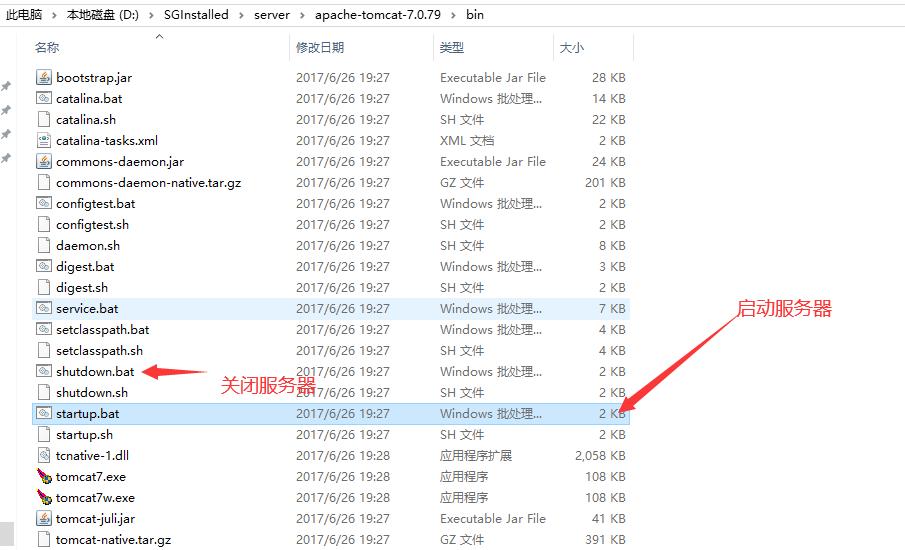

- 访问服务器（Tomcat）

  - http://localhost:8080 ,【http://127.0.0.1或IPV4http://192.168.x.xxx】访问成功界面如下所示：

    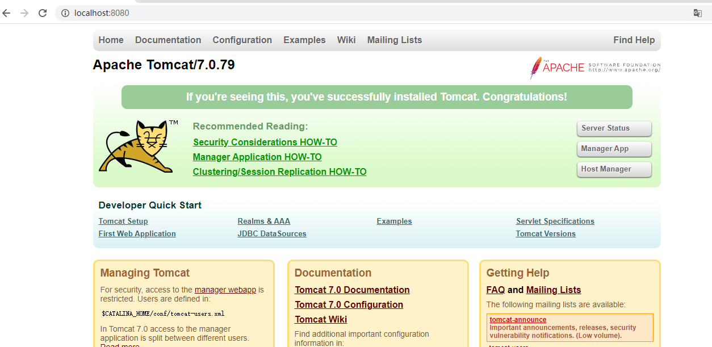

### 4. 如何访问Tomcat中的应用

**4.1 使用【http://localhost:8080】访问的是本地tomcat中的ROOT项目【index.jsp】**

**4.2 如当前tomcat中没有ROOT或ROOT中没有index.xxx页面，会报错【404】**

**4.3 【404页面】，请求资源未找到。**

**4.4 手动部署项目及访问**

- 访问项目根目录，默认会访问index.html|index.jsp页面。如没有index系列的页面，会报错：404
- 访问项目下的某个页面方式：http://localhost:8080/项目名称/页面名称。如：<http://192.168.0.101:8080/day01/a.html>

### 5. 更改Tomcat的默认端口号

**5.1 找到修改端口号的文件**

- tomcat->conf->server.xml

**5.2 找到修改端口号的位置**

- 找到【8080】字样，并进行修改即可。
- 不建议使用【0-1024】之间的端口，系统默认使用端口范围。
- 建议使用【8080端口附近的数值，如8081-8089】

### 6. 将Tomcat整合到Idea中使用

**6.1 整合Tomcat，步骤如下图所示**

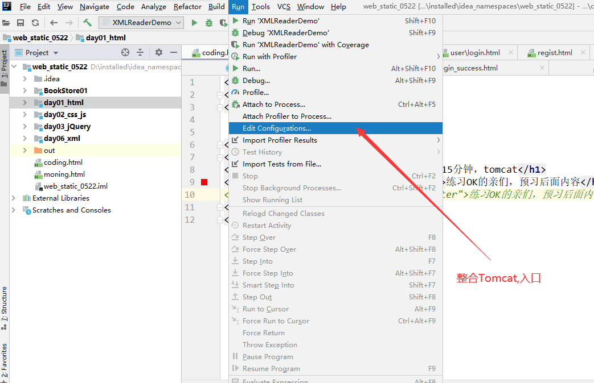

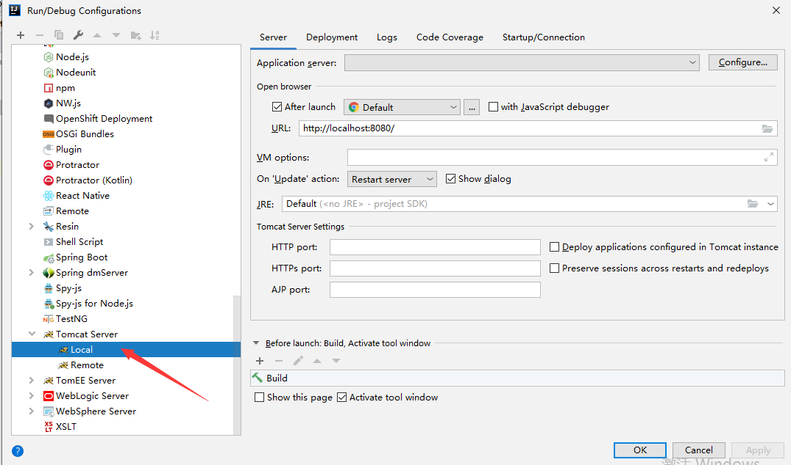

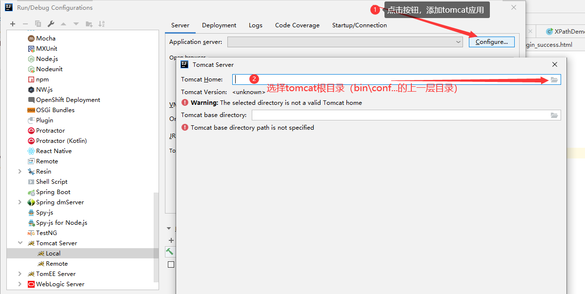

**6.2 将动态工程部署到Tomcat中，并运行**。具体步骤，如下图所示：

- 创建动态工程

  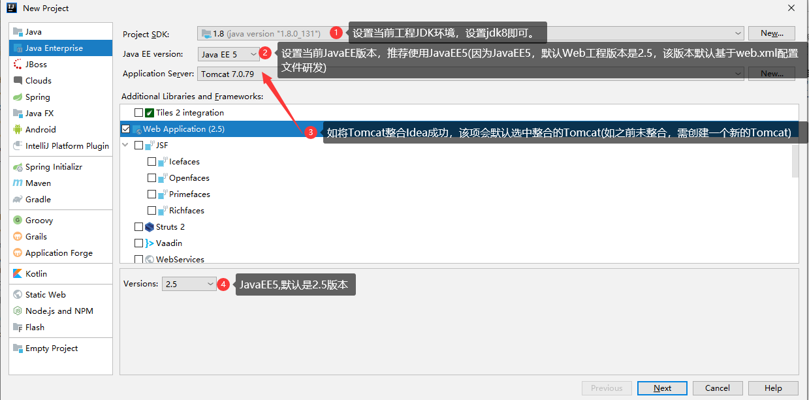

- 将动态工程部署到Tomcat

  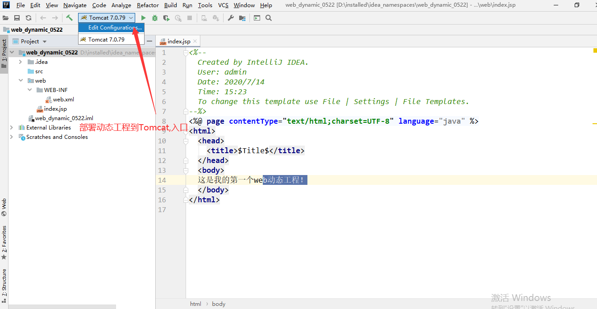

  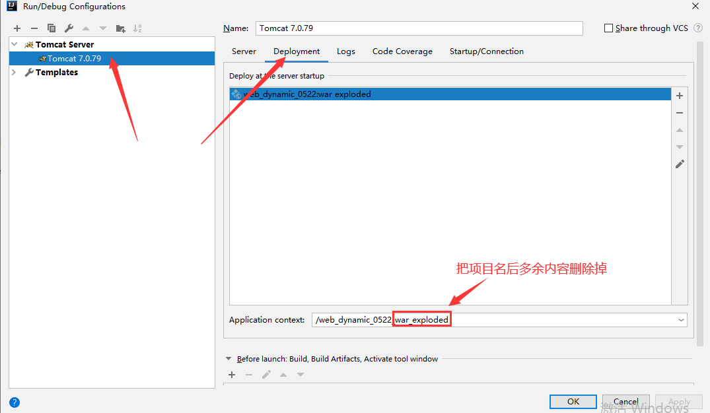

  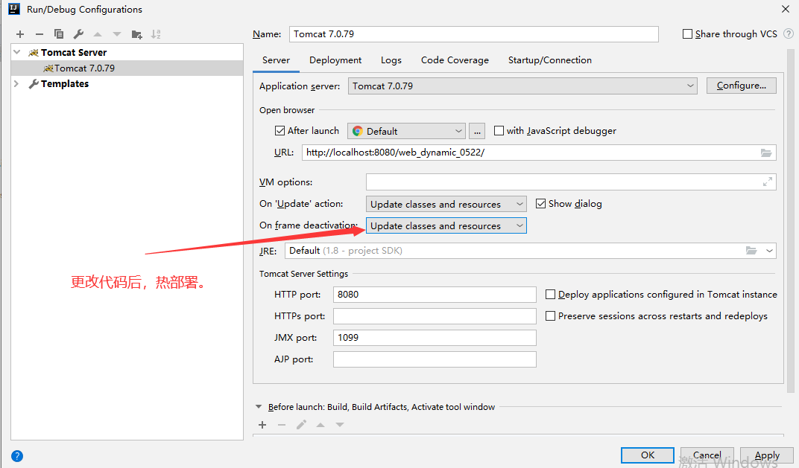

- 启动Tomcat服务器，运行当前web动态工程

  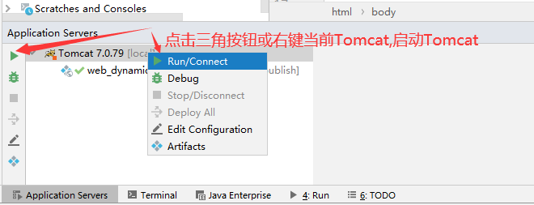

  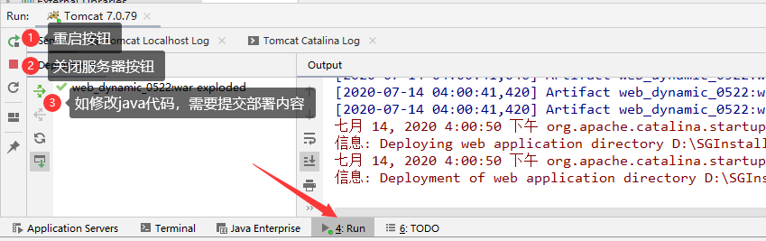

## HTTP

### 1. HTTP简介

**1.1 HTTP全称：Hyper Text Transfer Protocol【超文本传输协议】**

**1.2 HTTP是一种详细规定了浏览器与服务器之间的通信规则【交规】**

**1.3 浏览器与服务器通信内容，叫报文**

### 2. HTTP会话方式

**2.1 建立会话连接**

**2.2 浏览器向服务器发送请求**

**2.3 服务器向浏览器做出响应**

**2.4 关闭会话连接**

### 3. HTTP1.0（短连接）与HTTP1.1（长连接）区别

**3.1 HTTP1.0（短连接）：每个请求资源，都需要重新建立连接&关闭连接。效率相对比较低**

**3.2 HTTP1.1（长连接）：每个请求资源，统一共用一个连接资源（当前请求响应中，只建立一次连接&关闭一次连接）。效率相对较高。**

### 4. 报文

> 浏览器与服务器之间通信方式
>
> 1. 浏览器向服务器发送【请求】
> 2. 服务器向浏览器做出【响应】

**4.1 报文概念：浏览器与服务器通信时传输的内容，称之为报文。**HTTP协议就是规定报文的格式。

**4.2 报文种类**

> 目前为止请求方式区分
>
> 只有在<form method="post">时，才为POST请求【POST请求时，将请求数据存放请求体中，相对安全】
>
> 其他默认请求方式，均为GET请求【GET请求时，将请求数据拼接到URL后面，相对不安全】

- 请求报文：浏览器向服务器发送请求时，携带数据。

  - GET请求（没有请求体）

    - 请求行
    - 请求头

  - POST请求（有请求体）

    - 请求行

      请求方式		请求URL		协议版本

      GET			/项目名/路径...	HTTP1.1

    - 请求头

      User-Agent:保存用户信息（系统信息，浏览器信息...）

      Referer：保存前一个URL信息

      Cookie:保存cookie信息

    - 

    - 请求体

      保存用户提交的数据

- 响应报文：服务器向浏览器做出响应时，携带数据。

  - 响应行

    协议版本		响应码		响应状态

    HTTP1.1		200			OK

  - 响应头

    Content-Type:设置响应体中数据类型【text/html;charset=UTF-8】

  - 

  - 响应体[响应数据]

- 响应码

  - 200：请求成功
  - 404：请求失败【请求资源未找到】
  - 500：请求失败【请求资源找到了，但代码写错了！】
  - 302：重定向【请求资源重新定向，再次发送请求】

### 5. 不同浏览器中如何监听HTTP协议

> f12或fn+f12进入监听HTTP协议模式，具体操作如下图所示：

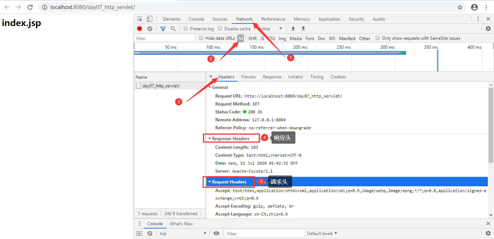

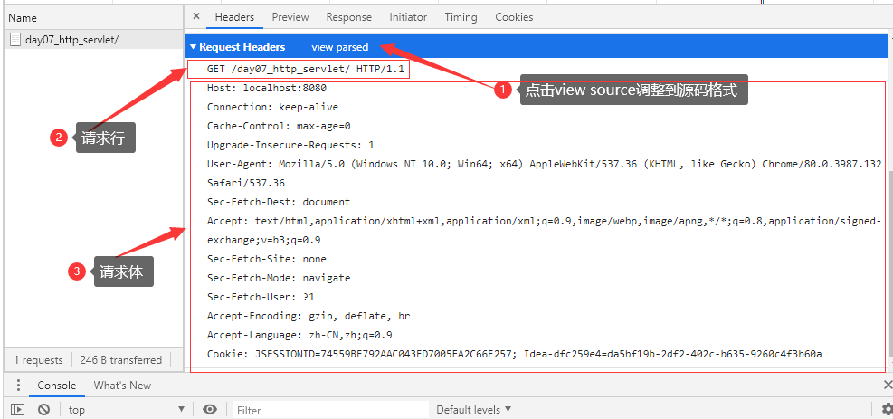

## java工程相关问题及解决方案

### 1. jar包导入问题

> 导入jar包一般常用如下两种方式（原理一致）

- 方式一

  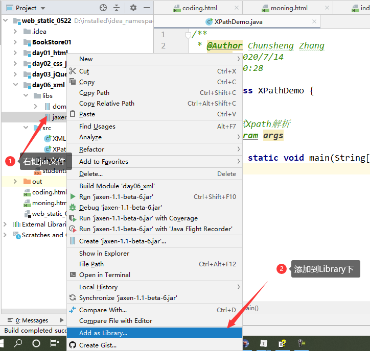

- 方式二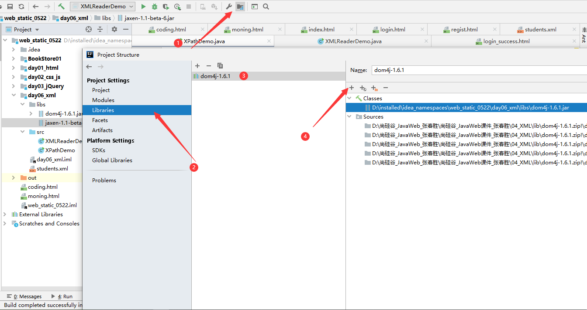

  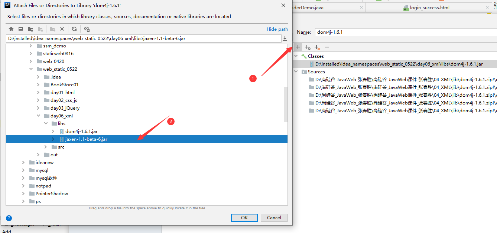

