# [面向对象编程（高级部分）](./TCH_Han/Chapter10.md)  
# 值得注意的概念
- 类方法又称为静态方法
- 类被加载的三种情况
- 普通代码块就是构造器的补充，如果构造器无调用，普通代码块也不会被调用
- [创建对象时类中的调用顺序](#3.2.3 创建一个对象时，在一个类调用顺序是（**重点难点**）) *看第三点写出结果*
- **类加载时与静态相关的会先执行**
-  当一个类中存在抽象方法时，需要将该类声明为abstract类
-  
1. [类变量和类方法](#1)
2. [理解```main```方法语法](#2)
3. [代码块](#3)
4. [单例设计模式](#4)
4. [```final```关键字](#5)
4. [抽象类](#6)
4. [抽象类最佳实践---模板设计模式](#7)
4. [接口](#8)
4. [内部类](#9)
4. [卖油翁和老黄牛](#10)
5. [作业](#作业)  
# 1

## 1.1 类变量快速入门

```java
//略

```


## 1.2 类变量与类方法

### 1.2.1 类变量与定义

- 类变量也叫**静态变量**/**静态属性**，是该类所有对象共享的变量，任何一个该类对象去访问它时，取到的都是相同的值
  1. ```staic```变量是同一个类中所有对象共享
  2. ```staic```类变量，在类加载时候就生产
  3. [那么和之前说的属性有啥区别呢](https://www.cnblogs.com/zxan/p/7277876.html)
- 定义：

```java
访问修饰符 static 数据类型 变量名; //推荐
static 访问修饰符 数据类型 变量名;
```


### 1.2.2 类变量内存剖析

```JDK```版本不同可能会导致静态变量存储的位置不同，但是要注意的是：

 - ```staic```变量是**同一个类**中所有对象**共享**

 -  ```staic```类变量，在类加载时候就生产

  

### 1.2.3 类变量使用注意事项与细节讨论

1. 什么时候需要用类变量：

   - 当需要让某个类的所有对象都共享一个变量是，就可以考虑使用类变量（静态变量）

2. 类变量与实例变量（普通属性）区别：

   - **类变量**是该类的所有对象**共享**的，而**实例变量**是每个对象**独享**的

3. 加上```static```称为类变量或静态变量，否则称为实例变量/普通变量/非静态变量

4. 类变量的方法方式有：（前提是满足访问修饰符的访问权限和范围）

   ```java
   类名.类变量名	//推荐 注意！实例变量此种访问方式错误
   对象名.类变量名
   ```

5. 类变量是在类加载是就初始化了，也就是即使没有创建对象，只要类加载了，就可以使用类变量
6. 类变量的生命周期是随类的加载开始，随着类消亡而销毁（看例子）

```java
package com.hspedu.static_; 

public class StaticDetail { 
    public static void main(String[] args) { 
        B b = new B(); 
        //System.out.println(B.n1); 
        System.out.println(B.n2); //静态变量是类加载的时候，就创建了,所以我们没有创建对象实例 
        System.out.println(C.address);  //也可通过类名.类变量名来访问
    } 
}

class B { 
    public int n1 = 100; 
    public static int n2 = 200; 
}

class C { 
    public static String address = "北京"; 
}
```


### 1.2.4 类方法基本介绍

如果希望不创建实例也可以调用某个方法（即当做工具类使用），这时把方法做成静态方法便非常合适。

- 类方法也叫静态方法

```java
访问修饰符 static 数据返回类型 方法名() {}//推荐
static 访问修饰符 数据返回类型 方法名() {}
```

- 类方法的调用**前提是**满足访问修饰符的访问权限

```java
class B {
    public static void printStart () {
        System.out.println("打印星星...");
    }
}
```


类方法使用案例

```java
package com.hspedu.static_; 

public class StaticMethod {
    public static void main(String[] args) { 
        
        //创建 2 个学生对象，叫学费 
        Stu tom = new Stu("tom"); 
        //tom.payFee(100); 
        Stu.payFee(100);//对不对?对 
        
        Stu mary = new Stu("mary"); 
        //mary.payFee(200); 
        Stu.payFee(200);//对 
        
        Stu.showFee();//300  输出当前收到的总学费 
        
        //如果希望不创建实例，也可以调用某个方法(即当做工具来使用) //这时，把方法做成静态方法时非常合适 
        System.out.println("9 开平方的结果是=" + Math.sqrt(9)); 
        System.out.println(MyTools.calSum(10, 30)); 
    } 
}

//开发自己的工具类时，可以将方法做成静态的，方便调用 
class MyTools { 
    //求出两个数的和 
    public static double calSum(double n1, double n2) {
        return n1 + n2; 
    }
    //可以写出很多这样的工具方法... 
}

class Stu { 
    private String name;//普通成员 
    //定义一个静态变量，来累积学生的学费 
    private static double fee = 0; 
    
    public Stu(String name) { 
        this.name = name; 
    }
    //说明 
    //1. 当方法使用了 static 修饰后，该方法就是静态方法 
    //2. 静态方法就可以访问静态属性/变量 
    public static void payFee(double fee) { 
        Stu.fee += fee;//累积到 
    }
    public static void showFee() { 
        System.out.println("总学费有:" + Stu.fee); 
    } 
}
```

  

  

### 1.2.5 类方法经典使用场景

- 当方法中不涉及到任何对象相关的成员，则可以将方法设计成静态方法，提高开发效率
- 在程序实际开发，往往会将一些通用的方法，设计成静态方法，这样便不需要创建对象可以使用，比如打印一维数组、冒泡排序，完成某个计算任务等
- 如```Math```类、```Arrays```类、```Collections```集合类看看源码


### 1.2.6 类方法使用注意事项和细节讨论

1. 类方法和普通方法都是随着类的加载而加载，将结构信息存储在方法区：
   - 类方法中**无**```this```参数
   - 普通方法中隐含```this```参数
   
2. 类方法可通过类名调用，也可以通过对象名调用。

   ```java
   class Person {
       public static say() {
           System.out.prtinln("hello");
       }
   }
   ```

   ```java
   //方法1 静态方法可以
   Perosn.say();
   //方法2
   Person ming = new Person();
   ming.say();
   ```

3. **普通方法**和对象有关，需要通过对象名调用，比如```对象名.方法名(参数)```，**不能通过类名调用**。

4. **类方法**中不允许使用和对象有关的关键字，**比如```this```和```super```**。```普通方法(成员方法)```可以。

5. ```类方法(静态方法)```中，**只能**访问**静态成员**，也可以访问**静态方法**。

6. 普通成员方法，**即**可以访问非静态成员，**也**可以访问静态成员。

**小结**：静态方法，只能访问静态的成员，非静态的方法，可以访问静态成员和非静态成员（必须遵循访问权限）。

```java
package com.hspedu.static_; 

public class StaticMethodDetail { 
    public static void main(String[] args) {
        D.hi();//ok 
        //D.say();, 错误，非静态方法，不能通过类名调用 需要先创建对象，再调用 
        new D().say();//可以
        } 
}

class D { 
    private int n1 = 100; 
    private static int n2 = 200;
    public void say() {//非静态方法,普通方法 
    }
    public static void hi() {//静态方法,类方法 
        n1 = 0;//错误，类方法中不允许使用和对象有关的关键字， 
        //System.out.println(this.n1); 错误的
    }
    
    //类方法(静态方法)中 只能访问 静态变量 或静态方法 
    //口诀:静态方法只能访问静态成员. 
    public static void hello() { 
        System.out.println(n2); 
        System.out.println(D.n2); 
        //System.out.println(this.n2);不能使用 
        hi();//OK 
        //say();//错误 
    }
    //普通成员方法，既可以访问 非静态成员，也可以访问静态成员
    
    //小结: 非静态方法可以访问 静态成员和非静态成员 
    public void ok() { 
        //非静态成员 
        System.out.println(n1); 
        say(); 
        //静态成员 
        System.out.println(n2); 
        hello(); 
    } 
}
```


### 1.2.7  课堂练习(1)：判断```total```值

[不用```this```如何给```total```赋值呢？](#1.2.3 类变量使用注意事项与细节讨论)。

```java
class TestPerson {
    public static void main(String[] args) {

        Person.setTotalPerson(3);
        new Person();
        Person.m();
    }
}

class Person { //StaticExercise03.java 2min 看
    private int id;
    private static int total = 0;
    public static void setTotalPerson(int total){
        
        // this.total = total;//错误，因为在static方法中，不可以使用this 关键字
        Person.total = total;//想要给total赋值就使用 类.静态属性
    }
    public Person() {//构造器
        total++;
        id = total;
    }
    public static void m() {//编写一个方法，输出total的值
        System.out.println("total的值=" + total);
    }
}
```

答案是4，**小结**：

- 静态方法只能访问静态成员（属性和方法）
- 非静态方法可以访问所有的成员
- 在编写代码时，仍然遵守访问权限规则

# 2

## 2.1 理解```main```方法语法

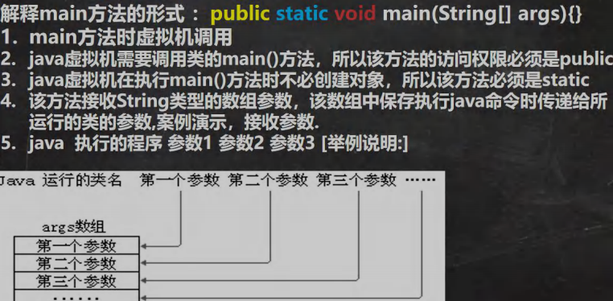

```java
public class myHomework {
	public static void main(String[] args) {

		for (int i = 0; i < args.length; i++) {
			System.out.println(i + "\t" +args[i]);
		}
	}
}
```
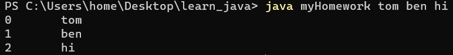


## 2.2 值得注意的地方

```java
package com.hspedu.main_;

public class Main01 {

    //静态的变量/属性
    private static  String name = "韩老师代码";
    //非静态的变量/属性
    private int n1 = 10000;

    //静态方法
    public static  void hi() {
        System.out.println("Main01的 hi方法");
    }
    //非静态方法
    public void cry() {
        System.out.println("Main01的 cry方法");
    }

    public static void main(String[] args) {

        //可以直接使用 name
        //1. 静态方法main 可以访问本类的静态成员
        System.out.println("name=" + name);
        hi();
        //2. 静态方法main 不可以访问本类的非静态成员
        //System.out.println("n1=" + n1);//错误
        //cry();
        //3. 静态方法main 要访问本类的非静态成员，需要先创建对象 , 再调用即可
        Main01 main01 = new Main01();
        System.out.println(main01.n1);//ok
        main01.cry();
    }
}
```

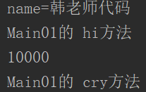

## 2.3 案例演示

如果想在```IDEA```中传入参数怎么弄？如图：

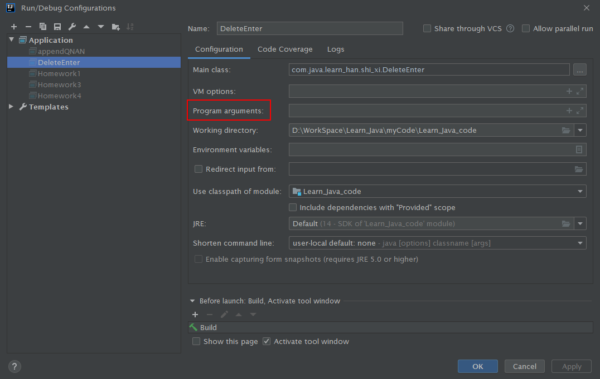

# 3

## 3.1 代码块基本介绍

- 代码块又称为**初始化块**，属于类中的成员（类中的一部分），类似于方法，将逻辑语句封装在方法体中，通过```{}```包围起来

- 但与方法不同，没有方法名，没有返回，没有参数，只有方法体，而且不用通过对象或类显示调用，而是加载类时，或创建对象时**隐式调用**

```java
[修饰符] {
  代码  
};
```

### 3.1.1 代码块基本语法

1. 修饰符 可选，要写也只能写```static```。
2. 代码块分为两类，使用```static```修饰的叫静态代码块，没有```static```修饰时，交普通代码块/非静态代码块。
3. 逻辑语句可以为任何逻辑语句（输入、输出、方法调用、循环、判断等）。
4. ```;```可以写上，也可以省略。

### 3.1.2 演示（普通代码块）

**代码块调用的顺序优先于构造器**，

```java
package com.java.learn_han.chapter10.codeblock_;

public class CodeBlock_ {
    public static void main(String[] args) {

        Movie movie = new Movie("你好，李焕英");
        System.out.println("===============");
        Movie movie2 = new Movie("唐探3", 100, "陈思诚");
    }
}

class Movie {
    private String name;
    private double price;
    private String director;

    public Movie(String name) {
        System.out.println("Movie(String name) 被调用...");
        this.name = name;
    }

    public Movie(String name, double price) {

        this.name = name;
        this.price = price;
    }

    public Movie(String name, double price, String director) {

        System.out.println("Movie(String name, double price, String director) 被调用...");
        this.name = name;
        this.price = price;
        this.director = director;
    }

    {
        System.out.println("电影屏幕打开...");
        System.out.println("广告开始...");
        System.out.println("电影正是开始...");
    };
}
```

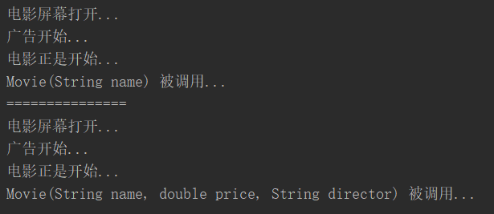

1. 相当于另外一种形式的构造器（对构造器的补充机制），可以做初始化的操作。
2. 场景：如果多个构造器中都有重复的语句，可以抽取到初始化块中，提高代码的重用性。


## 3.2 代码块使用注意事项与细节讨论

1. ```static```代码块也称静态代码块，作用就是对类进行初始化，而且随**类的加载**而执行，并且**只会执行一次**。如果是普通代码块，没创建一个对象，就执行。

### 3.2.1 类被加载的三种情况（**重点**）

- 创建对象实例时```new```

```java
package com.java.learn_han.chapter10.codeblock_;

public class CodeBlockDetail01 {
    public static void main(String[] args) {
        AA aa = new AA();
    }
}

class  AA {

    static {//静态代码块
        System.out.println("AA的静态代码块被执行");
    };
}

```

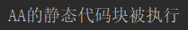

- 创建子类对象实例，父类也会被加载

```java
package com.java.learn_han.chapter10.codeblock_;

public class CodeBlockDetail01 {
    public static void main(String[] args) {
        AA aa = new AA();
    }
}

class BB {
    static {//静态代码块
        System.out.println("BB的静态代码块被执行");
    };
}

class  AA extends BB {
    static {//静态代码块
        System.out.println("AA的静态代码块被执行");
    };
}

```

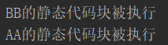

- 使用类的静态成员时（静态属性、静态方法）

```java
package com.java.learn_han.chapter10.codeblock_;

public class CodeBlockDetail01 {
    public static void main(String[] args) {
        System.out.println(Cat.n1);
    }
}
class Cat {
    public static int n1 = 999;
     static {//静态代码块
         System.out.println("Cat的静态代码块被执行");
     };
 }
```

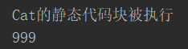

### 3.2.2 ```static```静态代码块

- 普通的代码块，在创建对象实例时，会被隐式的调用。被创建一次，就会调用一次。

```java
package com.java.learn_han.chapter10.codeblock_;

public class CodeBlockDetail01 {
    public static void main(String[] args) {
        DD d1 = new DD();
        DD d = new DD();
    }
}

class DD {
    static {//静态代码块
        System.out.println("BB的静态代码块被执行");
    }
    {//静态代码块
        System.out.println("BB的普通代码块被执行");
    }
}
```

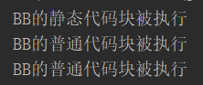

- 如果只是使用/调用类的静态成员时，普通代码块并不会执行。**普通代码块就是构造器的补充，如果构造器无调用，普通代码块也不会被调用**。

```java
package com.java.learn_han.chapter10.codeblock_;

public class CodeBlockDetail01 {
    public static void main(String[] args) {
        System.out.println(DD.i);
    }
}

class DD {
    public static int i = 999;

    static {//静态代码块
        System.out.println("BB的静态代码块被执行");
    }

    {//静态代码块
        System.out.println("BB的普通代码块被执行");
    }
}
```


> **小结：**
>
> 1. ```static```代码块是类加载时，执行，只会执行一次
> 2. 普通代码块是在创建对象时掉调用的，创建一次，调用一次
> 3. 类加载的3中情况，牢记


### 3.2.3 代码块调用顺序(1)**重点难点**

### 创建一个对象时，在一个类调用顺序是（**重点难点**）

1. 调用静态代码块和静态属性初始化
   - 注意：静态代码块和静态属性初始化调用的优先级一样，如果有多个静态代码块和多个静态变量初始化，则按其定义的顺序调用 
   
   ```java
   package com.java.learn_han.chapter10.codeblock_;
   
   public class CodeBlockDetail02 {
       public static void main(String[] args) {
           A a = new A();
       }
   }
   
   class A {
       private static  int n1 = getN1();//因为这个在前面
   
       static {
           System.out.println("A静态代码块01");
       }
   
       public static int getN1() {
           System.out.println("getN1被调用");
           return 100;
       }
   }
   ```
   
   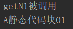
   
2. 调用普通代码块和普通属性的初始化
   - 注意：普通代码块和普通属性初始化调用优先级一样，如果有多个普通代码块和多个普通属性初始化，则按定义顺序调用
   
3. 调用构造方法

```java
package com.hspedu.codeblock_;

public class CodeBlockDetail02 {
    public static void main(String[] args) {
        A a = new A();// (1) A 静态代码块01 (2) getN1被调用...(3)A 普通代码块01(4)getN2被调用...(5)A() 构造器被调用
    }
}

class A {
    { //普通代码块
        System.out.println("A 普通代码块01");
    }
    private int n2 = getN2();//普通属性的初始化


    static { //静态代码块
        System.out.println("A 静态代码块01");
    }

    //静态属性的初始化
    private static  int n1 = getN1();

    public static int getN1() {
        System.out.println("getN1被调用...");
        return 100;
    }
    public int getN2() { //普通方法/非静态方法
        System.out.println("getN2被调用...");
        return 200;
    }

    //无参构造器
    public A() {
        System.out.println("A() 构造器被调用");
    }

}
```

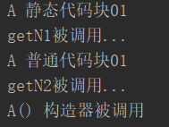


5. 构造器的最前面其实隐含了```super()```和调用普通代码块，新写一个类演示，静态相关的代码块，属性初始化，在类加载时，就执行完毕，因此优先于构造器和普通代码块执行的

   ```java
   class A {
       public A() {//构造器
           //这里有隐藏的执行要求
           //(1)super();
           //(2)调用普通代码块的
           System.out.println("ok");
       }
   }
   ```


### 3.2.4 代码块调用顺序(2)

创建一个子类对象时（继承关系），其静态代码块，静态属性初始化，普通代码块，普通属性初始化，构造方法的调用顺序：

演示：

```java
package com.hspedu.codeblock_;

public class CodeBlockDetail03 {
    public static void main(String[] args) {
        new BBB();
    }
}

class AAA { //父类Object
    {
        System.out.println("AAA的普通代码块");
    }
    public AAA() {
        System.out.println("AAA() 构造器被调用....");
    }
}

class BBB extends AAA  {
    {
        System.out.println("BBB的普通代码块...");
    }
    public BBB() {
        System.out.println("BBB() 构造器被调用....");
    }
}
```

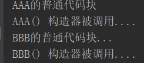

### 3.2.5  代码块调用顺序(3)

```java
package com.java.learn_han.chapter10.codeblock_;

public class CodeBlockDetail04 {
    public static void main(String[] args) {
        new B02();
    }
}

class A02 { //父类
    private static int n1 = getVal01();
    static {
        System.out.println("A02的一个静态代码块..");
    }
    {
        System.out.println("A02的第一个普通代码块..");
    }
    public int n3 = getVal02();
    public static int getVal01() {
        System.out.println("getVal01");
        return 10;
    }

    public int getVal02() {
        System.out.println("getVal02");
        return 10;
    }

    public A02() {//构造器
        System.out.println("A02的构造器");//(7)
    }

}

class B02 extends A02 { //

    private static int n3 = getVal03();

    static {
        System.out.println("B02的一个静态代码块..");
    }
    public int n5 = getVal04();
    {
        System.out.println("B02的第一个普通代码块..");//(9)
    }

    public static int getVal03() {
        System.out.println("getVal03");
        return 10;
    }

    public int getVal04() {
        System.out.println("getVal04");
        return 10;
    }

    public B02() {//构造器
        System.out.println("B02的构造器");
        // TODO Auto-generated constructor stub
    }
}

```

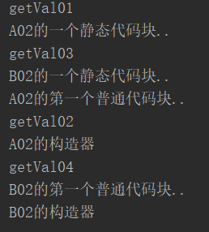

创建一个子类（继承）,其静态代码块、静态属性初始化、普通代码块、普通属性初始化、构造方法的调用顺训如下：

1. 父类的静态代码块和静态属性（优先级一样，按定义顺序执行）
2. 子类的静态代码块和静态属性（优先级一样，按定义顺序执行）
3. 父类的普通代码块和普通属性初始化（优先级一样，按定义顺序执行）
4. 父类的构造方法
5. 子类的普通代码块和普通属性初始化（优先级一样，按定义顺序执行）
6. 子类的构造方法

>我（**片面**）的理解是：
>
>静态与类加载想关，所以先执行（父类执行完子类），之后的代码块或属性在本类（父类执行完子类）顺序执行。


- **静态代码块只能直接调用静态成员（静态属性和静态方法），普通代码块可以调用任意成员。（学习比较麻烦工作轻松）**


##　3.3 课堂练习(1)：看图写结果

```java
package com.java.learn_han.chapter10.codeblock_;

public class Exercise01 {
}
class Person {
    public static int total;
    static {
            total = 100;
        System.out.println("in static block!");
    }
}

class Test {
    public static void main(String[] args) {
        System.out.println("total = "+ Person.total);
        System.out.println("total = "+ Person.total);
    }
}
```

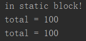

## 3.4 课堂练习(2)：看图写结果

```java
package com.java.learn_han.chapter10.codeblock_;

public class Exercise02 {
}

class Sample
{
    Sample(String s)
    {
        System.out.println(s);
    }
    Sample()
    {
        System.out.println("Sample默认构造函数被调用");
    }
}
class Test{
    Sample sam1=new Sample("sam1成员初始化");//
    static Sample sam=new Sample("静态成员sam初始化 ");//
    static{
        System.out.println("static块执行");//
        if(sam==null)System.out.println("sam is null");
    }
    Test()//构造器
    {
        System.out.println("Test默认构造函数被调用");//
    }
    //主方法
    public static void  main(String  str[])
    {
        Test a=new Test();//无参构造器
    }

}
```

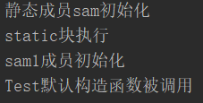

# 4

## 4.1 单例设计模式

单例（单个的实例）

1. 所谓类的单例设计模式，就是采取一定的方法保证在整个软件系统中，对某个类只能存在一个对象实例，并且该类只提供一个取得其对象实例的方法。

2. 单例模式有两种方式：

   - 饿汉式

   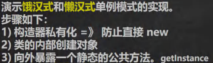

   ​	

   - 懒汉式


## 4.2 单例模式简介

### 4.2.1 饿汉式

```java
package com.hspedu.single_;

public class SingleTon01 {
    public static void main(String[] args) {
        //通过方法可以获取对象
        GirlFriend instance = GirlFriend.getInstance();
        System.out.println(instance);

        GirlFriend instance2 = GirlFriend.getInstance();
        System.out.println(instance2);

        System.out.println(instance == instance2);//T 证明是同一个对象
        
        
    }
}

//只能有一个女朋友
class GirlFriend {

    private String name; 
    
    //public static int n1 = 100; 如果在删除掉现在 main 的代码只添加 System.out.println(GirlFriend.n1); 也会创造出 改对象
    
    private static GirlFriend gf = new GirlFriend("小红红");	//2. 当类加载时 “女朋友”便创建好了
    
    private GirlFriend(String name) {						//1. 构造器私有化目的是 防止在类外部直接创建
        System.out.println("構造器被調用.");
        this.name = name;
    }

    public static GirlFriend getInstance() {				//3. 加 static 是为了没有创建对象时便可调用改方法
        return gf;
    }

    @Override
    public String toString() {
        return "GirlFriend{" +
                "name='" + name + '\'' +
                '}';
    }
}
```

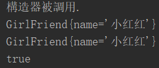

**饿汉式的缺点是有时并没有使用到该实例，却也会创造出该对象即“女朋友”**，可能造成创建了对象却没有使用，浪费资源。（看被注释```public static int n1 = 100;```这一行）

### 4.2.2 懒汉式

```java
package com.hspedu.single_;

public class SingleTon02 {
    public static void main(String[] args) {
      
        //System.out.println(Cat.n1);
        Cat instance = Cat.getInstance();
        System.out.println(instance);
        //再次調用getInstance
        Cat instance2 = Cat.getInstance();
        System.out.println(instance2);

        System.out.println(instance == instance2);//T
    }
}

//希望在程序運行過程中，只能創建一個Cat對象
//使用單例模式
class Cat {
    private String name;
    public static  int n1 = 999;
    private static Cat cat ; //2. （全局变量默認是null

    private Cat(String name) { //1. 
        System.out.println("構造器調用...");
        this.name = name;
    }
    public static Cat getInstance() {//3. 

        if(cat == null) {//如果還沒有創建cat對象
            cat = new Cat("小可愛");
        }
        return cat;
    }

    @Override
    public String toString() {
        return "Cat{" +
                "name='" + name + '\'' +
                '}';
    }
}
```

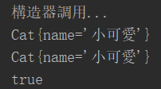

## 4.3 单例模式应用实例

步骤：

1. 构造器私有化 防止直接```new```
2. 类的内部创建对象
3. 向外暴露一个静态的公共方法 ```getInstance```
4. 代码实现


## 4.4 饿汉式 vs 懒汉式

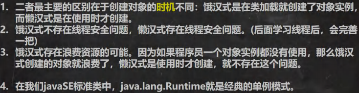

1. 单例模式的两种实现方式
2. 饿汉式的问题：在类加载时就创建，可能存在资源浪费问题
3. 懒汉式的问题：线程安全问题

# 5

## 5.1 ```final```关键字基本介绍

**```final```可以修饰类、属性、方法和局部变量**

出现一下情况就会使用到```final```：

1. 当**不希望类被继承**时
2. 当**不希望父类的某个方法被子类覆盖/重写**时
3. 当**不希望类的某个属性的值被修改**时
4. 当**不希望某个局部变量被修改**时

````java
final class A {//1. 类
    
    public final couble TAX_RATE = 0.08;//3. 属性
    
    public final void hi() {//2. 方法
     	final double NUM = 0.01;//4. 局变
    }
} 
````


## 5.2 ```final```关键字使用注意事项和细节讨论

1. ```final```修饰的属性又叫常量，一般用```XX_XX_XX```命名。

2. ```final```修饰的属性在定义时，必须**赋初值，并不能再修改**，赋值可以在如下位置之一：

   - 定义时：```public final```
   - 在构造器中
   - 在代码块中。

   ```java
   class AA {
       public final double TAX_RATE = 0.08;//1.定义时赋值
       public final double TAX_RATE2 ;
       public final double TAX_RATE3 ;
   
       public AA() {//构造器中赋值
           TAX_RATE2 = 1.1;
       }
       {//在代码块赋值
           TAX_RATE3 = 8.8;
       }
   }
   ```

3. 如果```final```修饰的属性是静态的，则初始化的位置只能是：

   - 定义时
   - 在静态代码块 
   - **不能在构造器中赋值**，因为类加载完后才有可能执行构造器。

   ```java
   class BB {
       public static final double TAX_RATE = 99.9;
       public static final double TAX_RATE2 ;
   
       static {
           TAX_RATE2 = 3.3;
       }
   }
   ```

4. ```final```类不能继承，但是可以实例化对象。

5. 如果类不是```final```类，但是含有```final```方法，则改方法虽然不能重写，但是可以被继承。

   ```java
   class DD {
       public final void cal() {
           System.out.println("cal()方法");
       }
   }
   class EE extends DD { }
   
   //在main方法中
   new EE().cal();
   ```

6. 如一个类已是```final```类，就无必要将方法修饰成```final```方法。

7. ```final```不能修饰构造方法（即构造器）

8. ```final```和```static```往往搭配使用效率更高，不会导致类加载，递增编译器做了优化处理，[不会类加载这点可对比下懒汉式](#4.2.2 懒汉式)

   ```java
   class Demo {
       public static final int i = 10000;
       static {
           System.out.println("Demo 类加载");//单独使用 i 不会类加载 本行无输出
       }
   }
   
   //main 打印 BBB.num 输出 -> 10000 
   ```

9. 包装类等```Interger、Double、Float、Boolean```等都是```final```，```String```也是```final```类，**这些类都不能被继承**


## 5. 3 ```final```课堂练习(1)：写圆面积计算

```java
package com.java.learn_han.chapter10.final_;

public class FinalExercise01 {
    public static void main(String[] args) {
        System.out.println(new Circle(5.0).calArea());
    }
}

class Circle {
    private double radius;
    private final double PI1 = 3.14;
    private final double PI2;
    private final double PI3;

    {
        PI3 = 3.14;
    }

    public Circle(double radius) {
        this.radius = radius;
        PI2 = 31.4;
    }

    public double calArea() {
        return radius * radius * PI1;
    }
}
```


# 6

## 6.1 抽象类快速入门

当父类的一些方法不能确定时，可以用```abstract```关键字来修饰该方法，这个方法就是抽象方法。**当一个类中存在抽象方法时，需要将该类声明为abstract类**。

```java
package com.hspedu.abstract_;

abstract class Animal {
    private String name;
    public Animal(String name) {
        this.name = name;
    }
    public abstract void eat()  ;//将该方法设计为抽象类(没有实现)
}
```


## 6.2 抽象类介绍

1. 用```abstract```关键字来修饰一个类时，这个类就叫抽象类

   ```java
   abstract class Animal {//抽象类
       String name;
       int age;
       abstract public void cry();//抽象方法
   }
   ```

2. 用```abstract```关键字来修饰一个方法时，这个方法就是抽象方法
3. 抽象类的价值更多作用是在与设计，是设计者设计好后，让子类继承并实现抽象类
4. 抽象类，是面试常问的知识点，在框架和设计模式使用较多


## 6.3 抽象类使用事项和细节讨论

1. 抽象类不能被实例化。

   ```java
   //在 main 中
   new A();//错误
   
   abstract class A {}
   ```

2. 抽象类不一定包含```abstract```方法，可以有具体的实现方法。

3. 一旦类包含了```abstract```方法，则这个类必须声明为```abstract```。

4. ```abstract```只能修饰类和方法，不能修饰属性和其它的。

   ```java
   class C {
       public abstract int n1 = 1;//错误
   }
   ```

5. 抽象类可以有任意成员**抽象类本质还是类**，比如：非抽象方法、构造器、静态属性

6. 抽象方法不能有主体，即不能实现

   ```java
   class A {
       abstract public hi() {};//错误不能有 {}
   }
   ```

7. 如果一个类继承了抽象类，则它必须实现抽象类的所有抽象方法，除非它自己也声明为```abstract```类。

   - 所谓实现就是有```{}```即方法体

8. 抽象方法不能使用```private```、```final```、```static```来修饰，因为这些关键字都是和重写相违背的

   - 如果为私有就没办法重写了
   - ```final```本意就是不希望子类重写
   - ```static```与重写相违背


## 6.4 课堂练习(1)：抽象类


## 6.5 抽象类最佳实践-模板设计模式


# 7

## 7.1 接口快速入门


```java

package com.java.learn_han.chapter10.interface_;

public class Interface01 {
    public static void main(String[] args) {
        Camera camera = new Camera();
        Phone phone = new Phone();

        Computer computer = new Computer();
        computer.work(camera);//把相机接入电脑
        System.out.println("===========");
        computer.work(phone);//把手机接入电脑
    }
}

//
package com.java.learn_han.chapter10.interface_;

public interface UsbInterface {

    //规定接口的相关方法
    public void start();
    public void stop();
}

//
package com.java.learn_han.chapter10.interface_;

public class Phone implements UsbInterface {
    @Override
    public void start() {
        System.out.println("手机开始工作");
    }

    @Override
    public void stop() {
        System.out.println("手机开始工作");
    }
}

//
package com.java.learn_han.chapter10.interface_;

public class Camera implements UsbInterface {
    @Override
    public void start() {
        System.out.println("相机开始工作");
    }

    @Override
    public void stop() {
        System.out.println("相机开始工作");
    }
}

//
package com.java.learn_han.chapter10.interface_;

public class Computer {

    public void work (UsbInterface usbInterface) {
        usbInterface.start();
        usbInterface.stop();
    }
}
```

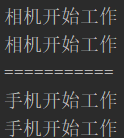

## 7.2 接口基本介绍

JDK8后接口可以有静态方法、默认方法，也就是接口中可以有方法的具体实现。

```java
interface 接口名 {
	//属性
	//方法 1. 抽象方法 2. 默认实现方法 3. 静态方法
}

class 类名 implements 接口 {
	//自己的属性
    //自己的方法
    //必须实现的接口的抽象方法
}
```

例子：

```java
package com.hspedu.interface_;

public interface AInterface {
    //写属性
    public int n1 = 10;
    //写方法
    //在接口中，抽象方法，可以省略abstract关键字
    public void hi();

    //在jdk8后，可以有默认实现方法,需要使用default关键字修饰
    default public void ok() {
        System.out.println("ok ...");
    }
    //在jdk8后, 可以有静态方法
    public static void cry() {
        System.out.println("cry ....");
    }
}

```


## 7.3 注意事项和细节


1. 接口不能被实例化

2. 接口中的所有方法时```public```方法，接口中抽象方法，可以不用```abstract```修饰

3. 一个普通类实现接口，就必须将该接口的所有方法都实现

4. 抽象类实现接口，可以不用实现接口的方法

5. 一个类同时可以实现多个接口

6. 接口的属性只能是```final```的，而且是```public static final```修饰符，比如：```int a = 1;```实际上是```public static final int a = 1;```**必须初始化**。

7. 接口中属性的访问形式：```接口名.属性名```

8. 接口不能继承其它的类，但是可以继承多个别的接口

   ```interface A extends B, C { } ```

9. 接口的修饰符只能是```public```和默认，这点和类的修饰符是一样的


## 7.？ 实现接口 VS 继承类


## 7. 接口的多态特性


# 8

## 8.1 内部类基本介绍

1. 定义类在局部位置（方法中/代码块）
   - 局部内部类
   - 匿名内部类
2. 定义在成员位置
   - 成员内部类
   - 静态内部类


一个类的内部又完整的嵌套了另一个类结构。被嵌套的类称为内部类，嵌套其它的类称为外部类。是我妈类的第五大成员，内部类的最大的特点就是可以直接访问私有属性


## 8.2 内部类基本语法


##　8.3 内部类的分类

- 定义在外部类局部位置上（比如方法内）：
  1. 局部内部类（有类名）
  2. 匿名内部类（**无类名**）

- 定义在外部类的成员位置上：
  1. 成员内部类（没用```static```修饰）
  2. 静态内部类（使用```static```修饰）


## 8.4 局部内部类的使用

说明：局部内部类时定义在外部类的局部位置，比如方法中，并且有类名字。

1. 可以直接访问外部类的所有成员，包含私有的
2. 不能添加访问修饰符，因为他的地位就是一个局部变量。局部变量是不能使用修饰符的。但是可以使用```final```修饰，因为局部变量也可以使用```final```
3. 作用域：仅仅在定义它的方法或代码块中
4. 局部内部类----访问---->外部类的成员 （访问方式：直接访问）
5. 外部类----访问---->局部内部类的成员（访问方式：创建对象，再访问**一定要在作用域内**）

>1. 局部内部类定义在方法中/代码块
>2. 作用域在方法题或者代码块中
>3. 本质仍然是一个类

6. 外部其它类----不能访问---->局部内部类，因为局部内部类地位是一个局部变量
7. 如果外部类和局部内部类的成会员重名时，默认遵循就近原则，如果想访问外部类的成员，则可以使用``外部类名.this.成员````


## 8.5  匿名内部类的使用


## 8.6 匿名内部类的最佳实践


## 8.7 课堂练习(1)：匿名内部类


## 8.8 成员内部类的使用


## 8.9 静态内部类的使用

说明静态内部类时定义在外部类的成员位置，并且有```static```修饰

1. 可以直接访问外部类的所有静态成员，包含私有的，但不能直接访问非晶态成员
2. 可以添加任意访问修饰符```public、protect、默认、private```，因为它的地位就是一个成员
3. 作用域：同其它的成员，为整个类题
4. 静态内部类----访问-----> 外部类（）
5. 外部类----访问---->静态内部类
6. 外部其它类----访问----->静态内部类
7. 如果外部类和静态内部类的成员重名时，静态内部类访问的时，默认遵循就
7. 近原则，如果想访问外部类的成员，则可以使用


## 8.10 课堂练习(2)：匿名内部类

# 作业

## 作业(1)

```
```