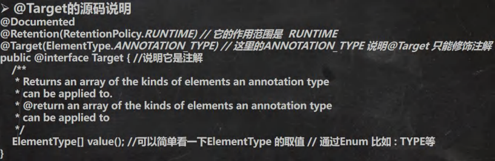

# [枚举和注解](./TCH_Han/Chapter11.md)  
# 值得注意的概念
- 
- 
- 
-  
1. [枚举](#1)
2. [注解](#2)
3. [元注解](#3)
5. [作业](#作业)  
# 1

## 1.1枚举介绍

### 1.1.1 特点

1. 季节的值是有限的几个值
2. 只读，不需要修改

### 1.1.2实现方式

1. 自定义类实现枚举
2. 使用```enum```关键字实现枚举


## 1.2  自定义实现枚举小结

1. 构造器私有化
2. 本类内部创建一组对象
3. 对外暴露对象（通过为对象添加 public final static 修饰符）
4. 可以提供```get```方法，但是不提供```set```

```java
package com.java.learn_han.chapter11.enum_;

public class Enumeration02 {
    public static void main(String[] args) {
        System.out.println(Season.SPRING);
    }
}

//演示自定义美剧
class Season {
    private String name;
    private String desc;

    //定义了四个对象, 固定.
    public static final Season SPRING = new Season("春天", "温暖");
    public static final Season WINTER = new Season("冬天", "寒冷");
    public static final Season AUTUMN = new Season("秋天", "凉爽");
    public static final Season SUMMER = new Season("夏天", "炎热");

    //1. 将构造器私有化,目的防止 直接 new
    //2. 去掉setXxx方法, 防止属性被修改
    //3. 在Season 内部，直接创建固定的对象
    //4. 优化，可以加入 final 修饰符
    private Season(String name, String desc) {
        this.name = name;
        this.desc = desc;
    }

    public String getName() {
        return name;
    }

    public String getDesc() {
        return desc;
    }

    @Override
    public String toString() {
        return "Season{" +
                "name='" + name + '\'' +
                ", desc='" + desc + '\'' +
                '}';
    }
}
```


## 1.3 使用```enum```关键字实现枚举

```java
package com.hspedu.enum_;

public class Enumeration03 {
    public static void main(String[] args) {
        System.out.println(Season2.AUTUMN);
        System.out.println(Season2.SUMMER);
    }
}
//演示使用enum关键字来实现枚举类
enum  Season2 {//类

    //如果使用了enum 来实现枚举类
    //1. 使用关键字 enum 替代 class
    //2. public static final Season SPRING = new Season("春天", "温暖") 直接使用
    //   SPRING("春天", "温暖") 解读 常量名(实参列表)
    //3. 如果有多个常量(对象)， 使用 ,号间隔即可
    //4. 如果使用enum 来实现枚举，要求将定义常量对象，写在前面
    //5. 如果我们使用的是无参构造器，创建常量对象，则可以省略 () 则下面What() 等价于 What
    SPRING("春天", "温暖"), WINTER("冬天", "寒冷"), AUTUMN("秋天", "凉爽"),
    SUMMER("夏天", "炎热")/*, What()*/;

    private String name;
    private String desc;//描述

    private Season2() {//无参构造器

    }

    private Season2(String name, String desc) {
        this.name = name;
        this.desc = desc;
    }

    public String getName() {
        return name;
    }

    public String getDesc() {
        return desc;
    }

    @Override
    public String toString() {
        return "Season{" +
                "name='" + name + '\'' +
                ", desc='" + desc + '\'' +
                '}';
    }
}
```


## 1.4枚举注意事项

1. 当我们使用 ```enum```关键字开发一个枚举类时，默认会继承 ```Enum```类, 而且是一个 ```final``` 类[如何证明],老师使用 ```javap``` 工 具来演示 
   - 
2. 传统的 ```public static final Season2 SPRING = new Season2("春天", "温暖");``` 简化成 ```SPRING("春天", "温暖")，```这里必 须知道，它调用的是哪个构造器. 
3. 如果使用无参构造器 创建 枚举对象，则实参列表和小括号都可以省略 
4. 当有多个枚举对象时，使用,间隔，最后有一个分号结尾 
5. 枚举对象必须放在枚举类的行首.


## 1.3课堂练习(1)：看代码判断结果

```java
enum Gender {
    BOY,GIRL;//调用 Gender 的无参构造器
}
```

上面的语法是正确的，但是，如果添加了构造器，便会覆盖无参构造，此时不显示定义无参数构造的话便是错误的。


## 1.4枚举常用方法说明及应用实例


1. ```toString:Enum``` 类已经重写过了，返回的是当前对象 名,子类可以重写该方法，用于返回对象的属性信息 

2. ```name```：返回当前对象名（常量名），子类中不能重写 

3. ```ordinal```：返回当前对象的位置号，默认从 0 开始 

4. ```values```：返回当前枚举类中所有的常量 

   - ```java
     Season2[] values = Season2.values();
     System.out.println("===遍历取出枚举对象(增强for)====");
     for (Season2 season: values) {//增强for循环
         System.out.println(season);
     }
     ```

5. ```valueOf```：将字符串转换成枚举对象，要求字符串必须 为已有的常量名，否则报异常

6. ```compareTo```：比较两个枚举常量，**比较的是编号**。

   - ```java
     //1. 就是把 Season2.AUTUMN 枚举对象的编号 和 Season2.SUMMER枚举对象的编号比较
     //2. 看看结果
     /*
     public final int compareTo(E o) {
     
         return self.ordinal - other.ordinal;
     }
     Season2.AUTUMN的编号[2] - Season2.SUMMER的编号[3]
      */
     System.out.println(Season2.AUTUMN.compareTo(Season2.SUMMER));
     ```


## 1.5 课堂练习(2)：实现星期并输出

```java
package com.hspedu.enum_;

public class EnumExercise02 {
    public static void main(String[] args) {
        //获取到所有的枚举对象， 即数组
        Week[] weeks = Week.values();
        //遍历，使用增强for
        System.out.println("===所有星期的信息如下===");
        for (Week week : weeks) {
            System.out.println(week);
        }
    }
}

/*
声明Week枚举类，其中包含星期一至星期日的定义；
MONDAY, TUESDAY, WEDNESDAY, THURSDAY, FRIDAY, SATURDAY, SUNDAY;
使用values 返回所有的枚举数组, 并遍历 , 输出左图效果

 */
enum Week   {
    //定义Week的枚举对象
    MONDAY("星期一"), TUESDAY("星期二"), WEDNESDAY("星期三"), THURSDAY("星期四"),
    FRIDAY("星期五"), SATURDAY("星期六"), SUNDAY("星期日");
    private String name;

    private Week(String name) {//构造器
        this.name = name;
    }

    @Override
    public String toString() {
        return name;
    }
}
```


## 1.6```enum```实现接口

1. 使用 ```enum``` 关键字后，就不能再继承其它类了，因为 ```enum``` 会隐式继承 ```Enum```，而 ```Java``` 是单继承机制。 
2. 枚举类和普通类一样，可以实现接口，如下形式。 ```enum 类名 implements 接口 1，接口 2{} ```

# 2

## 2.1注解的理解


 ## 2.2注解的介绍


## 2.3```@Override```


```java
package com.hspedu.annotation_;

public class Override_ {
    public static void main(String[] args) {

    }
}
class Father{//父类

    public void fly(){
        int i = 0;
        System.out.println("Father fly...");
    }
}

class Son extends Father {//子类
    //老韩解读
    //1. @Override 注解放在fly方法上，表示子类的fly方法时重写了父类的fly
    //2. 这里如果没有写 @Override 还是重写了父类fly
    //3. 如果你写了@Override注解，编译器就会去检查该方法是否真的重写了父类的
    //   方法，如果的确重写了，则编译通过，如果没有构成重写，则编译错误
    //4. 看看 @Override的定义
    //   解读： 如果发现 @interface 表示一个 注解类
    /*
        @Target(ElementType.METHOD)
        @Retention(RetentionPolicy.SOURCE)
        public @interface Override {
        }
     */
    @Override   //说明
    public void fly() {
        System.out.println("Son fly....");
    }
    
}
```


## 2.4```@Deprecated```

```@Deprecated```: 用于表示某个程序元素(类, 方法等)已过时 


```java
package com.hspedu.annotation_;

public class Deprecated_ {
    public static void main(String[] args) {
        A a = new A();
        a.hi();
        System.out.println(a.n1);
    }
}

//老韩解读
//1. @Deprecated 修饰某个元素, 表示该元素已经过时
//2. 即不在推荐使用，但是仍然可以使用
//3. 查看 @Deprecated 注解类的源码
//4. 可以修饰方法，类，字段, 包, 参数  等等
//5. @Deprecated 可以做版本升级过渡使用
/*
@Documented
@Retention(RetentionPolicy.RUNTIME)
@Target(value={CONSTRUCTOR, FIELD, LOCAL_VARIABLE, METHOD, PACKAGE, PARAMETER, TYPE})
public @interface Deprecated {
}
 */
@Deprecated
class A {
    @Deprecated
    public int n1 = 10;
    @Deprecated
    public void hi(){

    }
}
```


## 2.5```@SuppressWarnings```

```@SuppressWarnings```: 抑制编译器警告 


```java
package com.hspedu.annotation_;

import java.util.ArrayList;
import java.util.List;


@SuppressWarnings({"rawtypes", "unchecked", "unused"})
public class SuppressWarnings_ {

    //老韩解读
    //1. 当我们不希望看到这些警告的时候，可以使用 SuppressWarnings注解来抑制警告信息
    //2. 在{""} 中，可以写入你希望抑制(不显示)警告信息
    //3. 可以指定的警告类型有
    //          all，抑制所有警告
    //          boxing，抑制与封装/拆装作业相关的警告
    //        //cast，抑制与强制转型作业相关的警告
    //        //dep-ann，抑制与淘汰注释相关的警告
    //        //deprecation，抑制与淘汰的相关警告
    //        //fallthrough，抑制与switch陈述式中遗漏break相关的警告
    //        //finally，抑制与未传回finally区块相关的警告
    //        //hiding，抑制与隐藏变数的区域变数相关的警告
    //        //incomplete-switch，抑制与switch陈述式(enum case)中遗漏项目相关的警告
    //        //javadoc，抑制与javadoc相关的警告
    //        //nls，抑制与非nls字串文字相关的警告
    //        //null，抑制与空值分析相关的警告
    //        //rawtypes，抑制与使用raw类型相关的警告
    //        //resource，抑制与使用Closeable类型的资源相关的警告
    //        //restriction，抑制与使用不建议或禁止参照相关的警告
    //        //serial，抑制与可序列化的类别遗漏serialVersionUID栏位相关的警告
    //        //static-access，抑制与静态存取不正确相关的警告
    //        //static-method，抑制与可能宣告为static的方法相关的警告
    //        //super，抑制与置换方法相关但不含super呼叫的警告
    //        //synthetic-access，抑制与内部类别的存取未最佳化相关的警告
    //        //sync-override，抑制因为置换同步方法而遗漏同步化的警告
    //        //unchecked，抑制与未检查的作业相关的警告
    //        //unqualified-field-access，抑制与栏位存取不合格相关的警告
    //        //unused，抑制与未用的程式码及停用的程式码相关的警告
    //4. 关于SuppressWarnings 作用范围是和你放置的位置相关
    //   比如 @SuppressWarnings放置在 main方法，那么抑制警告的范围就是 main
    //   通常我们可以放置具体的语句, 方法, 类.
    //5.  看看 @SuppressWarnings 源码
    //(1) 放置的位置就是 TYPE, FIELD, METHOD, PARAMETER, CONSTRUCTOR, LOCAL_VARIABLE
    //(2) 该注解类有数组 String[] values() 设置一个数组比如 {"rawtypes", "unchecked", "unused"}
    /*
        @Target({TYPE, FIELD, METHOD, PARAMETER, CONSTRUCTOR, LOCAL_VARIABLE})
            @Retention(RetentionPolicy.SOURCE)
            public @interface SuppressWarnings {

                String[] value();
        }
     */
    public static void main(String[] args) {
        List list = new ArrayList();
        list.add("jack");
        list.add("tom");
        list.add("mary");
        int i;
        System.out.println(list.get(1));

    }

    public void f1() {
//        @SuppressWarnings({"rawtypes"})
        List list = new ArrayList();


        list.add("jack");
        list.add("tom");
        list.add("mary");
//        @SuppressWarnings({"unused"})
        int i;
        System.out.println(list.get(1));
    }
}
```


# 3

## 3.1 四种元注解


## 3.2```@Retention```

说明

只能用于修饰一个 ```Annotation``` 定义, 用于指定该 ```Annotation ```可以保留多长时间, ```@Rentention``` 包含一个 ```RetentionPolicy ```类型的成员变量, 使用 ```@Rentention``` 时必须为该 ```value ```成员变量指定值: 

```@Retention``` 的三种值：

1. ```RetentionPolicy.SOURCE```: 编译器使用后，直接丢弃这种策略的注释 
2. ```RetentionPolicy.CLASS```: 编译器将把注解记录在 ```class``` 文件中. 当运行 ```Java``` 程序时, ```JVM``` 不会保留注解。 这是默认值
3. ```RetentionPolicy.RUNTIME```:编译器将把注解记录在 ```class``` 文件中. 当运行 ```Java``` 程序时, ```JVM``` 会保留注解. 程序可以通过反射获取该注解


## 3.3```@Target``` 





## 3.4```@Documented ```


## 3.5```@Inherited```


# 作业

## 2


```java
package com.java.learn_han.chapter11.homework;

public class Homework2 {
    public static void main(String[] args) {
        System.out.println(Frock.getNextNum());
        System.out.println(Frock.getNextNum());

        Frock frock1 = new Frock();
        Frock frock2 = new Frock();
        Frock frock3 = new Frock();
        System.out.println(frock1.getSeriaNumber());
        System.out.println(frock2.getSeriaNumber());
        System.out.println(frock3.getSeriaNumber());
    }
}

class Frock {
    private static int currentNum = 100000;
    private int seriaNumber;

    public Frock() {
        this.seriaNumber = getNextNum();
    }

    public static int getNextNum() {
        currentNum += 100;
        return currentNum;
    }

    public int getSeriaNumber() {
        return seriaNumber;
    }
}
```


## 3


```java
package com.java.learn_han.chapter11.homework;

public class Homework3 {
    public static void main(String[] args) {
        Animal animal = new Cat() ;
        animal.shout();
        animal = new Dog();
        animal.shout();
    }
}

abstract class Animal {
    public abstract void shout();
}

class Cat extends Animal {
    public void shout() {
        System.out.println("小猫喵喵叫");
    }
}

class Dog extends Animal {
    public void shout() {
        System.out.println("小狗汪汪叫");
    }
}
```


## 4


## 5


## 6


## 7


## 8


## 9

