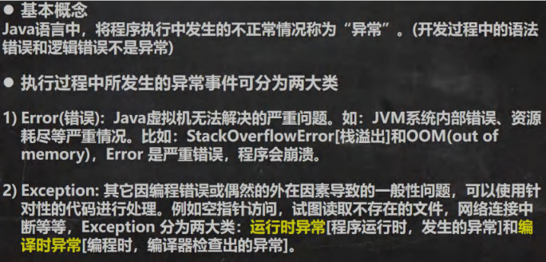
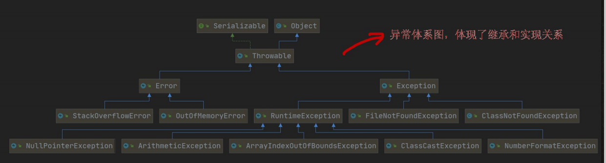

# [异常](./TCH_Han/Chapter12.md)  
# 值得注意的概念
- 
- 
- 
-  
1. [](#1)
2. [](#2)
3. [](#3)
4. [](#4)
5. [作业](#作业)  
# 1

## 1.1异常介绍






## 1.2小结

1. 异常分为两大类，运行时异常和编译时异常。
2. 运行时异常：编译器检查不出来。一般是指编程时的逻辑错误，是程序员应该避免出现的异常。```java.lang.RuntimeException```类及其子类都是运行时异常。
3. 对于运行时异常，可以不作处理，因为这类异常很普遍，若全处理可能会对程序的可读性和运行效率产生影响。
4. 编译时异常：是编译器要求必须处置的异常。


```    
```
# 2
```
```
# 3
```
```
# 4
```
```
# 作业
```
```