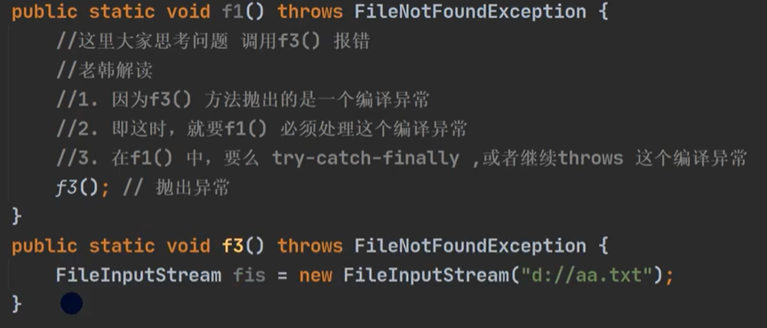

# [异常](./TCH_Han/Chapter12.md)  
# 值得注意的概念
- 快捷键 ctrl + alt + t  快速构建捕获代码
- 分别捕获异常时，要求子类异常写在前面，父类异常写在后面。
- 
- 
-  
1. [](#1)
2. [](#2)
3. [](#3)
4. [](#4)
5. [作业](#作业)  
# 1

## 1.1异常介绍

### 1.1.1快速入门

```java
package com.hspedu.exception_;

public class Exception01 {
    public static void main(String[] args)  {
        int num1 = 10;
        int num2 = 0;//Scanner();
        try {
            int res = num1 / num2;
        } catch (Exception e) {
            //e.printStackTrace();
            System.out.println("出现异常的原因=" + e.getMessage());//输出异常信息
        }

        System.out.println("程序继续运行....");
    }
}
```


### 1.1.2基本介绍


### 1.1.3异常体系图（**重点**）


## 1.2小结

1. 异常分为两大类，运行时异常和编译时异常。
2. 运行时异常：编译器检查不出来。一般是指编程时的逻辑错误，是程序员应该避免出现的异常。```java.lang.RuntimeException```类及其子类都是运行时异常。
3. 对于运行时异常，可以不作处理，因为这类异常很普遍，若全处理可能会对程序的可读性和运行效率产生影响。
4. 编译时异常：是编译器要求必须处置的异常。


## 1.3常见的运行异常

1. ```NullPointerException``` 空指针异常 

   - ```java
     package com.hspedu.exception_;
     
     public class NullPointerException_ {
         public static void main(String[] args) {
     
             String name = null;
             System.out.println(name.length());
         }
     }
     ```

2. ```ArithmeticException```数学运算异常 

   - 一开始除0的例子

3. ```ArrayIndexOutOfBoundsException ```数组下标越界异常 

   - ```java
     package com.hspedu.exception_;
     
     public class ArrayIndexOutOfBoundsException_ {
         public static void main(String[] args) {
             int[] arr = {1,2,4};
             for (int i = 0; i <= arr.length; i++) {//越界了，没有3
                 System.out.println(arr[i]);
             }
         }
     }
     ```

4. ```ClassCastException``` 类型转换异常 

   - ```java
     package com.hspedu.exception_;
     
     public class ClassCastException_ {
         public static void main(String[] args) {
             A b = new B(); //向上转型
             B b2 = (B)b;//向下转型，这里是OK
             C c2 = (C)b;//这里抛出ClassCastException 因为 C 与 B 没有任何关系
         }
     }
     class A {}
     class B extends A {}
     class C extends A {}
     ```

5. ```NumberFormatException``` 数字格式不正确异常[]

   - ```java
     package com.hspedu.exception_;
     
     public class NumberFormatException_ {
         public static void main(String[] args) {
             String name = "韩顺平教育";
             //将String 转成 int
             int num = Integer.parseInt(name);//抛出NumberFormatException
             System.out.println(num);//1234
         }
     }
     ```


## 1.4编译异常

### 1.4.1编译异常介绍

**编译异常是指在编译期间，就必须处理的异常，否则代码不能通过编译。**


### 1.4.2常见的编译异常


## 1.5异常处理

### 1.5.1异常处理基本介绍

**异常处理就是当异常发生时，对异常处理的方式。**


### 1.5.2异常处理方式

1. ```try-catch-finally```,快捷键 ctrl + alt + t -> 选中 try-catch
   - 程序员在代码中捕获发生的异常，自行处理。
2. ```throws```
   - 将发生的异常抛出，交给调用者（方法处理），最顶级的处理这就是```JVM```。


### 1.5.3示意图

**如果程序员没有显示处理异常，默认使用```throws```**。


# 2

## 2.1```try-catch```异常处理


### 2.1.1```try-catch```快速入门

```java

```


### 2.1.2```try-catch```使用的注意事项


```java
package com.hspedu.try_;

public class TryCatchDetail {
    public static void main(String[] args) {

        //ctrl + atl + t
        //老韩解读
        //1. 如果异常发生了，则异常发生后面的代码不会执行，直接进入到catch块
        //2. 如果异常没有发生，则顺序执行try的代码块，不会进入到catch
        //3. 如果希望不管是否发生异常，都执行某段代码(比如关闭连接，释放资源等)则使用如下代码- finally
        try {
            String str = "韩顺平";
            int a = Integer.parseInt(str);
            System.out.println("数字：" + a);
        } catch (NumberFormatException e) {
            System.out.println("异常信息=" + e.getMessage());
        } finally {
            System.out.println("finally代码块被执行...");
        }

        System.out.println("程序继续...");
    }
}
```


**分别捕获异常时，要求子类异常写在前面，父类异常写在后面。**

```java
package com.hspedu.try_;

public class TryCatchDetail02 {
    public static void main(String[] args) {

        //老韩解读
        //1.如果try代码块有可能有多个异常
        //2.可以使用多个catch 分别捕获不同的异常，相应处理
        //3.要求子类异常写在前面，父类异常写在后面
        try {
            Person person = new Person();
            //person = null;
            System.out.println(person.getName());//NullPointerException
            int n1 = 10;
            int n2 = 0;
            int res = n1 / n2;//ArithmeticException
        } catch (NullPointerException e) {
            System.out.println("空指针异常=" + e.getMessage());
        } catch (ArithmeticException e) {
            System.out.println("算术异常=" + e.getMessage());
        } catch (Exception e) {
            System.out.println(e.getMessage());
        } finally {
        }
    }
}

class Person {
    private String name = "jack";

    public String getName() {
        return name;
    }
}
```


想想结果是什么？

```java
package com.hspedu.try_;

public class TryCatchDetail03 {
    public static void main(String[] args) {

        /*
        可以进行 try-finally 配合使用, 这种用法相当于没有捕获异常，
        因此程序会直接崩掉/退出。应用场景，就是执行一段代码，不管是否发生异常，
        都必须执行某个业务逻辑
         */
        try{
            int n1 = 10;
            int n2 = 0;
            System.out.println(n1 / n2);
        }finally {
            System.out.println("执行了finally..");
        }
        System.out.println("程序继续执行..");
    }
} 
```


## 2.2课堂练习(1)：写出结果

```java
class Exception01 {
    public static int method() {
        try {
            String[] names = new String[3];//String[]数组
            if (names[1].equals("tom")) {//NullPointerException
                System.out.println(names[1]);
            } else {
                names[3] = "hspedu";
            }
            return 1;
        } catch (ArrayIndexOutOfBoundsException e) {
            return 2;
        } catch (NullPointerException e) {//捕获
            return 3;
        } finally { //必须执行
            return 4; 
        }
    }

    public static void main(String[] args) {
        System.out.println(method()); 
    }
}
```

该题目一开始会只能到return 3这里，但是返回的确实4，因为有finally


## 2.4课堂练习(2)：看出结果

```java
class ExceptionExe01 {
    public static int method() {
        int i = 1;//i = 1
        try {
            i++;// i=2
            String[] names = new String[3];
            if (names[1].equals("tom")) { //空指针
                System.out.println(names[1]);
            } else {
                names[3] = "hspedu";
            }
            return 1;
        } catch (ArrayIndexOutOfBoundsException e) {
            return 2;
        } catch (NullPointerException e) {
            return ++i;  
        } finally {
            ++i; //i = 4
            System.out.println("i=" + i);// i = 4
        }
    }

    public static void main(String[] args) {
        System.out.println(method());// 3
    }
}
```

在捕获异常中，有return，可是在finally中没有返回。此时3会被系统保存到一个temp变量，执行完finally后返回，**返回的值仍是3**。


## 2.5```try-catch```小结


## 2.6课堂练习(3)：如果用户输入的不是一个整数，就提示反复输入直到整数为止

```java
package com.java.learn_han.chapter12.exception_;

import java.util.Scanner;

public class Exception01 {
    public static void main(String[] args) {

        Scanner scanner = new Scanner(System.in);
        int num = 0;
        while (true) {
            System.out.println("请输入一个整数：");
            try {
                num = Integer.parseInt(scanner.next());
                break;
            } catch (NumberFormatException e) {
                System.out.println("你输入的不是一个整数：");
            }
        }
        System.out.println(num);
    }
}
```


# 3

## 3.1```throws```基本介绍


## 3.2快速入门

```java
package com.hspedu.throws_;

import java.io.FileInputStream;
import java.io.FileNotFoundException;

public class Throws01 {
    public static void main(String[] args) {

    }

    public void f2() throws FileNotFoundException,NullPointerException,ArithmeticException {
        //创建了一个文件流对象
        //老韩解读:
        //1. 这里的异常是一个FileNotFoundException 编译异常
        //2. 使用前面讲过的 try-catch-finally
        //3. 使用throws ,抛出异常, 让调用f2方法的调用者(方法)处理
        //4. throws后面的异常类型可以是方法中产生的异常类型，也可以是它的父类
        //5. throws 关键字后也可以是 异常列表, 即可以抛出多个异常
        FileInputStream fis = new FileInputStream("d://aa.txt");

    }
}
```


## 3.3注意事项与细节

默认是throws处理的是运行时异常。


3. 子类抛出异常不是父类异常的子类便会报错，就像父类是public但子类是private这样，缩小范围是错误的。


5. **在编译异常中**，如果子类抛出了异常，父类调用这个方法时必须有所处理，不然报错。



所以运行异常在编译前是没有错误显示的：


## 3.4自定义异常

### 3.4.1基本概念

当程序中出现了某些“错误”，但该错误信息并没有在Throwable子类中描述处理，这个时候可以自己设计异常类，用于描述该错误信息。


### 3.4.2自定义异常的步骤


### 3.4.3自定义异常的应用实例

自定义一个异常使不在年龄范围内抛出异常

```java
package com.hspedu.customexception_;

public class CustomException {
    public static void main(String[] args) /*throws AgeException*/ {

        int age = 180;
        //要求范围在 18 – 120 之间，否则抛出一个自定义异常
        if(!(age >= 18 && age <= 120)) {
            //这里我们可以通过构造器，设置信息
            throw new AgeException("年龄需要在 18~120之间");
        }
        System.out.println("你的年龄范围正确.");
    }
}
//自定义一个异常
//老韩解读
//1. 一般情况下，我们自定义异常是继承 RuntimeException
//2. 即把自定义异常做成 运行时异常，好处时，我们可以使用默认的处理机制
//3. 即比较方便 （使用默认处理机制
class AgeException extends RuntimeException {
    public AgeException(String message) {//构造器
        super(message);
    }
}
```


## 3.5```throw```和```thows```区别


|              | 意义                     | 位置       | 后面跟的东西 |
| ------------ | ------------------------ | ---------- | ------------ |
| ```throw```  | 异常处理的一种方式       | 方法声明处 | 异常类型     |
| ```throws``` | 手动生成异常对象的关键字 | 方法体中   | 异常对象     |


## 3.6 课堂练习(1)： 写出结果

```java
package com.hspedu.throws_;

public class ThrowException {
    public static void main(String[] args) {
        try {
            ReturnExceptionDemo.methodA();
        } catch (Exception e) {
            System.out.println(e.getMessage());
        }
        ReturnExceptionDemo.methodB();

    }
}

class ReturnExceptionDemo {
    static void methodA() {
        try {
            System.out.println("进入方法A");
            throw new RuntimeException("制造异常");
        } finally {
            System.out.println("用A方法的finally");
        }
    }

    static void methodB() {
        try {
            System.out.println("进入方法B");
            return;
        } finally {
            System.out.println("调用B方法的finally");
        }
    }
}
```


# 作业
```
```