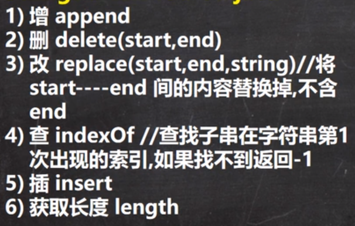

# [常用类](./TCH_Han/Chapter13.md)  
# 值得注意的概念
- 只要有基本数据类型，==判断的是值是否相同
- 字符串本质是字符数组，并且为final，final的意思是该数组地址不可改而不是内容不可改
- 调用一个方法会产生一个新栈
-  ```StringBuffer```用于存放数据的数组不是```final```所以是存放在堆中的，和```String```存放在栈中不同。
1. [包装类](#1)
2. [```String,StringBuffer,StringBuilder```](#2)
3. [](#3)
4. [](#4)
5. [作业](#作业)  
# 1

## 1.1包装类的分类

1. 针对八种基本数据类型相应的引用类型---包装类
2. 有了类的特点，就可以调用类中的方法
3. 如图：


下面三张图是类的继承关系图。


## 1.2包装类和基本数据的转换

1. jdk5前的手动装箱和拆箱方式，装箱：基本类型->包装类型，反之，拆箱
2. jdk5以后（含5）的自动装箱和拆箱方式
3. 自动装箱底层调用的是```valueof```方法，比如```Integer.valueOf()```
4. 其它包装类的用法类似

```    java
package com.hspedu.wrapper;

public class Integer01 {
    public static void main(String[] args) {
        //演示int <--> Integer 的装箱和拆箱
        //jdk5前是手动装箱和拆箱
        //手动装箱 int->Integer
        int n1 = 100;
        Integer integer = new Integer(n1);
        Integer integer1 = Integer.valueOf(n1);

        //手动拆箱
        //Integer -> int
        int i = integer.intValue();

        //jdk5后，就可以自动装箱和自动拆箱
        int n2 = 200;
        //自动装箱 int->Integer
        Integer integer2 = n2; //底层使用的是 Integer.valueOf(n2)
        //自动拆箱 Integer->int
        int n3 = integer2; //底层仍然使用的是 intValue()方法
    }
}
```

## 1.3课堂练习(1)：判断结果

```java
Object obj1 = true? new Integer(1) : new Double(2.0);
System.out.println(obk1);
```

**这里输出是1.0,因为三元运算符要看成一个整体**，虽然是用Integer的语句，但是后面有Double，而Double的优先级要大于Integer，所以会自动转型。


## 1.4包装类型和String类型的相互转换

```java
package com.hspedu.wrapper;

public class WrapperVSString {
    public static void main(String[] args) {
        //包装类(Integer)->String
        Integer i = 100;//自动装箱
        //方式1
        String str1 = i + "";
        //方式2
        String str2 = i.toString();
        //方式3
        String str3 = String.valueOf(i);

        //String -> 包装类(Integer)
        String str4 = "12345";
        Integer i2 = Integer.parseInt(str4);//使用到自动装箱
        Integer i3 = new Integer(str4);//构造器

        System.out.println("ok~~");

    }
}
```


## 1.5```Integer```类型和```Charater```类的常用方法

```java
public class WrapperMethod { 
    public static void main(String[] args) { 	
        System.out.println(Integer.MIN_VALUE); //返回最小值                           
        System.out.println(Integer.MAX_VALUE);//返回最大值 
        System.out.println(Character.isDigit('a'));//判断是不是数字 
        System.out.println(Character.isLetter('a'));//判断是不是字母 
        System.out.println(Character.isUpperCase('a'));//判断是不是大写 
        System.out.println(Character.isLowerCase('a'));//判断是不是小写 
        System.out.println(Character.isWhitespace('a'));//判断是不是空格 
        System.out.println(Character.toUpperCase('a'));//转成大写 
        System.out.println(Character.toLowerCase('A'));//转成小写 
    } 
}
```


## 1.6Integer类面试题

### 1.6.1面试1

```java
public class WrapperExercise02 {
    public static void main(String[] args) {
        Integer i = new Integer(1);
        Integer j = new Integer(1);
        System.out.println(i == j);
  
        Integer m = 1; 
        Integer n = 1;
        System.out.println(m == n); 
       
        Integer x = 128;
        Integer y = 128;
        System.out.println(x == y);

    }
}
```

- 两个new对象 为false
- 底层 ```Integer.valueOf(1);``` -> 阅读源码 发现在范围区间，为true
- 不在范围区间，为false


### 1.6.2面试2

```java
//示例1
Integer i1 = new Integer(127);
Integer i2 = new Integer(127);
System.out.println()i1 == i2;

//示例2
Integer i3 = new Integer(128);
Integer i4 = new Integer(128);
System.out.println(i3 == i4);

//示例3
Integer i5 = 127;
Integer i6 = 127;
System.out.println(i5 == i6);

//示例4
Integer i7 = 128;
Integer i8 = 128;
System.out.println(i7 == i8);

//示例5
Integer i9 = 127;
Integer i10 = new Integer(127);
System.out.println(i9 == i10);

//示例6
Integer i11 = 127;
int i12 = 127;
System.out.println(i11 == i12);

//示例7
Integer i13 = 128;
int i14 = 128;
System.out.println(i13 == i14);

//F F T F F T T
```

**案例六和七是因为只要有基本数据类型，判断的是值是否相同。**

# 2

## 2.1String类的理解和创建对象


- 串行化的意思是指可以在网络上传输
- 字符串本质是字符数组，并且为final，final的意思是该数组地址不可改而不是内容不可改


1. String 对象用于保存字符串，也就是一组字符序列

2.  "jack" 字符串常量, 双引号括起的字符序列

3. 字符串的字符使用Unicode字符编码，一个字符(不区分字母还是汉字)占两个字节

4. String 类有很多构造器，构造器的重载

   ```java
   //   常用的有 String  s1 = new String(); 
   String  s2 = new String(String original);
   String  s3 = new String(char[] a);
   String  s4 =  new String(char[] a,int startIndex,int count)
   String s5 = new String(byte[] b)
   ```

5. String 类实现了接口 Serializable【String 可以串行化:可以在网络传输】接口 Comparable [String 对象可以比较大小]

6.  String 是final 类，不能被其他的类继承

7. String 有属性 private final char value[]; 用于存放字符串内容

8.  一定要注意：value 是一个final类型， 不可以修改(需要功力)：即value不能指向新的地址，但是单个字符内容是可以变化

   ```java
   final char[] value = {'a', 'b', 'c'};
   char[] v2 = {'c', 'b', 'a'};
   value = v2;//错误！
   
   char[] value = {'a', 'b', 'c'};
   char[] v2 = {'c', 'b', 'a'};
   value = v2;//正确~
   ```

   


## 2.2创建String对象

### 2.2.1两种方式

1. 方式一：直接赋值
   - ```String s  = "CDUY333;"```
2. 方式二：调用构造器
   - ```String s  = new String("CDUY333");```


### 2.2.2两种方式的区别

1. 方式一：```String s  = "CDUY333;"```
   - 先**从常量池**查看是否有“CDUY333”数据空间，如果有，直接指向；如果没有则重新创建，然后指向。s最终指向的是常量池的空间地址。
2. 方式二：```String s  = new String("CDUY333");```
   - 先在**堆中**创建空间，里面维护了value属性，指向常量池的CDUY333空间。如果常量池没有“CDUY333”,重新创建，如果有，直接通过value指向。最终指向的是堆中的空间地址。
3. 内存分布图：


## 2.3课堂练习

### 2.3.1练习1

```java
public class StringExercise01 {
    public static void main(String[] args) {
        String a = "abc";
        String b ="abc";
        System.out.println(a.equals(b));
        System.out.println(a==b); 
    }
}
```

- equals在String中有重写方法，是一个一个字符来比较
- ```==```是比地址，然而它们的地址是相同的，只要在常量池中存在```abc```，**再创建一个字符时便会指向该地址**,**不要与new弄混了**，如果是```new String("abc");```，那么也是不同的。


### 2.3.2练习2

```java
String a = "hsp";
String b = new String("hsp");
System.out.println(a.equals(b));
System.out.println(a==b);
System.out.println(a==b.intern());
System.out.println(b==b.intern());
```

- T
- F 因为```b```用```new```创建对象，该对象保存的数值是一个地址即常量池中的```a```。当a与b用```==```进行比较时，比的是各自的地址，而不是各自的值。所以两者不相同。


- T ```b.intern()```方法最终返回的是常量池的地址（对象）

- F


### 2.2.3练习(3)

```java
Person p1 = new Person();
p1.name = "hspedu";
Person p2 = new Person();
p2.name = "hspedu";


System.out.println(p1.name.equals(p2.name));
System.out.println(p1.name == p2.name);  
System.out.println(p1.name == "hspedu");   

String s1 = new String("bcde");
String s2 = new String("bcde");
System.out.println(s1==s2); 

class Person {
    public String name;
}
```

- T 这个是String，在字符串中有重写equals方法，所以判断的是内容
- T p1.name或p2.name都是向位于常量池hspdedu的地址，因为String是引用变量，所以==比较的是地址，所以是相同的，
  - 那么既然p1.name是一个地址，为什么使用输出语句时可以输出字符串呢？这是因为String的默认方法就是调用toString。
  - 如果想查看p1与p2的地址可以打印其hascode，会发现是一样的。
- T 看图
- F


```java
Person p1 = new Person();
p1.name = "hspedu";
Person p2 = new Person();
p2.name = new String("hspedu");

System.out.println(p1.name.hashCode());
System.out.println(p2.name.hashCode());
System.out.println(p1.name == p2.name);
```

那我现在再折腾一下，写出结果。

- 既然有new那么他们肯定是不相同了（第三行的输出语句）
- 可是，为什么p1和p2的hasCode任然是相同呢？
  - 因为new后，p2.name的指向是堆的另外一个“东西”而不是常量池，所以p1.name == p2.name是不相同的，但堆里面的数据保存的仍然是hspedu位于常量池中的地址


## 2.4字符串的特性

1. ```String```是一个```final```类，代表不可变的字符序列
2. 字符串是不可变，一个字符串对象一旦被分配，其内容是不可变的

```java
//以下语句创建了几个对象
String s1 = "hello";
s1 = "haha";
```

- 创建了两个对象，原有的“hello”并不会消失，但是s1与hello的连接会被替换成```haha```。


## 2.5面试题

### 2.5.1面试题(1)

```java
//以下语句会创建几个对象
String a = "hello" + "abc";
```

- 一个，编译器会将语句优化为```String a = "helloabc"```。


### 2.5.2面试题(2)

```java
//以下语句会创建几个对象
String a = "hello";
String b = "abc";
//1. 先 创建一个 StringBuilder sb = StringBuilder()
//2. 执行  sb.append("hello");
//3. sb.append("abc");
//4. String c= sb.toString()
//最后其实是 c 指向堆中的对象(String) value[] -> 池中 "helloabc"
String c = a + b;
```

- **注意第三句写法与```String a = "hello" + "abc";是不一样的。 ```**
- 有三个对象，其中c的指向是堆，堆中是一个value数组指向位于常量池中的新常量“helloabc”。


```java
String a = "hello";
String b = "abc";
String c = a + b;
String d = "helloabc";
System,.ouyt.println(c == d);
```

- 答案是F，**因为c与d是对象，既然是对象比较的是地址。**


### 2.5.3韩老师小结

底层是(下面代码)，并且append是在原来字符串的基础上追加的

```java
StringBuilder sb = new StringBuilder();
sb.append(a);
sb.append(b);
```

**重要规则**，```String c1 = "ab" + "cd";``` **常量相加，看的是池。** ```String c1= a + b;```**变量相加，是在堆中。**


### 2.5.4面试题(3)

```java
class Test1 {
    String str = new String("hsp");
    final char[] ch = {'j', 'a', 'v', 'a'};

    public void change(String str, char ch[]) {
        str = "java";
        ch[0] = 'h';
    }

    public static void main(String[] args) {
        Test1 ex = new Test1();
        ex.change(ex.str, ex.ch);
        System.out.print(ex.str + " and ");
        System.out.println(ex.ch);
    }
}
```

输出的结果为hsp and hava

为什么是hsp而不是java，因为当执行到main函数中的change时，**调用一个方法便会产生一个新栈**，在这个新栈中的str一开始也是指向堆中的value的，但是之后执行java时，因为String是final类，所以便会取消一开始的连接，转而指向堆中的java。但是，执行完ex.change(ex.str, ex.ch);语句后，change栈便销毁了，回到主栈。位于main栈中的ex.str的指向是没有改变的，而接下来的输出语句也是此栈中的str。


## 2.6```String```类的常见方法

### 2.6.1```String```类的缺点

```String```类时保存字符串常量。每次更新都需要重新开辟空间，效率极低，因此Java设计者还提供了```StringBuilder```和```StringBuffer```来增强```String```功能并提高效率。


### 2.6.2```String```常见方法一览


```java
package com.hspedu.string_;

public class StringMethod01 {
    public static void main(String[] args) {
        //1. equals 前面已经讲过了. 比较内容是否相同，区分大小写
        String str1 = "hello";
        String str2 = "Hello";
        System.out.println(str1.equals(str2));//

        // 2.equalsIgnoreCase 忽略大小写的判断内容是否相等
        String username = "johN";
        if ("john".equalsIgnoreCase(username)) {
            System.out.println("Success!");
        } else {
            System.out.println("Failure!");
        }
        // 3.length 获取字符的个数，字符串的长度
        System.out.println("韩顺平".length());
        // 4.indexOf 获取字符在字符串对象中第一次出现的索引，索引从0开始，如果找不到，返回-1
        String s1 = "wer@terwe@g";
        int index = s1.indexOf('@');
        System.out.println(index);// 3
        System.out.println("weIndex=" + s1.indexOf("we"));//0
        // 5.lastIndexOf 获取字符在字符串中最后一次出现的索引，索引从0开始，如果找不到，返回-1
        s1 = "wer@terwe@g@";
        index = s1.lastIndexOf('@');
        System.out.println(index);//11
        System.out.println("ter的位置=" + s1.lastIndexOf("ter"));//4
        // 6.substring 截取指定范围的子串
        String name = "hello,张三";
        //下面name.substring(6) 从索引6开始截取后面所有的内容
        System.out.println(name.substring(6));//截取后面的字符
        //name.substring(0,5)表示从索引0开始截取，截取到索引 5-1=4位置
        System.out.println(name.substring(2,5));//llo

    }
}
```


```java
package com.hspedu.string_;

public class StringMethod02 {
    public static void main(String[] args) {
        // 1.toUpperCase转换成大写
        String s = "heLLo";
        System.out.println(s.toUpperCase());//HELLO
        // 2.toLowerCase
        System.out.println(s.toLowerCase());//hello
        // 3.concat拼接字符串
        String s1 = "宝玉";
        s1 = s1.concat("林黛玉").concat("薛宝钗").concat("together");
        System.out.println(s1);//宝玉林黛玉薛宝钗together
        // 4.replace 替换字符串中的字符
        s1 = "宝玉 and 林黛玉 林黛玉 林黛玉";
        //在s1中，将 所有的 林黛玉 替换成薛宝钗
        // 老韩解读: s1.replace() 方法执行后，返回的结果才是替换过的.
        // 注意对 s1没有任何影响
        String s11 = s1.replace("宝玉", "jack");
        System.out.println(s1);//宝玉 and 林黛玉 林黛玉 林黛玉
        System.out.println(s11);//jack and 林黛玉 林黛玉 林黛玉
        // 5.split 分割字符串, 对于某些分割字符，我们需要 转义比如 | \\等
        String poem = "锄禾日当午,汗滴禾下土,谁知盘中餐,粒粒皆辛苦";
        //老韩解读：
        // 1. 以 , 为标准对 poem 进行分割 , 返回一个数组
        // 2. 在对字符串进行分割时，如果有特殊字符，需要加入 转义符 \
        String[] split = poem.split(",");
        poem = "E:\\aaa\\bbb";
        split = poem.split("\\\\");
        System.out.println("==分割后内容===");
        for (int i = 0; i < split.length; i++) {
            System.out.println(split[i]);
        }
        // 6.toCharArray 转换成字符数组
        s = "happy";
        char[] chs = s.toCharArray();
        for (int i = 0; i < chs.length; i++) {
            System.out.println(chs[i]);
        }
        // 7.compareTo 比较两个字符串的大小，如果前者大，
        // 则返回正数，后者大，则返回负数，如果相等，返回0
        // 老韩解读
        // (1) 如果长度相同，并且每个字符也相同，就返回 0
        // (2) 如果长度相同或者不相同，但是在进行比较时，可以区分大小
        //     就返回 if (c1 != c2) {
        //                return c1 - c2;
        //            }
        // (3) 如果前面的部分都相同，就返回 str1.len - str2.len
        String a = "jcck";// len = 3
        String b = "jack";// len = 4
        System.out.println(a.compareTo(b)); // 返回值是 'c' - 'a' = 2的值
		// 8.format 格式字符串
        /* 占位符有:
         * %s 字符串 %c 字符 %d 整型 %.2f 浮点型
         *
         */
        String name = "john";
        int age = 10;
        double score = 56.857;
        char gender = '男';
        //将所有的信息都拼接在一个字符串.
        String info =
                "我的姓名是" + name + "年龄是" + age + ",成绩是" + score + "性别是" + gender + "。希望大家喜欢我！";

        System.out.println(info);


        //老韩解读
        //1. %s , %d , %.2f %c 称为占位符
        //2. 这些占位符由后面变量来替换
        //3. %s 表示后面由 字符串来替换
        //4. %d 是整数来替换
        //5. %.2f 表示使用小数来替换，替换后，只会保留小数点两位, 并且进行四舍五入的处理
        //6. %c 使用char 类型来替换
        String formatStr = "我的姓名是%s 年龄是%d，成绩是%.2f 性别是%c.希望大家喜欢我！";

        String info2 = String.format(formatStr, name, age, score, gender);

        System.out.println("info2=" + info2);
    }
}
```


## 2.7```StringBuffer```类

### 2.7.1简要介绍

- ```java.lang.StringBuffer```代表可变的字符序列，可以对字符串内容就行增删
- 很多方法与String相同，但```StringBuffer```是可变长度的
- ```StringBuffer```是一个容器


```java
package com.hspedu.stringbuffer_;

public class StringBuffer01 {
    public static void main(String[] args) {
        //1. StringBuffer 的直接父类 是 AbstractStringBuilder
        //2. StringBuffer 实现了 Serializable, 即StringBuffer的对象可以串行化
        //3. 在父类中  AbstractStringBuilder 有属性 char[] value,不是final
        //   该 value 数组存放 字符串内容，引出存放在堆中的
        //4. StringBuffer 是一个 final类，不能被继承
        //5. 因为StringBuffer 字符内容是存在 char[] value, 所有在变化(增加/删除)
        //   不用每次都更换地址(即不是每次创建新对象)， 所以效率高于 String

        StringBuffer stringBuffer = new StringBuffer("hello");
    }
}
```

- String类的数据有一点点改动，就会在常量池中创建一个新的一点点改动的对象，并重新指向即改变value的地址（看图）。而StringBuffer则直接在原有基础上进行修改，而不需每次变地址。其修改地址往往是罗荣的时候。

  ​	

- String保存的是字符串常量，里面的值不能修改，每次String类的更新实际上就是更改地址，效率极低。```private final char value[];``` 

- StringBuffer保存的是字符串变量，里面的值可以更改，每次StringBuffer的更新实际上可以更新内容，不用每次更新地址，效率极高。


### 2.7.2StringBuffer的构造器

```java
package com.hspedu.stringbuffer_;

public class StringBuffer02 {
    public static void main(String[] args) {

        //构造器的使用
        //1. 创建一个 大小为 16的 char[] ,用于存放字符内容
        StringBuffer stringBuffer = new StringBuffer();

        //2 通过构造器指定 char[] 大小
        StringBuffer stringBuffer1 = new StringBuffer(100);
        //3. 通过 给一个String 创建 StringBuffer, char[] 大小就是 str.length() + 16

        StringBuffer hello = new StringBuffer("hello");

    }
}
```


### 2.7.3```String ```与 ```StringBuffer```

- 相互转换

  - ·

    ```java
    package com.hspedu.stringbuffer_;
    
    public class StringAndStringBuffer {
        public static void main(String[] args) {
    
            //看 String——>StringBuffer
            String str = "hello tom";
            //方式1 使用构造器
            //注意： 返回的才是StringBuffer对象，对str 本身没有影响
            StringBuffer stringBuffer = new StringBuffer(str);
            //方式2 使用的是append方法
            StringBuffer stringBuffer1 = new StringBuffer();
            stringBuffer1 = stringBuffer1.append(str);
    
            //看看 StringBuffer ->String
            StringBuffer stringBuffer3 = new StringBuffer("韩顺平教育");
            //方式1 使用StringBuffer提供的 toString方法
            String s = stringBuffer3.toString();
            //方式2: 使用构造器来搞定
            String s1 = new String(stringBuffer3);
    
        }
    }
    ```

  

### 2.7.4```StringBuffer```常见方法



```java
package com.hspedu.stringbuffer_;

public class StringBufferMethod {
    public static void main(String[] args) {

        StringBuffer s = new StringBuffer("hello");
        //增
        s.append(',');// "hello,"
        s.append("张三丰");//"hello,张三丰"
        s.append("赵敏").append(100).append(true).append(10.5);//"hello,张三丰赵敏100true10.5"
        System.out.println(s);//"hello,张三丰赵敏100true10.5"


        //删
        /*
         * 删除索引为>=start && <end 处的字符
         * 解读: 删除 11~14的字符 [11, 14)
         */
        s.delete(11, 14);
        System.out.println(s);//"hello,张三丰赵敏true10.5"
        //改
        //老韩解读，使用 周芷若 替换 索引9-11的字符 [9,11)
        s.replace(9, 11, "周芷若");
        System.out.println(s);//"hello,张三丰周芷若true10.5"
        //查找指定的子串在字符串第一次出现的索引，如果找不到返回-1
        int indexOf = s.indexOf("张三丰");
        System.out.println(indexOf);//6
        //插
        //老韩解读，在索引为9的位置插入 "赵敏",原来索引为9的内容自动后移
        s.insert(9, "赵敏");
        System.out.println(s);//"hello,张三丰赵敏周芷若true10.5"
        //长度
        System.out.println(s.length());//22
        System.out.println(s);

    }
}
```


### 2.7.4课堂测试题

```java
package com.hspedu.stringbuffer_;

public class StringBufferExercise01 {
    public static void main(String[] args) {
        String str = null;// ok
        StringBuffer sb = new StringBuffer(); //ok
        sb.append(str);//需要看源码 , 底层调用的是 AbstractStringBuilder 的 appendNull
        System.out.println(sb.length());//4

        System.out.println(sb);//null
        //下面的构造器，会抛出NullpointerException
        StringBuffer sb1 = new StringBuffer(str);//看底层源码 super(str.length() + 16);
        System.out.println(sb1);

    }
}
```


### 2.7.5课堂测试题

要求：输入商品名称和商品价格，要求打印效果示例, 使用前面学习的方法完成：

商品名    商品价格
手机 123,564.59  //比如 价格 3,456,789.88

要求：价格的小数点前面每三位用逗号隔开, 再输出。

```java
package com.hspedu.stringbuffer_;

import java.util.Scanner;

public class StringBufferExercise02 {
    public static void main(String[] args) {
        /*
        思路分析
        1. 定义一个Scanner 对象，接收用户输入的 价格(String)
        2. 希望使用到 StringBuffer的 insert ，需要将 String 转成 StringBuffer
        3. 然后使用相关方法进行字符串的处理
        代码实
         */

        //new Scanner(System.in)
        String price = "8123564.59";
        StringBuffer sb = new StringBuffer(price);
        //先完成一个最简单的实现123,564.59
        //找到小数点的索引，然后在该位置的前3位，插入,即可
//        int i = sb.lastIndexOf(".");
//        sb = sb.insert(i - 3, ",");

        //上面的两步需要做一个循环处理,才是正确的
        for (int i = sb.lastIndexOf(".") - 3; i > 0; i -= 3) {
            sb = sb.insert(i, ",");
        }
        System.out.println(sb);//8,123,564.59
    }
}
```


## 2.8```StringBuilder```

### 2.8.1```StringBuilder```基本介绍


### 2.8.2```StringBuilder```常用方法

StringBuilder和StringBuffer君代表可变的字符序列，方法时一样的，所以使用和StringBuffer一样。

```java
package com.hspedu.stringbuilder_;

public class StringBuilder01 {
    public static void main(String[] args) {
        //老韩解读
        //1. StringBuilder 继承 AbstractStringBuilder 类
        //2. 实现了 Serializable ,说明StringBuilder对象是可以串行化(对象可以网络传输,可以保存到文件)
        //3. StringBuilder 是final类, 不能被继承
        //4. StringBuilder 对象字符序列仍然是存放在其父类 AbstractStringBuilder的 char[] value;
        //   因此，字符序列是堆中
        //5. StringBuilder 的方法，没有做互斥的处理,即没有synchronized 关键字,因此在单线程的情况下使用
        //   StringBuilder
        StringBuilder stringBuilder = new StringBuilder();
    }
}
```


### 2.8.3```String``` vs ```StringBuffer ```vs ```StringBuilder```比较及效率测试																																																																																																																																																														

1. StringBuffer和StringBuilder非常相似，均可代表可变的字符序列，而且方法也一样

2. String：不可变字符序列，效率低，但是复用率高

3. StringBuffer：可变字符序列，效率较高（增删）、线程安全

4. StringBuilder：可变字符序列、效率最高、线程不安全

5. String使用说明：

   ```java
   String s = "a";//创建一个字符串
   s += "b";//实际上原来的“a”字符串对象已经丢弃了，现在又产生一个字符串 s+b（也就是“ab”）。如果多次执行这些改变串内容的操作，会导致大量副本字符串对象存留在内存中，降低效率。如果这样的擦偶哦放到循环中，会极大影响程序的性能
   ```

**结论：如果对String作大量修改，不要使用String**

StringBuilder > StringBuffer > String


## 2.9```String``` vs ``` StringBuffer``` vs  ```StringBuilder```的选择（必记）

1. 如果字符串存在大量的修改操作，一般使用``` StringBuffer``` 或```StringBuilder```。
2. 如果字符串存在大量的修改操作，并在单线程的情况，使用```StringBuilder```。
3. 如果字符串存在大量的修改操作，并在多线程的情况，使用``` StringBuffer```。 
4. 如果我们字符串很少修改，被多个对象引用，使用```Sting```，比如配置信息等。

# 3

## 3.1```MATH```类的介绍

Math 类包含用于执行基本数学运算的方法，如初等指数、对数、平方根和三角函数。 

## 3.2方法一览(均为静态方法)


## 3.3```Math ```类常见方法应用案例

```
```
# 4

## 4.1```Arrays ```类常见方法应用案例 

Arrays中包含一系列静态方法，用于管理或操作数组

1. toString返回数组的字符串形式
2. sort排序（自然排序和定制排序）
3. binarySearch通过二分法搜索继续查找，要求必须排好序
4. copyOf数组元素的复制
5. fill数组元素的填充
6. equals比较两个数组元素内容是否完全一致
7. asList将一组值转换成List


## 4.2课堂练习(1)：Arrays 类课堂练习


# 5

## 5.1System 类常见方法和案例 


# 6

## 6.1BigInteger 和 BigDecimal 类 介绍

1. BigInteger适合保存比较大的整形
2. BigBecimal适合保存精度更高的浮点型（小数）


## 6.2BigInteger 和 BigDecimal 常见方法

1. add
2. subtract
3. multiply
4. divide


# 7

## 7.1日期类---第一代


## 7.2日期类---第二代


## 7.3日期类---第三代


## 7.4DateTimeFormatter 格式日期类


## 7.5Instant 时间戳


## 7.6第三代日期类更多方法

# 作业

```
```