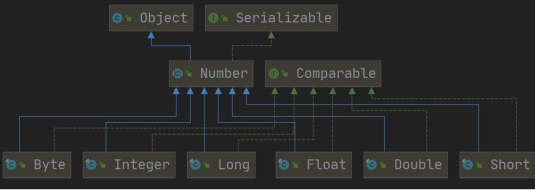
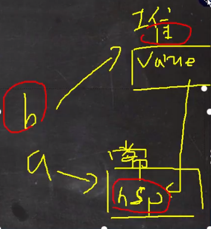

# [常用类](./TCH_Han/Chapter13.md)  
# 值得注意的概念
- 只要有基本数据类型，==判断的是值是否相同
- 字符串本质是字符数组，并且为final，final的意思是该数组地址不可改而不是内容不可改
- 
-  
1. [](#1)
2. [](#2)
3. [](#3)
4. [](#4)
5. [作业](#作业)  
# 1

## 1.1包装类的分类

1. 针对八种基本数据类型相应的引用类型---包装类
2. 有了类的特点，就可以调用类中的方法
3. 如图：


下面三张图是类的继承关系图。





## 1.2包装类和基本数据的转换

1. jdk5前的手动装箱和拆箱方式，装箱：基本类型->包装类型，反之，拆箱
2. jdk5以后（含5）的自动装箱和拆箱方式
3. 自动装箱底层调用的是valueof方法，比如Integer.valueOf()
4. 其它包装类的用法类似

```    java
package com.hspedu.wrapper;

public class Integer01 {
    public static void main(String[] args) {
        //演示int <--> Integer 的装箱和拆箱
        //jdk5前是手动装箱和拆箱
        //手动装箱 int->Integer
        int n1 = 100;
        Integer integer = new Integer(n1);
        Integer integer1 = Integer.valueOf(n1);

        //手动拆箱
        //Integer -> int
        int i = integer.intValue();

        //jdk5后，就可以自动装箱和自动拆箱
        int n2 = 200;
        //自动装箱 int->Integer
        Integer integer2 = n2; //底层使用的是 Integer.valueOf(n2)
        //自动拆箱 Integer->int
        int n3 = integer2; //底层仍然使用的是 intValue()方法
    }
}
```

## 1.3课堂练习(1)：判断结果

```java
Object obj1 = true? new Integer(1) : new Double(2.0);
System.out.println(obk1);
```

**这里输出是1.0,因为三元运算符要看成一个整体**，虽然是用Integer的语句，但是后面有Double，而Double的优先级要大于Integer，所以会自动转型。


## 1.4包装类型和String类型的相互转换

```java
package com.hspedu.wrapper;

public class WrapperVSString {
    public static void main(String[] args) {
        //包装类(Integer)->String
        Integer i = 100;//自动装箱
        //方式1
        String str1 = i + "";
        //方式2
        String str2 = i.toString();
        //方式3
        String str3 = String.valueOf(i);

        //String -> 包装类(Integer)
        String str4 = "12345";
        Integer i2 = Integer.parseInt(str4);//使用到自动装箱
        Integer i3 = new Integer(str4);//构造器

        System.out.println("ok~~");

    }
}
```


## 1.5Integer类型和Charater类的常用方法

```java
public class WrapperMethod { 
    public static void main(String[] args) { 	
        System.out.println(Integer.MIN_VALUE); //返回最小值                           
        System.out.println(Integer.MAX_VALUE);//返回最大值 
        System.out.println(Character.isDigit('a'));//判断是不是数字 
        System.out.println(Character.isLetter('a'));//判断是不是字母 
        System.out.println(Character.isUpperCase('a'));//判断是不是大写 
        System.out.println(Character.isLowerCase('a'));//判断是不是小写 
        System.out.println(Character.isWhitespace('a'));//判断是不是空格 
        System.out.println(Character.toUpperCase('a'));//转成大写 
        System.out.println(Character.toLowerCase('A'));//转成小写 
    } 
}
```


## 1.6Integer类面试题

### 1.6.1面试1

```java
public class WrapperExercise02 {
    public static void main(String[] args) {
        Integer i = new Integer(1);
        Integer j = new Integer(1);
        System.out.println(i == j);
  
        Integer m = 1; 
        Integer n = 1;
        System.out.println(m == n); 
       
        Integer x = 128;
        Integer y = 128;
        System.out.println(x == y);

    }
}
```

- 两个new对象 为false
- 底层 Integer.valueOf(1); -> 阅读源码 发现在范围区间，为true
- 不在范围区间，为false


### 1.6.2面试2

```java
//示例1
Integer i1 = new Integer(127);
Integer i2 = new Integer(127);
System.out.println()i1 == i2;

//示例2
Integer i3 = new Integer(128);
Integer i4 = new Integer(128);
System.out.println(i3 == i4);

//示例3
Integer i5 = 127;
Integer i6 = 127;
System.out.println(i5 == i6);

//示例4
Integer i7 = 128;
Integer i8 = 128;
System.out.println(i7 == i8);

//示例5
Integer i9 = 127;
Integer i10 = new Integer(127);
System.out.println(i9 == i10);

//示例6
Integer i11 = 127;
int i12 = 127;
System.out.println(i11 == i12);

//示例7
Integer i13 = 128;
int i14 = 128;
System.out.println(i13 == i14);

//F F T F F T T
```

**案例六和七是因为只要有基本数据类型，判断的是值是否相同。**

# 2

## 2.1String类的理解和创建对象


- 串行化的意思是指可以在网络上传输
- 字符串本质是字符数组，并且为final，final的意思是该数组地址不可改而不是内容不可改


1. String 对象用于保存字符串，也就是一组字符序列

2.  "jack" 字符串常量, 双引号括起的字符序列

3. 字符串的字符使用Unicode字符编码，一个字符(不区分字母还是汉字)占两个字节

4. String 类有很多构造器，构造器的重载

   ```java
   //   常用的有 String  s1 = new String(); 
   String  s2 = new String(String original);
   String  s3 = new String(char[] a);
   String  s4 =  new String(char[] a,int startIndex,int count)
   String s5 = new String(byte[] b)
   ```

5. String 类实现了接口 Serializable【String 可以串行化:可以在网络传输】接口 Comparable [String 对象可以比较大小]

6.  String 是final 类，不能被其他的类继承

7. String 有属性 private final char value[]; 用于存放字符串内容

8.  一定要注意：value 是一个final类型， 不可以修改(需要功力)：即value不能指向新的地址，但是单个字符内容是可以变化

   ```java
   final char[] value = {'a', 'b', 'c'};
   char[] v2 = {'c', 'b', 'a'};
   value = v2;//错误！
   
   char[] value = {'a', 'b', 'c'};
   char[] v2 = {'c', 'b', 'a'};
   value = v2;//正确~
   ```

   


## 2.2创建String对象

### 2.2.1两种方式

1. 方式一：直接赋值
   - ```String s  = "CDUY333;"```
2. 方式二：调用构造器
   - ```String s  = new String("CDUY333");```


### 2.2.2两种方式的区别

1. 方式一：```String s  = "CDUY333;"```
   - 先**从常量池**查看是否有“CDUY333”数据空间，如果有，直接指向；如果没有则重新创建，然后指向。s最终指向的是常量池的空间地址。
2. 方式二：```String s  = new String("CDUY333");```
   - 先在**堆中**创建空间，里面维护了value属性，指向常量池的CDUY333空间。如果常量池没有“CDUY333”,重新创建，如果有，直接通过value指向。最终指向的是堆中的空间地址。
3. 内存分布图：


## 2.3课堂练习

### 2.3.1练习1

```java
public class StringExercise01 {
    public static void main(String[] args) {
        String a = "abc";
        String b ="abc";
        System.out.println(a.equals(b));
        System.out.println(a==b); 
    }
}
```

- equals在String中有重写方法，是一个一个字符来比较
- ```==```是比地址，然而它们的地址是相同的，只要在常量池中存在```abc```，**再创建一个字符时便会指向该地址**,**不要与new弄混了**，如果是```new String("abc");```，那么也是不同的。


### 2.3.2练习2

```java
String a = "hsp";
String b = new String("hsp");
System.out.println(a.equals(b));
System.out.println(a==b);
System.out.println(a==b.intern());
System.out.println(b==b.intern());
```

- T
- F 因为```b```用```new```创建对象，该对象保存的数值是一个地址即常量池中的```a```。当a与b用```==```进行比较时，比的是各自的地址，而不是各自的值。所以两者不相同。



- T ```b.intern()```方法最终返回的是常量池的地址（对象）

- F


### 2.2.3练习(3)

```java
Person p1 = new Person();
p1.name = "hspedu";
Person p2 = new Person();
p2.name = "hspedu";


System.out.println(p1.name.equals(p2.name));
System.out.println(p1.name == p2.name);  
System.out.println(p1.name == "hspedu");   

String s1 = new String("bcde");
String s2 = new String("bcde");
System.out.println(s1==s2); 

class Person {
    public String name;
}
```

- T 这个是String，在字符串中有重写equals方法，所以判断的是内容
- T p1.name或p2.name都是向位于常量池hspdedu的地址，因为String是引用变量，所以==比较的是地址，所以是相同的，
  - 那么既然p1.name是一个地址，为什么使用输出语句时可以输出字符串呢？这是因为String的默认方法就是调用toString。
  - 如果想查看p1与p2的地址可以打印其hascode，会发现是一样的。
- T 看图
- F


```java
Person p1 = new Person();
p1.name = "hspedu";
Person p2 = new Person();
p2.name = new String("hspedu");

System.out.println(p1.name.hashCode());
System.out.println(p2.name.hashCode());
System.out.println(p1.name == p2.name);
```

那我现在再折腾一下，写出结果。

- 既然有new那么他们肯定是不相同了（第三行的输出语句）
- 可是，为什么p1和p2的hasCode任然是相同呢？
  - 因为new后，p2.name的指向是堆的另外一个“东西”而不是常量池，所以p1.name == p2.name是不相同的，但堆里面的数据保存的仍然是hspedu位于常量池中的地址


## 2.4字符串的特性

1. ```String```是一个```final```类，代表不可变的字符序列
2. 字符串是不可变，一个字符串对象一旦被分配，其内容是不可变的

```java
//以下语句创建了几个对象
String s1 = "hello";
s1 = "haha";
```

- 创建了两个对象，原有的“hello”并不会消失，但是s1与hello的连接会被替换成“haha“。


## 2.5面试题

### 2.5.1

```java
//以下语句会创建几个对象
String a = "hello" + "abc";
```

- 一个，编译器会将语句优化为```String a = "helloabc"```。


### 2.5.2

```java
//以下语句会创建几个对象
String a = "hello";
String b = "abc";
//1. 先 创建一个 StringBuilder sb = StringBuilder()
//2. 执行  sb.append("hello");
//3. sb.append("abc");
//4. String c= sb.toString()
//最后其实是 c 指向堆中的对象(String) value[] -> 池中 "helloabc"
String c = a + b;
```

- **注意第三句写法与```String a = "hello" + "abc";是不一样的。 ```**
- 有三个对象，其中c的指向是堆，堆中是一个value数组指向位于常量池中的新常量“helloabc”。


```java
String a = "hello";
String b = "abc";
String c = a + b;
String d = "helloabc";
System,.ouyt.println(c == d);
```

- 答案是F，**因为c与d是对象，既然是对象比较的是地址。**


### 2.5.3韩老师小结

底层是(下面代码)，并且append是在原来字符串的基础上追加的

```java
StringBuilder sb = new StringBuilder();
sb.append(a);
sb.append(b);
```

**重要规则**，String c1 = "ab" + "cd"; **常量相加，看的是池。** ```String c1= a + b;```**变量相加，是在堆中。**


## 2.6String类的常见方法

### 2.6.1


### 2.6.2String常见方法一览


## 2.7StringBuffer类

### 2.7.1简要介绍

- java.lang.StringBuffer代表可变的字符序列，可以对字符串内容就行增删
- 很多方法与String相同，但StringBuffer是可变长度的
- StringBuffer是一个容器


### 2.7.2String vs StringBuffer


### 2.7.3StringBuffer常见方法


### 2.7.4课堂测试题


## 2.8StringBuilder

### 2.8.1StringBuilder基本介绍


### 2.8.2StringBuilder常用方法


### 2.8.3String vs StringBuffer vs StringBuilder比较及效率测试


## 2.9String vs StringBuffer vs StringBuilder的选择

# 3

## 3.1MATH类的介绍

Math 类包含用于执行基本数学运算的方法，如初等指数、对数、平方根和三角函数。 

## 3.2方法一览(均为静态方法)


## 3.3Math 类常见方法应用案例

```
```
# 4

## 4.1Arrays 类常见方法应用案例 

Arrays中包含一系列静态方法，用于管理或操作数组

1. toString返回数组的字符串形式
2. sort排序（自然排序和定制排序）
3. binarySearch通过二分法搜索继续查找，要求必须排好序
4. copyOf数组元素的复制
5. fill数组元素的填充
6. equals比较两个数组元素内容是否完全一致
7. asList将一组值转换成List


## 4.2课堂练习(1)：Arrays 类课堂练习


# 5

## 5.1System 类常见方法和案例 


# 6

## 6.1BigInteger 和 BigDecimal 类 介绍

1. BigInteger适合保存比较大的整形
2. BigBecimal适合保存精度更高的浮点型（小数）


## 6.2BigInteger 和 BigDecimal 常见方法

1. add
2. subtract
3. multiply
4. divide


# 7

## 7.1日期类---第一代


## 7.2日期类---第二代


## 7.3日期类---第三代


## 7.4DateTimeFormatter 格式日期类


## 7.5Instant 时间戳


## 7.6第三代日期类更多方法

# 作业

```
```