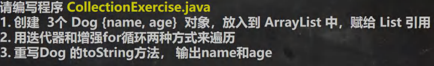
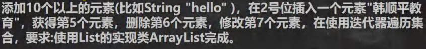

# [集合](./TCH_Han/Chapter14.md)  
# 值得注意的概念
- 
- 
- 
-  
1. [](#1)
2. [](#2)
3. [](#3)
4. [](#4)
5. [作业](#作业)  
# 1

## 1.1集合的基本简介

数组的缺陷：

1. 长度开始时必须指定，而且一旦指定，不能更改。
2. 保存的必须为同一类型的元素。
3. 使用数组进行增加/删除元素比较麻烦


集合：

1. 可以**动态保存**任意多个对象，使用比较方便
2. 提供了一些列方便的操作对象的方法：add、remove、set、get
3. 使用集合添加、删除元素简洁明了

```    
```


## 1.2```Collection```接口实现类的特点

```java
public interface Collection<E> extends Iterable<E>
```

1. ```Collection```实现子类可以存放多个元素，每个元素可以是```Object```
2. 有些```Collection```的实现类，可以存放重复的元素，有些不行
3. 有些```Collection```的实现类，有些事有序的List，有些不是有序Set
4. ```Collection```接口没有直接的实现子类，是通过它的子接口Set和List来实现的


### 1.2.1```Collection```接口遍历元素方式1-使用 Iterator(迭代器)


### 1.2.2Collection 接口遍历对象方式 2-for 循环增强


### 1.2.3课堂练习




# 2

## 2.1List 接口和常用方法

### 2.1.1List 接口基本介绍

```
```


### 2.1.2List 接口的常用方法


### 2.1.3List 接口课堂练习 




### 2.1.4List 的三种遍历方式 [ArrayList, LinkedList,Vector]


### 2.1.5实现类的课堂练习 2


## 2.2ArrayList 底层结构和源码分析

### 2.2.1ArrayList 的注意事项


### 2.2.2ArrayList 的底层操作机制源码分析(重点，难点.)


## 2.3Vector 底层结构和源码剖析

### 2.3.1Vector 的基本介绍


### 2.3.2Vector 和 ArrayList 的比较

|           | 底层结构         | 版本   | 线程安全（同步）效率 | 扩容倍数                                                     |
| --------- | ---------------- | ------ | -------------------- | ------------------------------------------------------------ |
| ArrayList | 可变数组         | jdk1.2 | 不安全，效率高       | 如果有参构造1.5倍，如果是无参1.第一次10 2.从第二次开始按1.5扩 |
| Vector    | 可变数组Object[] | jdk1.0 | 安全，效率不高       | 如果是无参，默认10满后，就按2倍扩容，如果指定大小，则每次直接按2倍扩容 |


## 2.4LinkedList 底层结构

### 2.4.1LinkedList 的全面说明 

1. LinkedList底层实现类双向链表和双端队列特点
2. 可以添加任意元素（元素可以重复），包括null
3. 线程不安全，没有实现同步


### 2.4.2LinkedList 的底层操作机制


### 2.4.3LinkedList 的增删改查案例


## 2.5ArrayList 和 LinkedList 的比较

|            | 底层结构 | 增删的效率         | 该查的效率 |
| ---------- | -------- | ------------------ | ---------- |
| ArrayList  | 可变数组 | 较低 数组扩容      | 较高       |
| LinkedList | 双向链表 | 较高，通过链表追加 | 较低       |


# 3

## 3.1Set 接口和常用方法

### 3.1.1Set 接口基本介绍

1. 无序（添加和取出的顺序不一致），没有索引
2. 不允许重复元素，所以最多包含一个null
3. JDK API中set接口的实现类有


### 3.1.2Set 接口的常用方法

和 List 接口一样, Set 接口也是 Collection 的子接口，因此，常用方法和 Collection 接口一样


### 3.1.3Set 接口的遍历方式


### 3.1.4Set 接口的常用方法举例


## 3.2Set 接口实现类-HashSet 

### 3.2.1HashSet 的全面说明


### 3.2.2HashSet 案例说明


### 3.2.3HashSet 底层机制说明 


### 3.2.4HashSet 课堂练习 1


### 3.2.5HashSet 课后练习 2


## 3.3Set 接口实现类-LinkedHashSet

### 3.3.1LinkedHashSet 的全面说明 


### 3.3.2LinkedHashSet 课后练习题 LinkedHashSetExercise.java


## 3.4Map 接口和常用方法


### 3.4.1Map 接口实现类的特点 [很实用]


### 3.4.2Map 接口常用方法


### 3.4.3Map 接口遍历方法


### 3.4.4Map 接口课堂练习 


## 3.5Map 接口实现类-HashMap 


### 3.5.1HashMap 小结 


### 3.5.2HashMap 底层机制及源码剖析


### 3.5.3HashMap 底层机制及源码剖析


## 3.6Map 接口实现类-Hashtable

### 3.6.1HashTable 的基本介绍


### 3.6.2Hashtable 和 HashMap 对比

|           | 版本 | 线程安全（同步） | 效率 | 允许null健null值 |
| --------- | ---- | ---------------- | ---- | ---------------- |
| HashMap   | 1.2  | 不安全           | 高   | 可以             |
| Hashtable | 1.0  | 安全             | 较低 | 不可以           |


## 3.7Map 接口实现类-Properties

### 3.7.1基本介绍 


### 3.7.2基本使用 


## 3.86总结-开发中如何选择集合实现类(记住)

```
```
# 4

## 4.1Collections 工具类

### 4.1.1Collections 工具类介绍 


### 4.1.2排序操作：（均为 static 方法)


### 4.1.3排序操作：（均为 static 方法) 


### 4.1.4查找、替换

```
```
# 作业
```
```