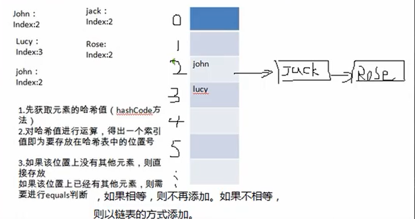
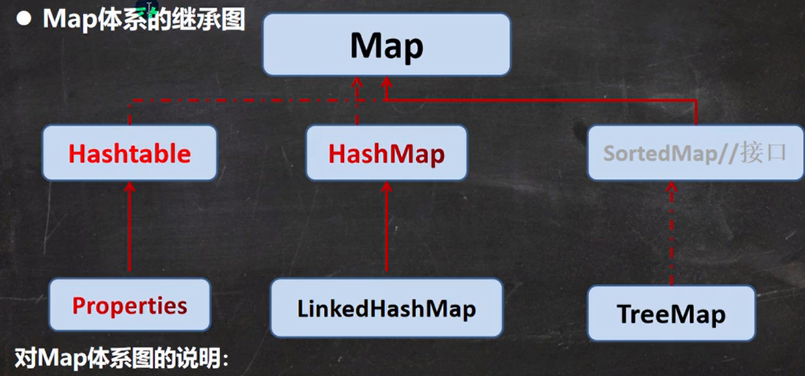

# [集合](./TCH_Han/Chapter14.md)  
# 值得注意的概念
- ```itit```快速生成while循环
- idea在默认下回阉割部分数据显示，在Build,Execution...->Debugger->Data Views->Java->取消勾选Enblde altermative view for...
- set接口对象不能用普通for循环，因为不能通过索引获取
-  ```HashSet```是无序的，因为没有头结点，所以第一个取得数据取决于放的顺序，```LinkedHashSet```是有序的，因为有头结点。
1. [](#1)
2. [](#2)
3. [](#3)
4. [](#4)
5. [作业](#作业)  
# 1

## 1.1集合的基本简介

### 1.1.1数组的缺陷：

1. 长度开始时必须指定，而且一旦指定，不能更改。
2. 保存的必须为同一类型的元素。
3. 使用数组进行增加/删除元素比较麻烦


### 1.1.2集合：

1. 可以**动态保存**任意多个对象，使用比较方便
2. 提供了一些列方便的操作对象的方法：add、remove、set、get
3. 使用集合添加、删除元素简洁明了


### 1.1.3基本介绍

**两图必记**

1. 集合主要是两组(单列集合 , 双列集合)
2. Collection 接口有两个重要的子接口 List Set , 他们的实现子类都是单列集合
3. Map 接口的实现子类 是双列集合，存放的 K-V
4. 把老师梳理的两张图记住

- 单列集合


- 双列集合


## 1.2```Collection```接口实现类的特点

```java
public interface Collection<E> extends Iterable<E>
```

1. ```Collection```实现子类可以存放多个元素，每个元素可以是```Object```
2. 有些```Collection```的实现类，可以存放重复的元素，有些不行
3. 有些```Collection```的实现类，有些事有序的List，有些不是有序Set
4. ```Collection```接口没有直接的实现子类，是通过它的子接口Set和List来实现的

```java
package com.hspedu.collection_;

import java.util.ArrayList;
import java.util.List;

public class CollectionMethod {
    @SuppressWarnings({"all"})
    public static void main(String[] args) {
        List list = new ArrayList();
//        add:添加单个元素
        list.add("jack");
        list.add(10);//list.add(new Integer(10))
        list.add(true);
        System.out.println("list=" + list);
//        remove:删除指定元素
        //list.remove(0);//删除第一个元素
        list.remove(true);//指定删除某个元素
        System.out.println("list=" + list);
//        contains:查找元素是否存在
        System.out.println(list.contains("jack"));//T
//        size:获取元素个数
        System.out.println(list.size());//2
//        isEmpty:判断是否为空
        System.out.println(list.isEmpty());//F
//        clear:清空
        list.clear();
        System.out.println("list=" + list);
//        addAll:添加多个元素
        ArrayList list2 = new ArrayList();
        list2.add("红楼梦");
        list2.add("三国演义");
        list.addAll(list2);
        System.out.println("list=" + list);
//        containsAll:查找多个元素是否都存在
        System.out.println(list.containsAll(list2));//T
//        removeAll：删除多个元素
        list.add("聊斋");
        list.removeAll(list2);
        System.out.println("list=" + list);//[聊斋]
//        说明：以ArrayList实现类来演示.

    }
}
```


### 1.2.1```Collection```接口遍历元素方式1-使用 Iterator(迭代器)


```java
package com.hspedu.collection_;


import java.util.ArrayList;
import java.util.Collection;
import java.util.Iterator;

public class CollectionIterator {
    @SuppressWarnings({"all"})
    public static void main(String[] args) {

        Collection col = new ArrayList();//向上转型

        col.add(new Book("三国演义", "罗贯中", 10.1));
        col.add(new Book("小李飞刀", "古龙", 5.1));
        col.add(new Book("红楼梦", "曹雪芹", 34.6));


        //System.out.println("col=" + col);
        //现在老师希望能够遍历 col集合
        //1. 先得到 col 对应的 迭代器
        Iterator iterator = col.iterator();
        //2. 使用while循环遍历 快速生成 while => itit
        //显示所有的快捷键的的快捷键 ctrl + j
        while (iterator.hasNext()) {
            //返回下一个元素，类型是Object 并多态绑定
            Object obj = iterator.next();
            System.out.println("obj=" + obj);

        }
        //3. 当退出while循环后 , 这时iterator迭代器，指向最后的元素
        //   iterator.next();//NoSuchElementException
        //4. 如果希望再次遍历，需要重置我们的迭代器
        iterator = col.iterator();//重置
        System.out.println("===第二次遍历===");
        while (iterator.hasNext()) {
            Object obj = iterator.next();
            System.out.println("obj=" + obj);

        }

    }
}

class Book {
    private String name;
    private String author;
    private double price;

    public Book(String name, String author, double price) {
        this.name = name;
        this.author = author;
        this.price = price;
    }

    public String getName() {
        return name;
    }

    public void setName(String name) {
        this.name = name;
    }

    public String getAuthor() {
        return author;
    }

    public void setAuthor(String author) {
        this.author = author;
    }

    public double getPrice() {
        return price;
    }

    public void setPrice(double price) {
        this.price = price;
    }

    @Override
    public String toString() {
        return "Book{" +
                "name='" + name + '\'' +
                ", author='" + author + '\'' +
                ", price=" + price +
                '}';
    }
}
```


### 1.2.2Collection 接口遍历对象方式 2-for 循环增强

**特点：**增强for就是简化版的iterator，本质相同，只能用于遍历集合或数组。

**基本语法**

```java
for (元素类型 元素名 : 集合名或数组名) {
    访问元素
}
```

```java
package com.hspedu.collection_;

import java.util.ArrayList;
import java.util.Collection;

public class CollectionFor {
    @SuppressWarnings({"all"})
    public static void main(String[] args) {
        Collection col = new ArrayList();

        col.add(new Book("三国演义", "罗贯中", 10.1));
        col.add(new Book("小李飞刀", "古龙", 5.1));
        col.add(new Book("红楼梦", "曹雪芹", 34.6));

        //老韩解读
        //1. 使用增强for, 在Collection集合
        //2. 增强for， 底层仍然是迭代器
        //3. 增强for可以理解成就是简化版本的 迭代器遍历
        //4. 快捷键方式 I
//        for (Object book : col) {
//            System.out.println("book=" + book);
//        }
        for (Object o : col) {
            System.out.println("book=" + o);
        }

        //增强for，也可以直接在数组使用
//        int[] nums = {1, 8, 10, 90};
//        for (int i : nums) {
//            System.out.println("i=" + i);
//        }


    }
}
```


### 1.2.3课堂练习

**要求**

 * 创建  3个 Dog {name, age}  对象，放入到 ArrayList 中，赋给 List 引用
 * 用迭代器和增强for循环两种方式来遍历
 * 重写Dog 的toString方法， 输出name和age

```java
package com.hspedu.collection_;

import java.util.ArrayList;
import java.util.Iterator;
import java.util.List;


public class CollectionExercise {
    @SuppressWarnings({"all"})
    public static void main(String[] args) {
        List list = new ArrayList();
        list.add(new Dog("小黑", 3));
        list.add(new Dog("大黄", 100));
        list.add(new Dog("大壮", 8));


        //先使用for增强
        for (Object dog : list) {
            System.out.println("dog=" + dog);
        }

        //使用迭代器
        System.out.println("===使用迭代器来遍历===");
        Iterator iterator = list.iterator();
        while (iterator.hasNext()) {
            Object dog =  iterator.next();
            System.out.println("dog=" + dog);

        }

    }
}

class Dog {
    private String name;
    private int age;

    public Dog(String name, int age) {
        this.name = name;
        this.age = age;
    }

    public String getName() {
        return name;
    }

    public void setName(String name) {
        this.name = name;
    }

    public int getAge() {
        return age;
    }

    public void setAge(int age) {
        this.age = age;
    }

    @Override
    public String toString() {
        return "Dog{" +
                "name='" + name + '\'' +
                ", age=" + age +
                '}';
    }
}
```


# 2

## 2.1List 接口和常用方法

### 2.1.1List 接口基本介绍

```java
package com.hspedu.list_;

import java.util.ArrayList;
import java.util.List;

public class List_ {
    @SuppressWarnings({"all"})
    public static void main(String[] args) {
        //1. List集合类中元素有序(即添加顺序和取出顺序一致)、且可重复 [案例]
        List list = new ArrayList();
        list.add("jack");
        list.add("tom");
        list.add("mary");
        list.add("hsp");
        list.add("tom");
        System.out.println("list=" + list);
        //2. List集合中的每个元素都有其对应的顺序索引，即支持索引
        //   索引是从0开始的
        System.out.println(list.get(3));//hsp
        //3.
    }
}
```


### 2.1.2List 接口的常用方法


```java
package com.hspedu.list_;

import java.util.ArrayList;
import java.util.List;

public class ListMethod {
    @SuppressWarnings({"all"})
    public static void main(String[] args) {
        List list = new ArrayList();
        list.add("张三丰");
        list.add("贾宝玉");
//        void add(int index, Object ele):在index位置插入ele元素
        //在index = 1的位置插入一个对象
        list.add(1, "韩顺平");
        System.out.println("list=" + list);
//        boolean addAll(int index, Collection eles):从index位置开始将eles中的所有元素添加进来
        List list2 = new ArrayList();
        list2.add("jack");
        list2.add("tom");
        list.addAll(1, list2);
        System.out.println("list=" + list);
//        Object get(int index):获取指定index位置的元素
        //说过
//        int indexOf(Object obj):返回obj在集合中首次出现的位置
        System.out.println(list.indexOf("tom"));//2
//        int lastIndexOf(Object obj):返回obj在当前集合中末次出现的位置
        list.add("韩顺平");
        System.out.println("list=" + list);
        System.out.println(list.lastIndexOf("韩顺平"));
//        Object remove(int index):移除指定index位置的元素，并返回此元素
        list.remove(0);
        System.out.println("list=" + list);
//        Object set(int index, Object ele):设置指定index位置的元素为ele , 相当于是替换.
        list.set(1, "玛丽");
        System.out.println("list=" + list);
//        List subList(int fromIndex, int toIndex):返回从fromIndex到toIndex位置的子集合
        // 注意返回的子集合 fromIndex <= subList < toIndex
        List returnlist = list.subList(0, 2);
        System.out.println("returnlist=" + returnlist);

    }
}
```


### 2.1.3List 接口课堂练习 

- 添加10个以上的元素(比如String "hello" )，在2号位插入一个元素"韩顺平教育"，获得第5个元素，删除第6个元素，修改第7个元素，在使用迭代器遍历集合，要求:使用List的实现类ArrayList完成。

```java
package com.hspedu.list_;

import java.util.ArrayList;
import java.util.Iterator;
import java.util.List;

public class ListExercise {
    @SuppressWarnings({"all"})
    public static void main(String[] args) {
     
        List list = new ArrayList();
        for (int i = 0; i < 12; i++) {
            list.add("hello" + i);
        }
        System.out.println("list=" + list);

        //在2号位插入一个元素"韩顺平教育"
        list.add(1, "韩顺平教育");
        System.out.println("list=" + list);
        //获得第5个元素
        System.out.println("第五个元素=" + list.get(4));
        //删除第6个元素
        list.remove(5);
        System.out.println("list=" + list);
        //修改第7个元素
        list.set(6, "三国演义");
        System.out.println("list=" + list);

        //在使用迭代器遍历集合
        Iterator iterator = list.iterator();
        while (iterator.hasNext()) {
            Object obj =  iterator.next();
            System.out.println("obj=" + obj);
        }
    }
}
```


### 2.1.4List 的三种遍历方式 [ArrayList, LinkedList,Vector]


### 2.1.5实现类的课堂练习 2

```java
package com.java.learn_han.chapter14.list_;

import java.util.ArrayList;
import java.util.List;

public class ListExercise02 {
    public static void main(String[] args) {
        List list = new ArrayList();
        list.add(new Book("红楼梦", "曹雪芹", 1000));
        list.add(new Book("西游记", "吴承恩", 100));
        list.add(new Book("水浒传", "施耐庵", 10));

        for (Object o : list) {
            System.out.println(o);
        }

        for (int i = 1; i < list.size(); i++) {
            for (int j = 0; j < list.size() - 1; j++) {
                Book book1 = (Book) list.get(j);//向下转型 因为返回的是 Object
                Book book2 = (Book) list.get(j + 1);

                if (book1.getPrice() > book2.getPrice()) {
                    list.set(j, book2);
                    list.set(j+1,book1);
                }
            }
        }
        System.out.println("======排序后======");
        for (Object o : list) {
            System.out.println(o);
        }
    }
}

class Book {
    private String name;
    private String author;
    private double price;

    public Book(String name, String author, double price) {
        this.name = name;
        this.author = author;
        this.price = price;
    }

    public String getName() {
        return name;
    }

    public void setName(String name) {
        this.name = name;
    }

    public String getAuthor() {
        return author;
    }

    public void setAuthor(String author) {
        this.author = author;
    }

    public double getPrice() {
        return price;
    }

    public void setPrice(double price) {
        this.price = price;
    }

    @Override
    public String toString() {
        return "Book{" +
                "name='" + name + '\'' +
                "author" + author + '\n' +
                ", price=" + price +
                '}';
    }
}
```


## 2.2ArrayList 底层结构和源码分析

### 2.2.1ArrayList 的注意事项


### 2.2.2ArrayList 的底层操作机制源码分析(重点，难点.)


## 2.3Vector 底层结构和源码剖析

### 2.3.1Vector 的基本介绍


### 2.3.2Vector 和 ArrayList 的比较

|                 | 底层结构         | 版本   | 线程安全（同步）效率 | 扩容倍数                                                     |
| --------------- | ---------------- | ------ | -------------------- | ------------------------------------------------------------ |
| ```ArrayList``` | 可变数组         | jdk1.2 | 不安全，效率高       | 如果有参构造1.5倍，如果是无参1.第一次10 2.从第二次开始按1.5扩 |
| ```Vector```    | 可变数组Object[] | jdk1.0 | 安全，效率不高       | 如果是无参，默认10满后，就按2倍扩容，如果指定大小，则每次直接按2倍扩容 |


## 2.4LinkedList 底层结构

### 2.4.1LinkedList 的全面说明 

1. LinkedList底层实现类双向链表和双端队列特点
2. 可以添加任意元素（元素可以重复），包括null
3. 线程不安全，没有实现同步


### 2.4.2LinkedList 的底层操作机制


```java
package com.hspedu.list_;

public class LinkedList01 {
    public static void main(String[] args) {
        //模拟一个简单的双向链表

        Node jack = new Node("jack");
        Node tom = new Node("tom");
        Node hsp = new Node("老韩");

        //连接三个结点，形成双向链表
        //jack -> tom -> hsp
        jack.next = tom;
        tom.next = hsp;
        //hsp -> tom -> jack
        hsp.pre = tom;
        tom.pre = jack;

        Node first = jack;//让first引用指向jack,就是双向链表的头结点
        Node last = hsp; //让last引用指向hsp,就是双向链表的尾结点


        //演示，从头到尾进行遍历
        System.out.println("===从头到尾进行遍历===");
        while (true) {
            if(first == null) {
                break;
            }
            //输出first 信息
            System.out.println(first);
            first = first.next;
        }

        //演示，从尾到头的遍历
        System.out.println("====从尾到头的遍历====");
        while (true) {
            if(last == null) {
                break;
            }
            //输出last 信息
            System.out.println(last);
            last = last.pre;
        }

        //演示链表的添加对象/数据，是多么的方便
        //要求，是在 tom --------- 老韩直接，插入一个对象 smith

        //1. 先创建一个 Node 结点，name 就是 smith
        Node smith = new Node("smith");
        //下面就把 smith 加入到双向链表了
        smith.next = hsp;
        smith.pre = tom;
        hsp.pre = smith;
        tom.next = smith;

        //让first 再次指向jack
        first = jack;//让first引用指向jack,就是双向链表的头结点

        System.out.println("===从头到尾进行遍历===");
        while (true) {
            if(first == null) {
                break;
            }
            //输出first 信息
            System.out.println(first);
            first = first.next;
        }

        last = hsp; //让last 重新指向最后一个结点
        //演示，从尾到头的遍历
        System.out.println("====从尾到头的遍历====");
        while (true) {
            if(last == null) {
                break;
            }
            //输出last 信息
            System.out.println(last);
            last = last.pre;
        }


    }
}

//定义一个Node 类，Node 对象 表示双向链表的一个结点
class Node {
    public Object item; //真正存放数据
    public Node next; //指向后一个结点
    public Node pre; //指向前一个结点
    public Node(Object name) {
        this.item = name;
    }
    public String toString() {
        return "Node name=" + item;
    }
}
```


### 2.4.3LinkedList 的增删改查案例

```java
package com.hspedu.list_;

import java.util.Iterator;
import java.util.LinkedList;

@SuppressWarnings({"all"})
public class LinkedListCRUD {
    public static void main(String[] args) {

        LinkedList linkedList = new LinkedList();
        linkedList.add(1);
        linkedList.add(2);
        linkedList.add(3);
        System.out.println("linkedList=" + linkedList);

        //演示一个删除结点的
        linkedList.remove(); // 这里默认删除的是第一个结点
        //linkedList.remove(2);

        System.out.println("linkedList=" + linkedList);

        //修改某个结点对象
        linkedList.set(1, 999);
        System.out.println("linkedList=" + linkedList);

        //得到某个结点对象
        //get(1) 是得到双向链表的第二个对象
        Object o = linkedList.get(1);
        System.out.println(o);//999

        //因为LinkedList 是 实现了List接口, 遍历方式
        System.out.println("===LinkeList遍历迭代器====");
        Iterator iterator = linkedList.iterator();
        while (iterator.hasNext()) {
            Object next =  iterator.next();
            System.out.println("next=" + next);

        }

        System.out.println("===LinkeList遍历增强for====");
        for (Object o1 : linkedList) {
            System.out.println("o1=" + o1);
        }
        System.out.println("===LinkeList遍历普通for====");
        for (int i = 0; i < linkedList.size(); i++) {
            System.out.println(linkedList.get(i));
        }


        //老韩源码阅读.
        /* 1. LinkedList linkedList = new LinkedList();
              public LinkedList() {}
           2. 这时 linkeList 的属性 first = null  last = null
           3. 执行 添加
               public boolean add(E e) {
                    linkLast(e);
                    return true;
                }
            4.将新的结点，加入到双向链表的最后
             void linkLast(E e) {
                final Node<E> l = last;
                final Node<E> newNode = new Node<>(l, e, null);
                last = newNode;
                if (l == null)
                    first = newNode;
                else
                    l.next = newNode;
                size++;
                modCount++;
            }

         */

        /*
          老韩读源码 linkedList.remove(); // 这里默认删除的是第一个结点
          1. 执行 removeFirst
            public E remove() {
                return removeFirst();
            }
         2. 执行
            public E removeFirst() {
                final Node<E> f = first;
                if (f == null)
                    throw new NoSuchElementException();
                return unlinkFirst(f);
            }
          3. 执行 unlinkFirst, 将 f 指向的双向链表的第一个结点拿掉
            private E unlinkFirst(Node<E> f) {
                // assert f == first && f != null;
                final E element = f.item;
                final Node<E> next = f.next;
                f.item = null;
                f.next = null; // help GC
                first = next;
                if (next == null)
                    last = null;
                else
                    next.prev = null;
                size--;
                modCount++;
                return element;
            }
         */
    }
}
```


## 2.5ArrayList 和 LinkedList 的比较

|                  | 底层结构 | 增删的效率         | 该查的效率 |
| ---------------- | -------- | ------------------ | ---------- |
| ```ArrayList```  | 可变数组 | 较低 数组扩容      | 较高       |
| ```LinkedList``` | 双向链表 | 较高，通过链表追加 | 较低       |

**两者都是线程不安全的**

1. 如果改查的操作多，选择ArrayList
2. 如果增删的操作多，选择LinkedList
3. 一般来说，在程序中，80%~90%都是查询，因此大部分情况下选择ArrayList
4. 在一个项目中，根据业务灵活选择，也有可能一个模块内使用ArrayLsit另一模块使用LinkedList

# 3

## 3.1Set 接口和常用方法

### 3.1.1Set 接口基本介绍

1. 无序（添加和取出的顺序不一致），没有索引
2. 不允许重复元素，所以最多包含一个null
3. JDK API中set接口的实现类有【看API】


### 3.1.2Set 接口的常用方法

和 List 接口一样, Set 接口也是 Collection 的子接口，因此，常用方法和 Collection 接口一样


### 3.1.3Set 接口的遍历方式

同Collection的遍历方式一样，以为Set接口是Collection接口的子接口。

1. 可以使用迭代器
2. 增强for
3. **不能使用**索引的方式来获取


### 3.1.4Set 接口的常用方法举例

1. 以Set 接口的实现类 HashSet 来讲解Set 接口的方法
2.  set 接口的实现类的对象(Set接口对象), 不能存放重复的元素, 可以添加一个null
3. set 接口对象存放数据是无序(即添加的顺序和取出的顺序不一致)
4. 注意：取出的顺序的顺序虽然不是添加的顺序，但是他的固定.

```java
package com.hspedu.set_;

import java.util.HashSet;
import java.util.Iterator;
import java.util.Set;

@SuppressWarnings({"all"})
public class SetMethod {
    public static void main(String[] args) {
        //老韩解读
        //1. 以Set 接口的实现类 HashSet 来讲解Set 接口的方法
        //2. set 接口的实现类的对象(Set接口对象), 不能存放重复的元素, 可以添加一个null
        //3. set 接口对象存放数据是无序(即添加的顺序和取出的顺序不一致)
        //4. 注意：取出的顺序的顺序虽然不是添加的顺序，但是他的固定.
        Set set = new HashSet();
        set.add("john");
        set.add("lucy");
        set.add("john");//重复
        set.add("jack");
        set.add("hsp");
        set.add("mary");
        set.add(null);//
        set.add(null);//再次添加null
        for(int i = 0; i <10;i ++) {
            System.out.println("set=" + set);
        }

        //遍历
        //方式1： 使用迭代器
        System.out.println("=====使用迭代器====");
        Iterator iterator = set.iterator();
        while (iterator.hasNext()) {
            Object obj =  iterator.next();
            System.out.println("obj=" + obj);
        }
        set.remove(null);

        //方式2: 增强for
        System.out.println("=====增强for====");

        for (Object o : set) {
            System.out.println("o=" + o);
        }
        //set 接口对象，不能通过索引来获取
    }
}
```


## 3.2Set 接口实现类-HashSet 

### 3.2.1HashSet 的全面说明

1. ```HashSet```实现类Set接口

2. ```HashSet```实际上是HashMap

   - ```java
     public HashSet() {
         map = new HashMap<>();
     }
     ```

3. 可以存放null值，但只能有一个null

4. ```HashSet```不保证元素是有序的，取决于hash后，在确定索引的结果

5. 不能有重复元素/对象，在前面set接口使用讲过


### 3.2.2HashSet 案例说明

**看难题来了部分**

```java
package com.hspedu.set_;

import java.util.HashSet;

@SuppressWarnings({"all"})
public class HashSet01 {
    public static void main(String[] args) {
        HashSet set = new HashSet();

        //说明
        //1. 在执行add方法后，会返回一个boolean值
        //2. 如果添加成功，返回 true, 否则返回false
        //3. 可以通过 remove 指定删除哪个对象
        System.out.println(set.add("john"));//T
        System.out.println(set.add("lucy"));//T
        System.out.println(set.add("john"));//F
        System.out.println(set.add("jack"));//T
        System.out.println(set.add("Rose"));//T

        set.remove("john");
        System.out.println("set=" + set);//3个

        // 难题来了
        set  = new HashSet();
        System.out.println("set=" + set);//0
        //4 Hashset 不能添加相同的元素/数据?
        set.add("lucy");//添加成功
        set.add("lucy");//加入不了
        set.add(new Dog("tom"));//OK
        set.add(new Dog("tom"));//Ok
        System.out.println("set=" + set);

        //在加深一下. 非常经典的面试题.
        //看源码，做分析， 先给小伙伴留一个坑，以后讲完源码，你就了然
        //去看他的源码，即 add 到底发生了什么?=> 底层机制.
        set.add(new String("hsp"));//ok
        set.add(new String("hsp"));//加入不了.
        System.out.println("set=" + set);
    }
}
class Dog { //定义了Dog类
    private String name;

    public Dog(String name) {
        this.name = name;
    }

    @Override
    public String toString() {
        return "Dog{" +
                "name='" + name + '\'' +
                '}';
    }
}
```

#### 值得留意的疑问：为什么```Dog```可以加入但是```String```却加入不了


### 3.2.3```HashSet``` 底层机制说明(1)：整体介绍 




- 即每个下标（索引）就是一个链表，其目的是为了高效

```java
package com.hspedu.set_;

@SuppressWarnings({"all"})
public class HashSetStructure {
    public static void main(String[] args) {
        //模拟一个HashSet的底层 (HashMap 的底层结构)

        //1. 创建一个数组，数组的类型是 Node[]
        //2. 有些人，直接把 Node[] 数组称为 表
        Node[] table = new Node[16];

        //3. 创建结点
        Node john = new Node("john", null);

        table[2] = john;
        Node jack = new Node("jack", null);
        john.next = jack;// 将jack 结点挂载到john
        Node rose = new Node("Rose", null);
        jack.next = rose;// 将rose 结点挂载到jack

        Node lucy = new Node("lucy", null);
        table[3] = lucy; // 把lucy 放到 table表的索引为3的位置.
        System.out.println("table=" + table);


    }
}
class Node { //结点, 存储数据, 可以指向下一个结点，从而形成链表
    Object item; //存放数据
    Node next; // 指向下一个结点

    public Node(Object item, Node next) {
        this.item = item;
        this.next = next;
    }
}
```


### 3.2.4```HashSet``` 底层机制说明(2)：```add```方法


```java
package com.hspedu.set_;

import java.util.HashSet;

/**
 * @author 韩顺平
 * @version 1.0
 */
@SuppressWarnings({"all"})
public class HashSetSource {
    public static void main(String[] args) {

        HashSet hashSet = new HashSet();
        hashSet.add("java");//到此位置，第1次add分析完毕.
        hashSet.add("php");//到此位置，第2次add分析完毕
        hashSet.add("java");
        System.out.println("set=" + hashSet);

        /*
        老韩对HashSet 的源码解读
        1. 执行 HashSet()
            public HashSet() {
                map = new HashMap<>();
            }
        2. 执行 add()
           public boolean add(E e) {//e = "java"
                return map.put(e, PRESENT)==null;//(static) PRESENT = new Object();
           }
         3.执行 put() , 该方法会执行 hash(key) 得到key对应的hash值 算法h = key.hashCode()) ^ (h >>> 16)
             public V put(K key, V value) {//key = "java" value = PRESENT 共享
                return putVal(hash(key), key, value, false, true);
            }
         4.执行 putVal
         final V putVal(int hash, K key, V value, boolean onlyIfAbsent,
                   boolean evict) {
                Node<K,V>[] tab; Node<K,V> p; int n, i; //定义了辅助变量
                //table 就是 HashMap 的一个数组，类型是 Node[]
                //if 语句表示如果当前table 是null, 或者 大小=0
                //就是第一次扩容，到16个空间.
                if ((tab = table) == null || (n = tab.length) == 0)
                    n = (tab = resize()).length;

                //(1)根据key，得到hash 去计算该key应该存放到table表的哪个索引位置
                //并把这个位置的对象，赋给 p
                //(2)判断p 是否为null
                //(2.1) 如果p 为null, 表示还没有存放元素, 就创建一个Node (key="java",value=PRESENT)
                //(2.2) 就放在该位置 tab[i] = newNode(hash, key, value, null)

                if ((p = tab[i = (n - 1) & hash]) == null)
                    tab[i] = newNode(hash, key, value, null);
                else {
                    //一个开发技巧提示： 在需要局部变量(辅助变量)时候，在创建
                    Node<K,V> e; K k; //
                    //如果当前索引位置对应的链表的第一个元素和准备添加的key的hash值一样并且满足 下面两个条件之一:
                    //(1) 准备加入的key 和 p 指向的Node 结点的 key 是同一个对象
                    //(2)  p 指向的Node 结点的 key 的equals() 和准备加入的key比较后相同
                    //就不能加入
                    if (p.hash == hash &&
                        ((k = p.key) == key || (key != null && key.equals(k))))
                        e = p;
                    //再判断 p 是不是一颗红黑树,
                    //如果是一颗红黑树，就调用 putTreeVal , 来进行添加
                    else if (p instanceof TreeNode)
                        e = ((TreeNode<K,V>)p).putTreeVal(this, tab, hash, key, value);
                    else {//如果table对应索引位置，已经是一个链表, 就使用for循环比较
                          //(1) 依次和该链表的每一个元素比较后，都不相同, 则加入到该链表的最后
                          //    注意在把元素添加到链表后，立即判断 该链表是否已经达到8个结点
                          //    , 就调用 treeifyBin() 对当前这个链表进行树化(转成红黑树)
                          //    注意，在转成红黑树时，要进行判断, 判断条件
                          //    if (tab == null || (n = tab.length) < MIN_TREEIFY_CAPACITY(64))
                          //            resize();
                          //    如果上面条件成立，先table扩容.
                          //    只有上面条件不成立时，才进行转成红黑树
                          //(2) 依次和该链表的每一个元素比较过程中，如果有相同情况,就直接break

                        for (int binCount = 0; ; ++binCount) {
                            if ((e = p.next) == null) {
                                p.next = newNode(hash, key, value, null);
                                if (binCount >= TREEIFY_THRESHOLD(8) - 1) // -1 for 1st
                                    treeifyBin(tab, hash);
                                break;
                            }
                            if (e.hash == hash &&
                                ((k = e.key) == key || (key != null && key.equals(k))))
                                break;
                            p = e;
                        }
                    }
                    if (e != null) { // existing mapping for key
                        V oldValue = e.value;
                        if (!onlyIfAbsent || oldValue == null)
                            e.value = value;
                        afterNodeAccess(e);
                        return oldValue;
                    }
                }
                ++modCount;
                //size 就是我们每加入一个结点Node(k,v,h,next), size++
                if (++size > threshold)
                    resize();//扩容
                afterNodeInsertion(evict);
                return null;
            }
         */

    }
}
```


### 3.2.5```HashSet``` 底层机制说明(2)：分析HanSet扩容和转成红黑树机制：


​       

1. HashSet底层是HashMap, 第一次添加时，table 数组扩容到 16，临界值(threshold)是 16*加载因子(loadFactor)是0.75 = 12如果table 数组使用到了临界值 12,就会扩容到 16 * 2 = 32,新的临界值就是 32*0.75 = 24, 依次类推     

```java
public class HashSetIncrement {
	public static void main(String[] args) {
		HashSet hashSet = new HashSet();
       		for(int i = 1; i <= 100; i++) {
            	hashSet.add(i);//1,2,3,4,5...100
        	}
         }
}
```

2. 在Java8中, 如果一条链表的元素个数到达 TREEIFY_THRESHOLD(默认是 8 )，并且table的大小 >= MIN_TREEIFY_CAPACITY(默认64),就会进行树化(红黑树),  否则仍然采用数组扩容机制

```java
package com.hspedu.set_;

import java.util.HashSet;
import java.util.Objects;

@SuppressWarnings({"all"})
public class HashSetIncrement {
    public static void main(String[] args) {

        HashSet hashSet = new HashSet();
        
        for(int i = 1; i <= 12; i++) {
            hashSet.add(new A(i));//
        }
    }
}

class A {
    private int n;

    public A(int n) {
        this.n = n;
    }
    @Override
    public int hashCode() {
        return 100;
    }
}
```


3. 当我们向hashset增加一个元素，-> Node -> 加入table , 就算是增加了一个size++。

```java
package com.hspedu.set_;

import java.util.HashSet;
import java.util.Objects;

@SuppressWarnings({"all"})
public class HashSetIncrement {
    public static void main(String[] args) {

        HashSet hashSet = new HashSet();
        
        for(int i = 1; i <= 7; i++) {//在table的某一条链表上添加了 7个A对象
            hashSet.add(new A(i));//
        }

        for(int i = 1; i <= 7; i++) {//在table的另外一条链表上添加了 7个B对象
            hashSet.add(new B(i));//
        }
    }
}

class B {
    private int n;

    public B(int n) {
        this.n = n;
    }
    @Override
    public int hashCode() {
        return 200;
    }
}

class A {
    private int n;

    public A(int n) {
        this.n = n;
    }
    @Override
    public int hashCode() {
        return 100;
    }
}
```


### 3.2.6```HashSet``` 课堂练习 1

定义一个Employee类，改类包含：private成员属性和name,age要求：

1. 创建3个Employee对象放入HashSet中
2. 当name和age的值相同时，认为是相同员工，不能添加到HashSet集合中

```java
package com.java.learn_han.chapter14.list_;

import java.util.HashSet;
import java.util.Objects;

/**
 * @author CDUY
 * @version 1.0
 */

/*定义一耳光Employee类，改类包含：private成员属性和name,age要求：
        1. 创建3个Employee对象放入HashSet中
        2. 当name和age的值相同时，认为是相同员工，不能添加到HashSet集合中*/
public class HashSetExercise {
    public static void main(String[] args) {
        Employee employee1 = new Employee("小明", 10);
        Employee employee2 = new Employee("小明", 10);
        Employee employee3 = new Employee("小明", 90);

        HashSet hashSet = new HashSet();
        hashSet.add(employee1);
        hashSet.add(employee2);
        hashSet.add(employee3);

        System.out.println(hashSet);
    }
}

class Employee {
    private String name;
    private int age;

    public Employee(String name, int age) {
        this.name = name;
        this.age = age;
    }

   /* @Override 自己写的忽略 应该用快速生成
    public boolean equals(Object obj) {
        if (this.name.equals(((Employee) obj).name) && this.age == ((Employee) obj).age) {
            return true;
        } else {
            return false;
        }
    }*/

    @Override
    public boolean equals(Object o) {
        if (this == o) return true;
        if (!(o instanceof Employee)) return false;
        Employee employee = (Employee) o;
        return age == employee.age &&
                Objects.equals(name, employee.name);
    }

    @Override
    public int hashCode() {
        return Objects.hash(name, age);
    }

    @Override
    public String toString() {
        return "Employee{" +
                "name='" + name + '\'' +
                ", age=" + age +
                '}';
    }
}
```


### 3.2.7```HashSet``` 课后练习 2

- 定义一耳光Employee类，该类包含private成员属性name，sal，birthady(MyDate类型)其中birthday为MyDate类型（属性包括year,month,day）要求

  1. 创建3个Employee放入HashSet中
  2. 当name和birthday的值相同认为是相同员工，不能添加到HashSet中

  ```java
  package com.java.learn_han.chapter14.list_;
  
  import java.util.HashSet;
  import java.util.Objects;
  
  public class HashSetExercise2 {
  public static void main(String[] args) {
          HashSet hashSet = new HashSet();
          hashSet.add(new Employee2("小明",new MyDate(1960,1,1), 11));
          hashSet.add(new Employee2("小明",new MyDate(1960,1,1), 80));
          hashSet.add(new Employee2("小明",new MyDate(1960,1,1), 11));
  
          System.out.println(hashSet);
      }
  }
  
  class MyDate {
      private int year;
      private int month;
      private int day;
  
      public MyDate(int year, int month, int day) {
          this.year = year;
          this.month = month;
          this.day = day;
      }
  
      @Override
      public boolean equals(Object o) {
          if (this == o) return true;
          if (!(o instanceof MyDate)) return false;
          MyDate myDate = (MyDate) o;
          return getYear() == myDate.getYear() &&
                  getMonth() == myDate.getMonth() &&
                  getDay() == myDate.getDay();
      }
  
      @Override
      public int hashCode() {
          return Objects.hash(getYear(), getMonth(), getDay());
      }
  
      public int getYear() {
          return year;
      }
  
      public void setYear(int year) {
          this.year = year;
      }
  
      public int getMonth() {
          return month;
      }
  
      public void setMonth(int month) {
          this.month = month;
      }
  
      public int getDay() {
          return day;
      }
  
      public void setDay(int day) {
          this.day = day;
      }
  
      @Override
      public String toString() {
          return "MyDate{" +
                  "year=" + year +
                  ", month=" + month +
                  ", day=" + day +
                  '}';
      }
  }
  
  class Employee2 {
      private String name;
      private MyDate birthday;
      private int age;
  
      public Employee2(String name, MyDate birthday, int age) {
          this.name = name;
          this.birthday = birthday;
          this.age = age;
      }
  
      @Override
      public boolean equals(Object o) {
          if (this == o) return true;
          if (!(o instanceof Employee2)) return false;
          Employee2 employee2 = (Employee2) o;
          return getAge() == employee2.getAge() &&
                  Objects.equals(getName(), employee2.getName()) &&
                  Objects.equals(getBirthday(), employee2.getBirthday());
      }
  
      @Override
      public int hashCode() {
          return Objects.hash(getName(), getBirthday(), getAge());
      }
  
      public String getName() {
          return name;
      }
  
      public void setName(String name) {
          this.name = name;
      }
  
      public MyDate getBirthday() {
          return birthday;
      }
  
      public void setBirthday(MyDate birthday) {
          this.birthday = birthday;
      }
  
      public int getAge() {
          return age;
      }
  
      public void setAge(int age) {
          this.age = age;
      }
  
      @Override
      public String toString() {
          return "Employee2{" +
                  "name='" + name + '\'' +
                  ", birthday=" + birthday +
                  ", age=" + age +
                  '}';
      }
  }
  ```

  


## 3.3```Set``` 接口实现类-```LinkedHashSet```

### 3.3.1```LinkedHashSet``` 的全面说明 

1. ```LinkedHashSet``` 是```HashSet```的子类
2. ```LinkedHashSet``` 底层是一个```LinkedHashMap```，底层维护一个数组 + 双向链表
3. ```LinkedHashSet``` 根据元素的```hashCode```值来决定元素的存储位置，同时使用链表维护元素的次序，这使得元素看起来是以插入顺序保存的
4. ```LinkedHashSet``` 不允许添加重复元素   


```java
package com.hspedu.set_;

import java.util.LinkedHashSet;
import java.util.Set;

@SuppressWarnings({"all"})
public class LinkedHashSetSource {
    public static void main(String[] args) {
        //分析一下LinkedHashSet的底层机制
        Set set = new LinkedHashSet();
        set.add(new String("AA"));
        set.add(456);
        set.add(456);
        set.add(new Customer("刘", 1001));
        set.add(123);
        set.add("HSP");

        System.out.println("set=" + set);
        //老韩解读
        //1. LinkedHashSet 加入顺序和取出元素/数据的顺序一致
        //2. LinkedHashSet 底层维护的是一个LinkedHashMap(是HashMap的子类)
        //3. LinkedHashSet 底层结构 (数组table+双向链表)
        //4. 添加第一次时，直接将 数组table 扩容到 16 ,存放的结点类型是 LinkedHashMap$Entry
        //5. 数组是 HashMap$Node[] 存放的元素/数据是 LinkedHashMap$Entry类型
        /*
                //继承关系是在内部类完成.
                static class Entry<K,V> extends HashMap.Node<K,V> {
                    Entry<K,V> before, after;
                    Entry(int hash, K key, V value, Node<K,V> next) {
                        super(hash, key, value, next);
                    }
                }

         */

    }
}
class Customer {
    private String name;
    private int no;

    public Customer(String name, int no) {
        this.name = name;
        this.no = no;
    }
}
```

- 看源码时为什么table的类型是NOde但是里买呢却是Extry呢？这就是之前的多态了，为什么会有多态呢，因为继承了Node
- 

### 3.3.2```LinkedHashSet ```课后练习题 ```LinkedHashSetExercise.java```

```java
package com.hspedu.set_;

import java.util.LinkedHashSet;
import java.util.Objects;

@SuppressWarnings({"all"})
public class LinkedHashSetExercise {
    public static void main(String[] args) {

        LinkedHashSet linkedHashSet = new LinkedHashSet();
        linkedHashSet.add(new Car("奥拓", 1000));//OK
        linkedHashSet.add(new Car("奥迪", 300000));//OK
        linkedHashSet.add(new Car("法拉利", 10000000));//OK
        linkedHashSet.add(new Car("奥迪", 300000));//加入不了
        linkedHashSet.add(new Car("保时捷", 70000000));//OK
        linkedHashSet.add(new Car("奥迪", 300000));//加入不了

        System.out.println("linkedHashSet=" + linkedHashSet);

    }
}

/**
 * Car 类(属性:name,price)，  如果 name 和 price 一样，
 * 则认为是相同元素，就不能添加。 5min
 */

class Car {
    private String name;
    private double price;

    public Car(String name, double price) {
        this.name = name;
        this.price = price;
    }

    public String getName() {
        return name;
    }

    public void setName(String name) {
        this.name = name;
    }

    public double getPrice() {
        return price;
    }

    public void setPrice(double price) {
        this.price = price;
    }

    @Override
    public String toString() {
        return "\nCar{" +
                "name='" + name + '\'' +
                ", price=" + price +
                '}';
    }

    //重写equals 方法 和 hashCode
    //当 name 和 price 相同时， 就返回相同的 hashCode 值, equals返回t

    @Override
    public boolean equals(Object o) {
        if (this == o) return true;
        if (o == null || getClass() != o.getClass()) return false;
        Car car = (Car) o;
        return Double.compare(car.price, price) == 0 &&
                Objects.equals(name, car.name);
    }

    @Override
    public int hashCode() {
        return Objects.hash(name, price);
    }
}
```


## 3.4```Map```接口和常用方法


### 3.4.1```Map``` 接口实现类的特点 [很实用]

1. ```Map```与Collection并列存在，用于保存具有映射关系的数据key-value
2. ```Map```中的key和value可以是任何引用类型的数据，会封装到HashMao$Node对象中
3. ```Map```中的key不允许重复，**原因和HashSet一样**
4. ```Map```的value跨越重复
5. ```Map```的key康有为null，value也可以，主要以key为null只能有一个，value为null可以多个
6. 常用String类作为Mao的key
7. key和value之间存在单向一对一关系，即通过指定的key总能找到对象的value

```java
package com.hspedu.map_;

import java.util.HashMap;
import java.util.Map;

@SuppressWarnings({"all"})
public class Map_ {
    public static void main(String[] args) {
        //老韩解读Map 接口实现类的特点, 使用实现类HashMap
        //1. Map与Collection并列存在。用于保存具有映射关系的数据:Key-Value(双列元素)
        //2. Map 中的 key 和  value 可以是任何引用类型的数据，会封装到HashMap$Node 对象中
        //3. Map 中的 key 不允许重复，原因和HashSet 一样，前面分析过源码.
        //4. Map 中的 value 可以重复
        //5. Map 的key 可以为 null, value 也可以为null ，注意 key 为null,
        //   只能有一个，value 为null ,可以多个
        //6. 常用String类作为Map的 key
        //7. key 和 value 之间存在单向一对一关系，即通过指定的 key 总能找到对应的 value
        Map map = new HashMap();
        map.put("no1", "韩顺平");//k-v
        map.put("no2", "张无忌");//k-v
        map.put("no1", "张三丰");//当有相同的k , 就等价于替换.
        map.put("no3", "张三丰");//k-v
        map.put(null, null); //k-v
        map.put(null, "abc"); //等价替换
        map.put("no4", null); //k-v
        map.put("no5", null); //k-v
        map.put(1, "赵敏");//k-v
        map.put(new Object(), "金毛狮王");//k-v
        // 通过get 方法，传入 key ,会返回对应的value
        System.out.println(map.get("no2"));//张无忌

        System.out.println("map=" + map);


    }
}
```

8. ```Map```存放的数据的keyvalue示意图，一对k-v是放在一个Node中，有因为Node实现了Entry接口，有些书上也说一对k-v就是一个Entry

### 3.4.2```Map``` 源码解读（难点）




Node放入了Entry进行管理，Extry只是一个引用指向Node中的地址。

```java
package com.hspedu.map_;

import java.util.HashMap;


@SuppressWarnings({"all"})
public class HashMapSource1 {
    public static void main(String[] args) {
        HashMap map = new HashMap();
        map.put("java", 10);//ok
        map.put("php", 10);//ok
        map.put("java", 20);//替换value

        System.out.println("map=" + map);//

        /*老韩解读HashMap的源码+图解
        1. 执行构造器 new HashMap()
           初始化加载因子 loadfactor = 0.75
           HashMap$Node[] table = null
        2. 执行put 调用 hash方法，计算 key的 hash值 (h = key.hashCode()) ^ (h >>> 16)
            public V put(K key, V value) {//K = "java" value = 10
                return putVal(hash(key), key, value, false, true);
            }
         3. 执行 putVal
         final V putVal(int hash, K key, V value, boolean onlyIfAbsent,
                   boolean evict) {
                Node<K,V>[] tab; Node<K,V> p; int n, i;//辅助变量
                //如果底层的table 数组为null, 或者 length =0 , 就扩容到16
                if ((tab = table) == null || (n = tab.length) == 0)
                    n = (tab = resize()).length;
                //取出hash值对应的table的索引位置的Node, 如果为null, 就直接把加入的k-v
                //, 创建成一个 Node ,加入该位置即可
                if ((p = tab[i = (n - 1) & hash]) == null)
                    tab[i] = newNode(hash, key, value, null);
                else {
                    Node<K,V> e; K k;//辅助变量
                // 如果table的索引位置的key的hash相同和新的key的hash值相同，
                 // 并 满足(table现有的结点的key和准备添加的key是同一个对象  || equals返回真)
                 // 就认为不能加入新的k-v
                    if (p.hash == hash &&
                        ((k = p.key) == key || (key != null && key.equals(k))))
                        e = p;
                    else if (p instanceof TreeNode)//如果当前的table的已有的Node 是红黑树，就按照红黑树的方式处理
                        e = ((TreeNode<K,V>)p).putTreeVal(this, tab, hash, key, value);
                    else {
                        //如果找到的结点，后面是链表，就循环比较
                        for (int binCount = 0; ; ++binCount) {//死循环
                            if ((e = p.next) == null) {//如果整个链表，没有和他相同,就加到该链表的最后
                                p.next = newNode(hash, key, value, null);
                                //加入后，判断当前链表的个数，是否已经到8个，到8个，后
                                //就调用 treeifyBin 方法进行红黑树的转换
                                if (binCount >= TREEIFY_THRESHOLD - 1) // -1 for 1st
                                    treeifyBin(tab, hash);
                                break;
                            }
                            if (e.hash == hash && //如果在循环比较过程中，发现有相同,就break,就只是替换value
                                ((k = e.key) == key || (key != null && key.equals(k))))
                                break;
                            p = e;
                        }
                    }
                    if (e != null) { // existing mapping for key
                        V oldValue = e.value;
                        if (!onlyIfAbsent || oldValue == null)
                            e.value = value; //替换，key对应value
                        afterNodeAccess(e);
                        return oldValue;
                    }
                }
                ++modCount;//每增加一个Node ,就size++
                if (++size > threshold[12-24-48])//如size > 临界值，就扩容
                    resize();
                afterNodeInsertion(evict);
                return null;
            }

              5. 关于树化(转成红黑树)
              //如果table 为null ,或者大小还没有到 64，暂时不树化，而是进行扩容.
              //否则才会真正的树化 -> 剪枝
              final void treeifyBin(Node<K,V>[] tab, int hash) {
                int n, index; Node<K,V> e;
                if (tab == null || (n = tab.length) < MIN_TREEIFY_CAPACITY)
                    resize();

            }
         */


    }
}
```


### 3.4.2```Map```接口常用方法

```java
package com.hspedu.map_;

import java.util.HashMap;
import java.util.Map;

@SuppressWarnings({"all"})
public class MapMethod {
    public static void main(String[] args) {
        //演示map接口常用方法

        Map map = new HashMap();
        map.put("邓超", new Book("", 100));//OK
        map.put("邓超", "孙俪");//替换-> 一会分析源码
        map.put("王宝强", "马蓉");//OK
        map.put("宋喆", "马蓉");//OK
        map.put("刘令博", null);//OK
        map.put(null, "刘亦菲");//OK
        map.put("鹿晗", "关晓彤");//OK
        map.put("hsp", "hsp的老婆");

        System.out.println("map=" + map);

//        remove:根据键删除映射关系
        map.remove(null);
        System.out.println("map=" + map);
//        get：根据键获取值
        Object val = map.get("鹿晗");
        System.out.println("val=" + val);
//        size:获取元素个数
        System.out.println("k-v=" + map.size());
//        isEmpty:判断个数是否为0
        System.out.println(map.isEmpty());//F
//        clear:清除k-v
        //map.clear();
        System.out.println("map=" + map);
//        containsKey:查找键是否存在
        System.out.println("结果=" + map.containsKey("hsp"));//T


    }
}

class Book {
    private String name;
    private int num;

    public Book(String name, int num) {
        this.name = name;
        this.num = num;
    }
}
```


### 3.4.3```Map```接口遍历方法

- ```Map map = new HashMap();```

1. 先取出所有 key ，通过 key 取出对应的 value
   - ```Set keySet = map.keySet();```
   - 增强 for
   - 迭代器
2. 把所有的 value 取出
   - ```Collection values = map.values();```
   - 增强 for
   - 迭代器
3. 通过 EntrySet 来获取 k-v
   - ```Set entrySet  = map.entrySet();```
   - 增强 for
   - 迭代器


```java
package com.hspedu.map_;

import java.util.*;

@SuppressWarnings({"all"})
public class MapFor {
    public static void main(String[] args) {

        Map map = new HashMap();
        map.put("邓超", "孙俪");
        map.put("王宝强", "马蓉");
        map.put("宋喆", "马蓉");
        map.put("刘令博", null);
        map.put(null, "刘亦菲");
        map.put("鹿晗", "关晓彤");

        //第一组: 先取出 所有的Key , 通过Key 取出对应的Value
        Set keyset = map.keySet();
        //(1) 增强for
        System.out.println("-----第一种方式-------");
        for (Object key : keyset) {
            System.out.println(key + "-" + map.get(key));
        }
        //(2) 迭代器
        System.out.println("----第二种方式--------");
        Iterator iterator = keyset.iterator();
        while (iterator.hasNext()) {
            Object key =  iterator.next();
            System.out.println(key + "-" + map.get(key));
        }

        //第二组: 把所有的values取出
        Collection values = map.values();
        //这里可以使用所有的Collections使用的遍历方法
        //(1) 增强for
        System.out.println("---取出所有的value 增强for----");
        for (Object value : values) {
            System.out.println(value);
        }
        //(2) 迭代器
        System.out.println("---取出所有的value 迭代器----");
        Iterator iterator2 = values.iterator();
        while (iterator2.hasNext()) {
            Object value =  iterator2.next();
            System.out.println(value);

        }

        //第三组: 通过EntrySet 来获取 k-v
        Set entrySet = map.entrySet();// EntrySet<Map.Entry<K,V>>
        //(1) 增强for
        System.out.println("----使用EntrySet 的 for增强(第3种)----");
        for (Object entry : entrySet) {
            //将entry 转成 Map.Entry
            Map.Entry m = (Map.Entry) entry;
            System.out.println(m.getKey() + "-" + m.getValue());
        }
        //(2) 迭代器
        System.out.println("----使用EntrySet 的 迭代器(第4种)----");
        Iterator iterator3 = entrySet.iterator();
        while (iterator3.hasNext()) {
            Object entry =  iterator3.next();
            //System.out.println(next.getClass());//HashMap$Node -实现-> Map.Entry (getKey,getValue)
            //向下转型 Map.Entry
            Map.Entry m = (Map.Entry) entry;
            System.out.println(m.getKey() + "-" + m.getValue());
        }


    }
}
```


### 3.4.4```Map```接口课堂练习 

>我**片面**的理解是：
>
>怎么拿```Map```中的值，看我本次想用```HashMap```中的哪一个方法拿，是 keySet 还是 entrySet 还是其它。
>
>一旦确定了用什么方法拿，就要知道它的返回类型是什么，比如 keySet 了，既然叫 key，那么返回的就是键，如果用的是 entrySet，既然是 entry，那么就是一整个 entry（键值对），那么获取到的返回值肯定可以使用 getValuer 和 getKey 方法的。
>
>得到后怎么遍历呢，用增强 for 或 迭代器。


```java
package com.hspedu.map_;

import java.util.HashMap;
import java.util.Iterator;
import java.util.Map;
import java.util.Set;


@SuppressWarnings({"all"})
public class MapExercise {
    public static void main(String[] args) {
        //完成代码
        Map hashMap = new HashMap();
        //添加对象
        hashMap.put(1, new Emp("jack", 300000, 1));
        hashMap.put(2, new Emp("tom", 21000, 2));
        hashMap.put(3, new Emp("milan", 12000, 3));


        //遍历2种方式
        //并遍历显示工资>18000的员工(遍历方式最少两种)
        //1. 使用keySet  -> 增强for
        Set keySet = hashMap.keySet();
        System.out.println("====第一种遍历方式====");
        for (Object key : keySet) {
            //先获取value
            Emp emp = (Emp) hashMap.get(key);
            if(emp.getSal() >18000) {
                System.out.println(emp);
            }
        }

        //2. 使用EntrySet -> 迭代器
        //   体现比较难的知识点
        //   慢慢品，越品越有味道.
        Set entrySet = hashMap.entrySet();
        System.out.println("======迭代器======");
        Iterator iterator = entrySet.iterator();
        while (iterator.hasNext()) {
            Map.Entry entry =  (Map.Entry)iterator.next();
            //通过entry 取得key 和 value
            Emp emp = (Emp) entry.getValue();
            if(emp.getSal() > 18000) {
                System.out.println(emp);
            }
        }

    }
}
/**
 * 使用HashMap添加3个员工对象，要求
 * 键：员工id
 * 值：员工对象
 *
 * 并遍历显示工资>18000的员工(遍历方式最少两种)
 * 员工类：姓名、工资、员工id
 */
class Emp {
    private String name;
    private double sal;
    private int id;

    public Emp(String name, double sal, int id) {
        this.name = name;
        this.sal = sal;
        this.id = id;
    }

    public String getName() {
        return name;
    }

    public void setName(String name) {
        this.name = name;
    }

    public double getSal() {
        return sal;
    }

    public void setSal(double sal) {
        this.sal = sal;
    }

    public int getId() {
        return id;
    }

    public void setId(int id) {
        this.id = id;
    }

    @Override
    public String toString() {
        return "Emp{" +
                "name='" + name + '\'' +
                ", sal=" + sal +
                ", id=" + id +
                '}';
    }
}
```


## 3.5Map 接口实现类-HashMap 


### 3.5.1HashMap 小结 


### 3.5.2HashMap 底层机制及源码剖析


```java
package com.hspedu.map_;

import java.util.HashMap;

@SuppressWarnings({"all"})
public class HashMapSource1 {
    public static void main(String[] args) {
        HashMap map = new HashMap();
        map.put("java", 10);//ok
        map.put("php", 10);//ok
        map.put("java", 20);//替换value

        System.out.println("map=" + map);//

        /*老韩解读HashMap的源码+图解
        1. 执行构造器 new HashMap()
           初始化加载因子 loadfactor = 0.75
           HashMap$Node[] table = null
        2. 执行put 调用 hash方法，计算 key的 hash值 (h = key.hashCode()) ^ (h >>> 16)
            public V put(K key, V value) {//K = "java" value = 10
                return putVal(hash(key), key, value, false, true);
            }
         3. 执行 putVal
         final V putVal(int hash, K key, V value, boolean onlyIfAbsent,
                   boolean evict) {
                Node<K,V>[] tab; Node<K,V> p; int n, i;//辅助变量
                //如果底层的table 数组为null, 或者 length =0 , 就扩容到16
                if ((tab = table) == null || (n = tab.length) == 0)
                    n = (tab = resize()).length;
                //取出hash值对应的table的索引位置的Node, 如果为null, 就直接把加入的k-v
                //, 创建成一个 Node ,加入该位置即可
                if ((p = tab[i = (n - 1) & hash]) == null)
                    tab[i] = newNode(hash, key, value, null);
                else {
                    Node<K,V> e; K k;//辅助变量
                // 如果table的索引位置的key的hash相同和新的key的hash值相同，
                 // 并 满足(table现有的结点的key和准备添加的key是同一个对象  || equals返回真)
                 // 就认为不能加入新的k-v
                    if (p.hash == hash &&
                        ((k = p.key) == key || (key != null && key.equals(k))))
                        e = p;
                    else if (p instanceof TreeNode)//如果当前的table的已有的Node 是红黑树，就按照红黑树的方式处理
                        e = ((TreeNode<K,V>)p).putTreeVal(this, tab, hash, key, value);
                    else {
                        //如果找到的结点，后面是链表，就循环比较
                        for (int binCount = 0; ; ++binCount) {//死循环
                            if ((e = p.next) == null) {//如果整个链表，没有和他相同,就加到该链表的最后
                                p.next = newNode(hash, key, value, null);
                                //加入后，判断当前链表的个数，是否已经到8个，到8个，后
                                //就调用 treeifyBin 方法进行红黑树的转换
                                if (binCount >= TREEIFY_THRESHOLD - 1) // -1 for 1st
                                    treeifyBin(tab, hash);
                                break;
                            }
                            if (e.hash == hash && //如果在循环比较过程中，发现有相同,就break,就只是替换value
                                ((k = e.key) == key || (key != null && key.equals(k))))
                                break;
                            p = e;
                        }
                    }
                    if (e != null) { // existing mapping for key
                        V oldValue = e.value;
                        if (!onlyIfAbsent || oldValue == null)
                            e.value = value; //替换，key对应value
                        afterNodeAccess(e);
                        return oldValue;
                    }
                }
                ++modCount;//每增加一个Node ,就size++
                if (++size > threshold[12-24-48])//如size > 临界值，就扩容
                    resize();
                afterNodeInsertion(evict);
                return null;
            }

              5. 关于树化(转成红黑树)
              //如果table 为null ,或者大小还没有到 64，暂时不树化，而是进行扩容.
              //否则才会真正的树化 -> 剪枝
              final void treeifyBin(Node<K,V>[] tab, int hash) {
                int n, index; Node<K,V> e;
                if (tab == null || (n = tab.length) < MIN_TREEIFY_CAPACITY)
                    resize();

            }
         */


    }
}
```


## 3.6Map 接口实现类-Hashtable

### 3.6.1HashTable 的基本介绍

1. 存放的元素是键值对：k-v
2. hashtable的键和值都不能为null
3. hashTable使用方法基本上和HashMap一样
4. hashTable是线程安全的，hashMap是线程不安全的
5. 简单看下底层结构

```java
table.put("john", 100); //ok
//table.put(null, 100); //异常 NullPointerException
//table.put("john", null);//异常 NullPointerException
table.put("lucy", 100);//ok
table.put("lic", 100);//ok
table.put("lic", 88);//替换
```


### 3.6.2Hashtable 和 HashMap 对比

|           | 版本 | 线程安全（同步） | 效率 | 允许null健null值 |
| --------- | ---- | ---------------- | ---- | ---------------- |
| HashMap   | 1.2  | 不安全           | 高   | 可以             |
| Hashtable | 1.0  | 安全             | 较低 | 不可以           |


## 3.7Map 接口实现类-Properties

### 3.7.1基本介绍 


### 3.7.2基本使用 


## 3.86总结-开发中如何选择集合实现类(记住)

在开发过程中，选择什么集合实现类，主要取决于业务操作特点，然后根据集合实现类特性进行选择：

1. 先判断存储的类型（一组对象或一组键值对）
2. 一组对象【单列】：Collection接口
   - 允许重复：List
     - 增删多：LinkList ：底层维护了一个双向链表
     - 改查多：ArrayList：底层维护 Object类型的可变数组
   - 不允许重复：Set
     - 无序：HashSet：底层是HashMap 维护了一个哈希表 （数组+链表+红黑树）
     - 排序：TreeSet
     - 插入和取出顺序一致：LinkedHashSet 【底层LinkeHashMapo的底层HashMap】维护数组+双向链表
3. 一组键值对：Map
   - 键无序：HashMap 底层是 哈希表 jdk7： 数组+链表 jdk8：数组+链表+红黑树
   - 键排序：TreeMap
   - 键插入和取出顺序一致：LinkedHashMap
   - 读取文件：Properties 


### 3.9TreeSet到时候调整一下顺序

```java
package com.hspedu.set_;

import java.util.Comparator;
import java.util.TreeSet;

@SuppressWarnings({"all"})
public class TreeSet_ {
    public static void main(String[] args) {

        //老韩解读
        //1. 当我们使用无参构造器，创建TreeSet时，仍然是无序的
        //2. 老师希望添加的元素，按照字符串大小来排序
        //3. 使用TreeSet 提供的一个构造器，可以传入一个比较器(匿名内部类)
        //   并指定排序规则
        //4. 简单看看源码
        //老韩解读
        /*
        1. 构造器把传入的比较器对象，赋给了 TreeSet的底层的 TreeMap的属性this.comparator

         public TreeMap(Comparator<? super K> comparator) {
                this.comparator = comparator;
            }
         2. 在 调用 treeSet.add("tom"), 在底层会执行到

             if (cpr != null) {//cpr 就是我们的匿名内部类(对象)
                do {
                    parent = t;
                    //动态绑定到我们的匿名内部类(对象)compare
                    cmp = cpr.compare(key, t.key);
                    if (cmp < 0)
                        t = t.left;
                    else if (cmp > 0)
                        t = t.right;
                    else //如果相等，即返回0,这个Key就没有加入
                        return t.setValue(value);
                } while (t != null);
            }
         */

//        TreeSet treeSet = new TreeSet();
        TreeSet treeSet = new TreeSet(new Comparator() {
            @Override
            public int compare(Object o1, Object o2) {
                //下面 调用String的 compareTo方法进行字符串大小比较
                //如果老韩要求加入的元素，按照长度大小排序
                //return ((String) o2).compareTo((String) o1);
                return ((String) o1).length() - ((String) o2).length();
            }
        });
        //添加数据.
        treeSet.add("jack");
        treeSet.add("tom");//3
        treeSet.add("sp");
        treeSet.add("a");
        treeSet.add("abc");//3


        System.out.println("treeSet=" + treeSet);
    }
}
```


### 3.10TreeMap

```java
package com.hspedu.map_;

import java.util.Comparator;
import java.util.TreeMap;

@SuppressWarnings({"all"})
public class TreeMap_ {
    public static void main(String[] args) {

        //使用默认的构造器，创建TreeMap, 是无序的(也没有排序)
        /*
            老韩要求：按照传入的 k(String) 的大小进行排序
         */
//        TreeMap treeMap = new TreeMap();
        TreeMap treeMap = new TreeMap(new Comparator() {
            @Override
            public int compare(Object o1, Object o2) {
                //按照传入的 k(String) 的大小进行排序
                //按照K(String) 的长度大小排序
                //return ((String) o2).compareTo((String) o1);
                return ((String) o2).length() - ((String) o1).length();
            }
        });
        treeMap.put("jack", "杰克");
        treeMap.put("tom", "汤姆");
        treeMap.put("kristina", "克瑞斯提诺");
        treeMap.put("smith", "斯密斯");
        treeMap.put("hsp", "韩顺平");//加入不了

        System.out.println("treemap=" + treeMap);

        /*

            老韩解读源码：
            1. 构造器. 把传入的实现了 Comparator接口的匿名内部类(对象)，传给给TreeMap的comparator
             public TreeMap(Comparator<? super K> comparator) {
                this.comparator = comparator;
            }
            2. 调用put方法
            2.1 第一次添加, 把k-v 封装到 Entry对象，放入root
            Entry<K,V> t = root;
            if (t == null) {
                compare(key, key); // type (and possibly null) check

                root = new Entry<>(key, value, null);
                size = 1;
                modCount++;
                return null;
            }
            2.2 以后添加
            Comparator<? super K> cpr = comparator;
            if (cpr != null) {
                do { //遍历所有的key , 给当前key找到适当位置
                    parent = t;
                    cmp = cpr.compare(key, t.key);//动态绑定到我们的匿名内部类的compare
                    if (cmp < 0)
                        t = t.left;
                    else if (cmp > 0)
                        t = t.right;
                    else  //如果遍历过程中，发现准备添加Key 和当前已有的Key 相等，就不添加
                        return t.setValue(value);
                } while (t != null);
            }
         */

    }
}
```


# 4


## 4.1Collections 工具类

### 4.1.1Collections 工具类介绍 


### 4.1.2排序操作：（均为 static 方法)

```java
package com.hspedu.collections_;

import java.util.*;

@SuppressWarnings({"all"})
public class Collections_ {
    public static void main(String[] args) {

        //创建ArrayList 集合，用于测试.
        List list = new ArrayList();
        list.add("tom");
        list.add("smith");
        list.add("king");
        list.add("milan");
        list.add("tom");


//        reverse(List)：反转 List 中元素的顺序
        Collections.reverse(list);
        System.out.println("list=" + list);
//        shuffle(List)：对 List 集合元素进行随机排序
//        for (int i = 0; i < 5; i++) {
//            Collections.shuffle(list);
//            System.out.println("list=" + list);
//        }

//        sort(List)：根据元素的自然顺序对指定 List 集合元素按升序排序
        Collections.sort(list);
        System.out.println("自然排序后");
        System.out.println("list=" + list);
//        sort(List，Comparator)：根据指定的 Comparator 产生的顺序对 List 集合元素进行排序
        //我们希望按照 字符串的长度大小排序
        Collections.sort(list, new Comparator() {
            @Override
            public int compare(Object o1, Object o2) {
                //可以加入校验代码.
                return ((String) o2).length() - ((String) o1).length();
            }
        });
        System.out.println("字符串长度大小排序=" + list);
//        swap(List，int， int)：将指定 list 集合中的 i 处元素和 j 处元素进行交换

        //比如
        Collections.swap(list, 0, 1);
        System.out.println("交换后的情况");
        System.out.println("list=" + list);

        //Object max(Collection)：根据元素的自然顺序，返回给定集合中的最大元素
        System.out.println("自然顺序最大元素=" + Collections.max(list));
        //Object max(Collection，Comparator)：根据 Comparator 指定的顺序，返回给定集合中的最大元素
        //比如，我们要返回长度最大的元素
        Object maxObject = Collections.max(list, new Comparator() {
            @Override
            public int compare(Object o1, Object o2) {
                return ((String)o1).length() - ((String)o2).length();
            }
        });
        System.out.println("长度最大的元素=" + maxObject);


        //Object min(Collection)
        //Object min(Collection，Comparator)
        //上面的两个方法，参考max即可

        //int frequency(Collection，Object)：返回指定集合中指定元素的出现次数
        System.out.println("tom出现的次数=" + Collections.frequency(list, "tom"));

        //void copy(List dest,List src)：将src中的内容复制到dest中

        ArrayList dest = new ArrayList();
        //为了完成一个完整拷贝，我们需要先给dest 赋值，大小和list.size()一样
        for(int i = 0; i < list.size(); i++) {
            dest.add("");
        }
        //拷贝
        Collections.copy(dest, list);
        System.out.println("dest=" + dest);

        //boolean replaceAll(List list，Object oldVal，Object newVal)：使用新值替换 List 对象的所有旧值
        //如果list中，有tom 就替换成 汤姆
        Collections.replaceAll(list, "tom", "汤姆");
        System.out.println("list替换后=" + list);

        
    }
}
```


### 4.1.3排序操作：（均为 static 方法) 


### 4.1.4查找、替换

```
```
# 作业
```
```