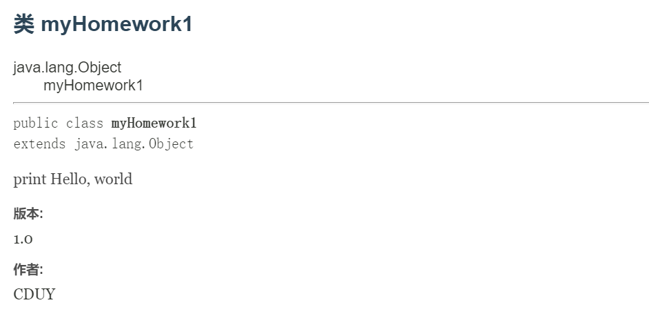

# [Java概述](./TCH_Han/Charpter2.md)


## 值得注意的点
- Java是解释性语言，即：编译后的代码，不能直接被机器执行,需要解释器来执行, 编译性语言, 编译后的代码, 可 以直接被机器执行, c /c++
- JVM -  java virtual machine
- JDK - Java Development Kit，**JDK = JRE +** **开发工具集**
- JRE - Java Runtime Environment，**JRE = JVM + Java SE** **标准类库**
- 一个源文件**最多只有一个**```public```类，其它类不限
- 如果源文件包含一个```public```类，则文件名必须按该类名命名


1. [常用的转义字符](#1)
2. [Java中注释类型](#2)
3. [DOS命令](#3)
4. [**用cmd编辑Java文件**](#4)  
4. [作业](#5)
## 1
```
\t ：一个制表位，实现对齐的功能
\n ：换行符
\\ ：一个\
\" :一个"
\' ：一个' 
\r :一个回车 System.out.println("韩顺平教育\r 北京");
```


## 2

**多行注释中不允许有多行注释的嵌套**

```
单行注释 //
多行注释 /* */
文档注释 /** */
```


在编写好注释后，执行```javadoc```语句后，在e盘的temp文件夹会新出很多文件（版本和作者一一对应）。

```
javadoc -d e://temp -author -version Chapter1.java
```



```java
/**print Hello, world
 * @author CDUY
 * @version 1.0
 * */
public class myHomework1 {
	public static void main(String args[]) {
		System.out.println("Hello, world");
		System.out.println("你好世界");
	}
}
```


## 3

### 3.1 常用的dos命令

```
1)查看当前目录是有什么内容 dir
dir dir d:\abc2\test200
2) 切换到其他盘下：盘符号 cd : change directory
案例演示：切换到 c 盘 cd /D c:
3) 切换到当前盘的其他目录下 (使用相对路径和绝对路径演示), ..\表示上一级目录
案例演示： cd d:\abc2\test200 cd ..\..\abc2\test200
4) 切换到上一级：
案例演示： cd .. 5) 切换到根目录：cd \
案例演示：cd \
6) 查看指定的目录下所有的子级目录 tree
7) 清屏 cls [苍老师]
8) 退出 DOS exit
```
### 3.2了解

```
md[创建目录]
rd[删除目录]
copy[拷贝文件]
del[删除文件]
echo[输入内容到文件]
type,move[剪切]
```


## 4

需要设置的有```JAVA_HOME```、```CLASSPATH```和```Path```三个。

### Window环境变量设置

- [Windows 10 配置Java 环境变量](https://www.runoob.com/w3cnote/windows10-java-setup.html)
- 查看是否设置了环境变量```echo %CLASSPATH%```

### Linux环境变量设置

我安装的是JDK14，不过方法都是一样的。

- 有些Linux会自带OpenJDK而不是OracleJDK，需要卸载[Linux卸载自带的OpenJdk步骤](https://blog.csdn.net/qazzwx/article/details/94725938?spm=1001.2101.3001.6650.2&utm_medium=distribute.pc_relevant.none-task-blog-2%7Edefault%7ECTRLIST%7ERate-2.pc_relevant_aa&depth_1-utm_source=distribute.pc_relevant.none-task-blog-2%7Edefault%7ECTRLIST%7ERate-2.pc_relevant_aa&utm_relevant_index=3)
- [Java环境变量设置（CentOS）](https://www.cnblogs.com/ycyzharry/p/13934880.html)
- 查看是否设置了环境变量```echo $CLASSPATH```
  		- 执行命令```echo $CLASSPATH```有显示并且```javac Hello.java```成功编译但```java Hello```出现以下错误，原因是**环境变量设置有误**
    		- 可参考[Linux执行java命令 错误: 找不到或无法加载主类](https://blog.csdn.net/shepherd_dirk/article/details/90514982)

> 错误：  找不到或无法加载主类 Hello
>
> 原因：java.lang.ClassNotFoundException: Hello

### 开始编译

- [Window用cmd编译Java文件](https://www.cnblogs.com/maritimeclimate/p/13958301.html)
- as


## 5

```java
/**print Hello, world
 * @author CDUY
 * @version 1.0
 * */
public class myHomework1 {
	public static void main(String args[]) {
		System.out.println("Hello, world");
		System.out.println("你好世界");
	}
}
```


```java
/**
 * @author CDUY
 * */
 public class myHomework2 {
    public static main(String args[]) {
        System.out.println("CDUY" + "\n" + "male" + "\n" + "China" + "\n" + "Guangdong");
        System.out.println("male");
        System.out.println("China");
        System.out.println("the house in China");
    }
 }
```


