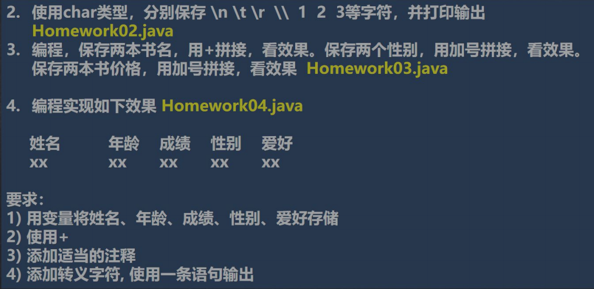

# [](./TCH_Han/Charpter3.md)

# 值得注意的概念
- **变量三要素**：变量=变量名+值+数据类型
- 长整型需要在数后加上```l```或```L```（默认为```int```）、单精度浮点型需加```f```或```F```（默认为```double```）
- [Java中文在线文档](https://www.apiref.com/java11-zh/index.html)
-  

1. [](#1)
2. [](#2)
3. [](#3)
4. [](#4)  
4. [作业](#作业)
## 1
```
```
## 2
```
```
## 3
```
```
## 4
```
```

## 作业




1. as

```

```

2. as

```java
public class myHomework2 {
	public static void main(String args[]) {
		char c1='\n';
		char c2='\t';
		char c3='\r';
		char c4='\\';
		char c5='1';
		char c6='2';
		char c7='3';
		System.out.println(c1);
		System.out.println(c2);
		System.out.println(c3);
		System.out.println(c4);
		System.out.println(c5);
		System.out.println(c6);
		System.out.println(c7);
	}
}
```

3. **不要把```"\t"```写成```'\t'```否则会显示数字**
   - 这是因为单引号是字符串，字符串的相加实际上是对应ASCII码相加
   - ```System.out.println('a'+'b');```相当于97+98故显示195

```java
public class myHomework3 {
	public static void main(String args[]) {
		String book1="小学语文",book2="初中物理";
		char sex1='男',sex2='女';
		double price1=17.2,price2=8.29;
		System.out.println(book1+"\t"+book2);
		System.out.println(sex1+"\t"+sex2);
		System.out.println(price1+"\t"+price2);
	}
}
```

4. 

```java
public class myHomework4 {
	public static void main(String argsp[]) {
		String name="张三",hobby="玩游戏";
		int age=12;
		float grade=59;
		char sex='男';
		System.out.println("姓名\t\t年龄\t成绩\t性别\t爱好\n"
			+name+"\t\t"+age+"\t"+grade+"\t"+sex+"\t"+hobby);
	}
}
```


```java

```


