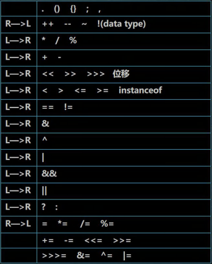
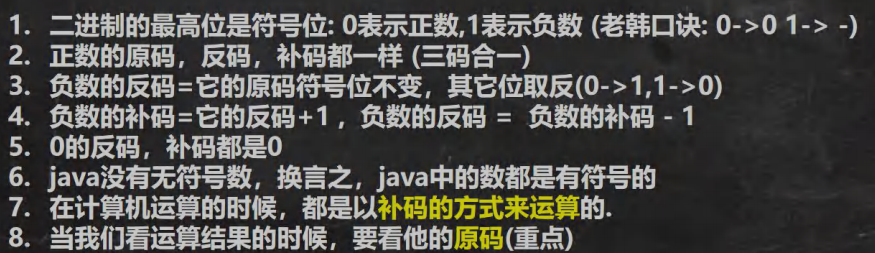

---------------------------
# [运算符](./TCH_Han/Chapter4.md)  

*因了解过C语言，故记录本章时省略了许多概念*

# 值得注意的概念
- ```++i```先自增，```i++```后自增
- ```instanceof```用于检查是否是类的对象
- ```a&b```中```&```叫逻辑与；```a&&b```叫短路与；```^```叫异或（当两值不同时为真）
-  短路与```&&```当第一个条件不满足时后面的条件不再判断（执行），而**逻辑与```&```不管第一条件是否为真，第二个条件都会判断**
-  ```a += b;```与```a = a + b;```
-  复合赋值运算符会进行类型转换

```java
byte b = 3;
b += 2;		//等价 b = (byte)(b+2);
b++;		//等价 b = (byte)(b+1);
```


1. [看程序写答案](#1)
2. [三元运算符与运算优先级](#2)
3. [标识符的命名规则和规范](#3)
4. [用户输入和进制简要](#4)
5. [作业](#作业)  
## 1
```java
//1.1
int x = 5;
int y = 5;
if(x++ == 6 & ++y == 6) {
	x = 11;
}
System.out.println("x=" + x + ",y=" + y);
```
```java
//1.2
int x = 5;
int y = 5;
if(x++ == 6 && ++y == 6) {
	x = 11;
}
System.out.println("x=" + x + ",y=" + y)
```

```java
//1.3
int x = 5;
int y = 5;
if(x++ == 6 | ++y == 6) {
	x = 11;
}
System.out.println("x=" + x + ",y=" + y)
```

```java
//1.4
int x = 5;
int y = 5;
if(x++ == 6 || ++y == 6) {
	x = 11;
}
System.out.println("x=" + x + ",y=" + y)
```

[答案在此](#答案)


## 2

###　三元运算符

```条件表达式  ? 表达式1:表达式2```其中条件表达式为真则结果为表达式1，否则为表达式2。

三元运算符**两个表达式要为可以赋给接受变量的类型**（或可以自动转换）。

```java
public class copyTCH_HanTenaryOperatorDetail {
    public static void main(String[] args) {
        int a = 3;
        int b = 8;
        int c = a > b ? (int)1.1 : (int)3.4;	 //大到小需强转
        double d = a > b ? a : b + 3;			//小到大可以自动转换
    }
}
```


### 运算符优先级




## 3

1. 变量名不能以数字开头

2. 包名：多单词组成时左右字母都要**小写**
   - ```aaa.bbb.ccc```或```com.CDUY.learn```

3. 类名、接口名：多单词组成时，所有**单词的首字母大写**
   - ```XxxYyyZzz```或```MyMethods```

4. 变量名、方法名：多单词组成时，**第一个单词首字母小写**，第二个开始**首字母大写**
   - ```firstMethod```

5. 常量名：**所有字母大写，多单词组成时用下划线连接**
   - ```CLOSE_TAG``` 


## 4

### 用户输入 

[该片段来自菜鸟教程](https://www.runoob.com/java/java-scanner-class.html)

- 使用```next()```方法

```java
import java.util.Scanner;

public class myHomework {
	public static void main(String args[]) {
		Scanner scan = new Scanner(System.in);
		
		System.out.println("next方式接收：");
		//判断是否还有输入
		if (scan.hasNext()) {
			String str1  = scan.next();
			System.out.println("输入的数据为：" + str1);
		}
		scan.close();
	}
}

//会发现输入Hello world只会显示Hello
```


- 使用```nextLine()```方法

```java
import java.util.Scanner;

public class myHomework {
	public static void main(String args[]) {
		Scanner scan = new Scanner(System.in);
		
		System.out.println("nextLine方式接收：");
		//判断是否还有输入
		if (scan.hasNextLine()) {
			String str2  = scan.nextLine();
			System.out.println("输入的数据为：" + str2);
		}
		scan.close();
	}
}
//输入Hello world，输出Hello world
```


- 区别
- next():
  - 1、一定要读取到有效字符后才可以结束输入。
  - 2、对输入有效字符之前遇到的空白，next() 方法会自动将其去掉。
  - 3、只有输入有效字符后才将其后面输入的空白作为分隔符或者结束符。
  - next() 不能得到带有空格的字符串。
- nextLine()：
  - 1、以Enter为结束符,也就是说 nextLine()方法返回的是输入回车之前的所有字符。
  - 2、可以获得空白。

如果输入```int```等类型数据，也可以用```hasNextInt()```等验证。


### 原码、反码、补码




 

## 作业

- 写出```String```转```double```的语句
- 写出将```char```转```String```的语句

```java
String str = "19.8";
double d1 = Double.parseDouble(str);

char c1 = '韩';
String str2 = c1 + "";
```


#### 答案

```java
6,6		//1.1
6,5 	//1.2
11,6	//1.3
11,5	//1.4
```

