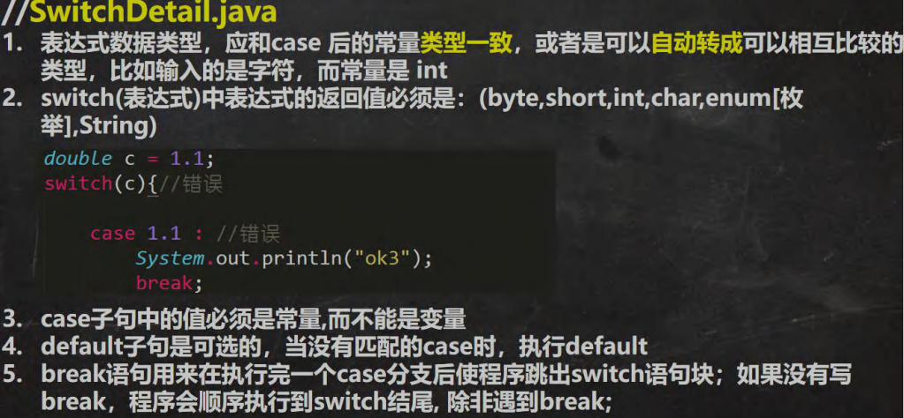
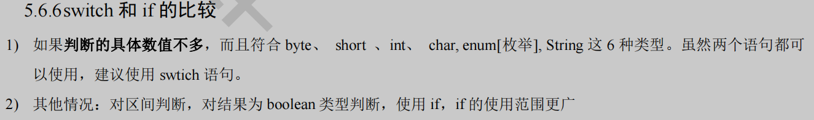
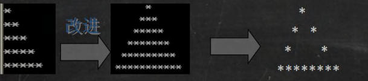
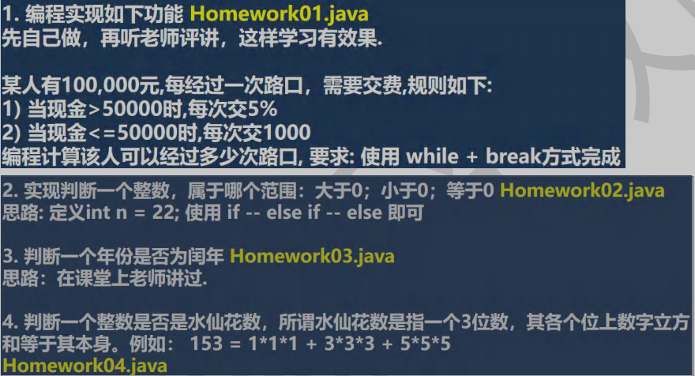
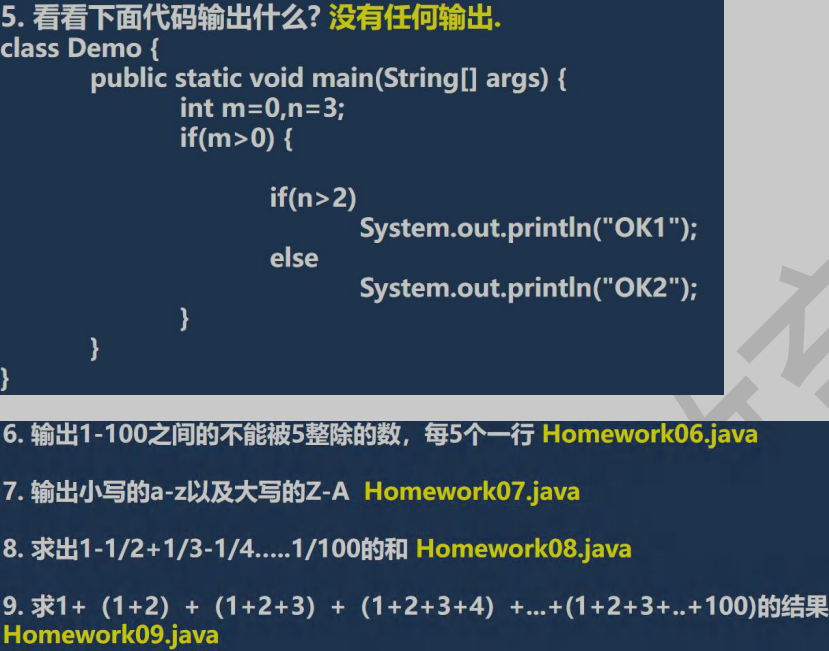
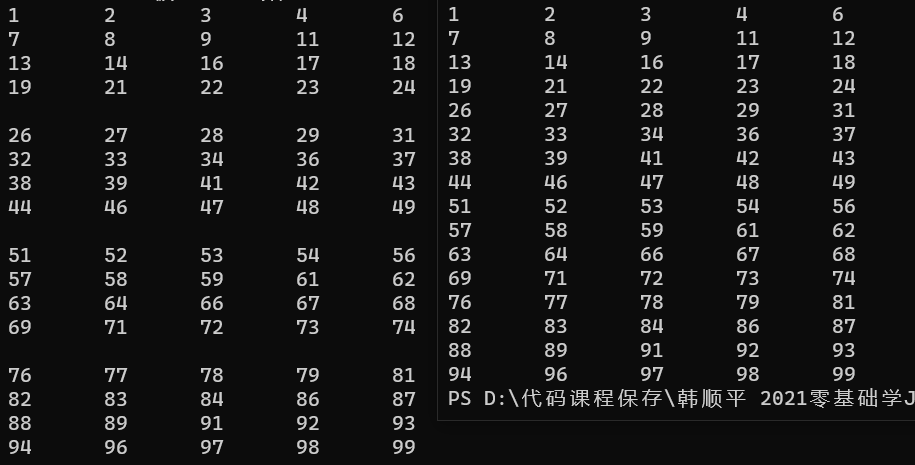

# [程序控制结构](./TCH_Han/Chapter5.md)  
# 值得注意的概念
- ```switch```需要留意的地方





- 嵌套的循环**最好不要超过三层**


1. [案例：输入同学成绩求平均分与不及格人数](#1)
2. [打印9*9乘法表](#2)
3. [循序渐进打印金字塔](#3)
4. [](#4)
5. [作业](#作业)  
## 1
```java
import java.util.Scanner;

public class myHomework {
	public static void main(String args[]) {
		int grade[][] = new int[3][5];//3个班，每班5同学的成绩
		int pass[] = new int[3];//每个班及格人数
		double total = 0, a_grade[] = new double[3];
		Scanner sca  = new Scanner(System.in);
		for (int i = 0; i < 3; i++) {//数据录入
			double temp = 0;//用于计算每个班的平均值
			for (int j = 0; j < 5; j++) {
				grade[i][j] = sca.nextInt();
				temp += grade[i][j];

				if (grade[i][j] >= 60) {
					pass[i]++;//及格人数加1
				}
			}
			a_grade[i] = temp / 5.0;//别写5
			total += a_grade[i];
		}

		for (int i = 0; i < 3; i++) {//数组输出
			System.out.print("本班每位同学成绩分别为：");
			for (int j = 0; j < 5; j++) {
				System.out.print(grade[i][j] + " ");
			}
			System.out.print(" 本班的平均分为:" + a_grade[i] + ",及格人数为：" + pass[i] + "\n");
		}
		System.out.println("本年级的平均分为：" + total / 3.0);
	}
}
```
## 2
```java
public class myHomework {
	public static void main(String args[]) {
		for (int i = 1; i <= 9; i++) {
			for (int j = 1; j <= i; j++) {
				System.out.print(i + " * " + j + " = " + i*j + "  ");
			}
			System.out.println();
		}
	}
}
```
## 3

金字塔样式如下



```java
import java.util.Scanner;

public class myHomework {
	public static void main(String args[]) {
		System.out.print("你想显示多少行的金字塔： ");
		Scanner sca = new Scanner(System.in);//需要显示几行的金字塔
		int line = sca.nextInt();

		System.out.println("第一种：");
		for (int i = 1; i <= line; i++) {
			for (int j = 0; j < i; j++) {//第一行1个，第二行2个
				System.out.print("*");
			}
			System.out.println("");	
		}


		System.out.println("\n第二种：");
		int num = 1;//每次循环将会输出*的个数
		for (int i = 0; i < line; i++) {

			for (int j = (line - i); j > 0; j--) {//输出空格，如果行数为2，那*前就有两空
				System.out.print(" ");
			}

			
			for (int j = 0; j < num; j++) {//输出*
				System.out.print("*");
			}
			num += 2;

			System.out.println("");
		}


		System.out.println("\n第三种：");
		num = 1;//每次循环将会输出*的个数
		for (int i = 0; i < line; i++) {

			for (int j = (line - i); j > 0; j--) {//输出空格，如果行数为2，那*前就有两空
				System.out.print(" ");
			}

			for (int j = 0; j < num; j++) {//输出*
				if (i == 0) {//显示第一行
					System.out.print("*");
				} else if(i == line-1) {//显示最后一行
					System.out.print("*");
				} else {//中间行
					if (j == 0 || j == num - 1) {//一头一尾显示*
						System.out.print("*");
					} else {//中间为空格
						System.out.print(" ");
					}

				}
			}
			num += 2;

			System.out.println("");
		}

	}
}
```


韩老师第三种写法，**反正都是输出```*```干脆就写在一个判断中**，不需要像上面代码那样写这么多```if``` ```else```语句了。

```java
public class Stars { 
	public static void main(String[] args) {
        
		int totalLevel = 20; //层数
		for(int i = 1; i <= totalLevel; i++) { //i 表示层数

			//在输出*之前，还有输出 对应空格 = 总层数-当前层
			for(int k = 1; k <= totalLevel - i; k++ ) {
				System.out.print(" ");
			}

			//控制打印每层的*个数
			for(int j = 1;j <= 2 * i - 1;j++) {
				//当前行的第一个位置是*,最后一个位置也是*, 最后一层全部 *
				if(j == 1 || j == 2 * i - 1 || i == totalLevel) {
					System.out.print("*");
				} else { //其他情况输出空格
					System.out.print(" ");
				}
			}
			System.out.println("");
		}
	}
}
```


重新写在第三种方法（把判断写在一起），在第一次写的基础上，化简的代码很快可以敲出来了。

```java
import java.util.Scanner;

public class myHomework {
	public static void main(String args[]) {
		System.out.print("你想显示多少行的金字塔： ");
		Scanner sca = new Scanner(System.in);//需要显示几行的金字塔
		int line = sca.nextInt();

		System.out.println("\n第三种：");
		int num = 1;//每次循环将会输出*的个数
		for (int i = 0; i < line; i++) {

			for (int j = (line - i); j > 0; j--) {//输出空格，如果行数为2，那*前就有两空
				System.out.print(" ");
			}

			for (int j = 0; j < num; j++) {//输出*
				if (i == 0 || i == line - 1 || j == 0 || j == num - 1) {//第一行，最后一行，中间行一头一尾
					System.out.print("*");
				} else {
					System.out.print(" ");
				}
			}
			num += 2;

			System.out.println("");
		}
	}
}
```


## 4

```
```
## 作业






### 过路口

```java
public class myHomework1 {
	public static void main(String args[]) {
		int num = 0;//路口数
		double money = 100000;
		while(money > 50000) {
			money -= (money*0.05);
			num++;
		}
		System.out.println("大于5000共经过路口：" + num);
		while(money > 1000) {
			money -= 1000;
			num++;
		}
		System.out.println("共经过路口：" + num);
	}
}
```


### 判断数的范围

```java
public class myHomework2 {
	public static void main(String args[]) {
		int n = 22;
		if (n > 0) {
			System.out.println("大于0");
		} else if (n < 0) {
			System.out.println("小于0");
		} else {
			System.out.println("等于0");
		}
	}
}
```


### 判断是否为闰年

- 能被4整除且不能被100整除
- 能被400整除

```java
import java.util.Scanner;

public class myHomework3 {
	public static void main(String args[]) {
		
		Scanner scanner = new Scanner(System.in);
        System.out.println("请输入要计算的年份:");
        int year = scanner.nextInt();    //year为输入的年份
        
        if (year % 4 == 0 && year % 100 != 0 || year % 400 == 0) {
            System.out.println(year+"年是闰年");
        } else {
            System.out.println(year+"年不是闰年");
        }	

	}
}
```


### 输入整数判断水仙花

```java
import java.util.Scanner;

public class myHomework4 {
	public static void main(String args[]) {
		System.out.println("输入需判断水仙花的整数：");
		Scanner sca  = new Scanner(System.in);
		int i = sca.nextInt();
		int ge = i%10, shi = (i%100)/10, bai = i/100;
		if(i == (ge*ge*ge + shi*shi*shi + bai*bai*bai)) {
			System.out.println("恭喜");
		} else {
			System.out.println("很遗憾");
		}
	}
}
```


### 输出1到100内不能被5整除的数，**每5个一行**

**注意本题犯的错误！**，看注释。

```java
public class myHomework6 {
	public static void main(String args[]) {
		System.out.println("1到100内不能被5整除的数：");
		int count = 0;
		for(int i = 1; i <101; i++) {
			if (i % 5 != 0) {
				System.out.print(i + "\t");
				count++;
				
			}
			if (count % 5 == 0) System.out.print("\n");
		}
	}
}

//上面的写法会导致输出结果奇怪，其原因仅仅是将5个一行的判断没有放进判断整除的循环内。下面是正确写法。
//上面代码只要count为5,前一步有没有输出不可整除的数没有关系，所以让25这些可以被5整除的数钻了空子。
//所以，有些功能是符合一定条件才会执行的，也就是有这个“前提”才会执行，就需要放在判断该条件的循环内。
public class myHomework6 {
	public static void main(String args[]) {
		System.out.println("1到100内不能被5整除的数：");
		int count = 0;
		for(int i = 1; i <101; i++) {
			if (i % 5 != 0) {
				System.out.print(i + "\t");
				count++;

				if (count % 5 == 0) System.out.print("\n");
			}		
		}
	}
}
```




### 输出小写与大写的字母表

```java
public class myHomework7 {
	public static void main(String args[]) {
		for(int i = 0; i < 26; i++) {
			char c1 = (char)('a' + i);
			System.out.print(c1 + " ");
		}
		System.out.println();
		for(int i = 0; i < 26; i++) {
			char c1 = (char)('A' + i);
			System.out.print(c1 + " ");
		}
	}
}
```

韩老师是用字符运算转成字符串，我也应该想到这种方法。

```java
//韩老师做法
public class Homework07 { 
	public static void main(String[] args) {
		
		for(char c1 = 'a'; c1 <= 'z'; c1++) {
			System.out.print(c1 +" ");
		} 
		System.out.println("============");
		//灵活的使用，编程..
		for(char c1 = 'Z'; c1 >= 'A'; c1--) {
			System.out.print(c1 +" ");
		}

	}
}
```


### 求```1-1/2+1/3-1/4...1/100```的和 **留意！**

当分数计算时，```double temp = 1/2;```必为0，虽然```temp```是双精度，**但```1```是整型**，```1```与```2```先运算再赋值给```temp```，所以**小数便舍去了**。

```java
public class myHomework8 {
	public static void main(String args[]) {
		double sum=0;
		for (int i = 1; i <= 100; i++) {
			if (i % 2 == 0) {//偶数
				double temp = 1.0 / i;//改成1是错误的
				sum -= temp;
			} else if(i % 2 == 1) {
				double temp = 1.0 / i;
				sum += temp;
			}
			
		}
		System.out.println("和的结果是：" + sum);
	}
}
```

```java
System.out.println(1/2);		//为0
System.out.println(1.0/2);		//为0.5
```


### 求```1+(1+2)+(1+2+3)+(1+2+3+4)+...+(1+2+3+...+100)``` **留意！**

每个新增加的数本身就可以用一个```for```循环实现，由于共有100项，所以外面需要一个```for```循环。

```java
public class myHomework9 {
	public static void main(String args[]) {
		int sum = 0;
		for (int i = 1; i <= 100; i++) {
			for(int j = 1; j <= i; j++) {//这里一定要用小于等于！
				sum += j;
			}
		}
		System.out.println("和是：" + sum);
	}
}
```

