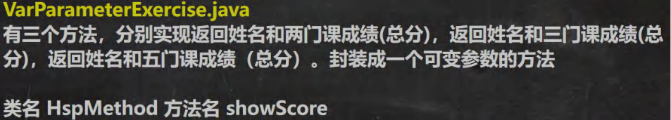
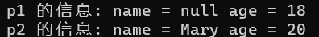

# [面向对象编程（基础部分）](./TCH_Han/Chapter7.md)  
# 值得注意的概念
- 体会面相过程与面向对象的不同之处
- 在一个类中，方法内不能再定义一个方法，**不能嵌套**
- 实参和形参的类型要一致或兼容、个数、顺序必须一致
- 形参拷贝是不会影响实参的


1. [类与对象](#1)
2. [传参机制](#2)
3. [递归练习](#3)
4. [方法重载](#4)
4. [可变参数与作用域](#5)
4. [构造器与对象创建](#6)
4. [```this```关键字](#7)
5. [作业](#作业)  
## 1

### 1.1 创建对象

```java
//先声明再创建
Cat cat;
cat = new Cat();

//直接创建
Cat cat = new Cat();
```


### 1.2 成员方法

像上一章说的[实现相同功能时与```C```的对比](./Chapter6.md#2)，因为```Java```把世间万物都封装成类了，然后类有一个个方法，这些在类里面方法就称为**成员方法**。与面向过程语言```C```的子程序、函数概念相当。

> 我的（**片面**）理解是想要在```Java```实现数组输出的方法，也需要定义一个类然将这个方法放到其中。
>
> 为什么要这样做呢，为什么不可以像```C```那样在主函数外面定一个新的函数然再主函数中调用即可？而是要定义一个类把方法（对应```C```的函数）放在其中，然调用时候先创建一个对象再用这个对象调用方法呢。
>
> 因为如果只是实现这一个步骤，相比与```C```要定义一个类好像有些多余，但是```Java```的思想就是**面向对象**的，把世间万物看成共同共有的属性抽取出来定义成类，然就可以让拥有这些属性的事物去使用。
>
> 这是编程思想的不同。虽然这里举的例子是先想到实现一个方法然却发现这样在```Java```中运行不了，故为其封装成一个类，毫无疑问一开始我被面向过程的思想所影响了。
>
> 就像是所有的载具都有加速这一属性，如果现在```Java```中要开发游戏中的驾驶汽车模块，就得先定义载具类然在这个类中定义加速这个方法。


### 1.3 方法的使用例子

```java
//方法在同一类中，直接调用即可
class A {
    public void print(int n) {
        System.out.println("方法被调用：n = " + n);
    }
    public void sayNu() {
        print(100);//调用同类方法
    }
}


//跨类方法调用，则需要创建对象
class A {
    B b = new B();
    b.hi();//跨类调用
}

class B {
    public void hi() {
        System.out.println("B类中的hi方法被执行");
    }
}
```


### 1.4 课堂练习(1)：写方法判断奇偶数并返回```boolean```

```java
import java.util.Scanner;

public class myHomework {
	public static void main(String[] args) {
		Scanner sca = new Scanner(System.in);
		System.out.print("输入要判断奇偶的数：");
		int nu = sca.nextInt();

		AA a = new AA();

		if (nu < 0) {//负数的处理
			nu *= -1;
		}

		if (a.panDuan(nu)) {
			System.out.println("输入的是奇数");
		} else {
			System.out.println("输入的偶数");
		}
	} 
}

class AA {
	public boolean panDuan(int n) {
		if (n % 2 == 1) { //奇数
			return true;//奇数为真
		} else {
			return false;
		}
	}
} 	
```


### 1.5课堂练习(2)：输入行、列与符号打印出对应效果

```java
import java.util.Scanner;

public class myHomework {
	public static void main(String[] args) {
		Scanner sca = new Scanner(System.in);
		AA a = new AA();

		a.printTip("输入行：");
		int hang = sca.nextInt();
		a.printTip("输入列：");
		int lie = sca.nextInt();
		a.printTip("输入字符：");
		char c = sca.next().charAt(0);
		
		a.printSth(hang, lie, c);

		sca.close();
	} 
}

class AA {
	public void printTip(String str) {//其实用语
		System.out.println(str);
	}

	public void printSth(int i, int j, char c) {//行、列、所打印的字符
		printTip("输出结果：");//同类调用
		for (int a = 0; a < i; a++) {
			for (int b = 0; b < j; b++) {
				System.out.print(c);
			}
			printTip("\t");//同类调用，换行
		}
	}
} 	
```


## 2

### 2.1  基本数据类型传参机制

**形参改变并不会影响实参**。因为基本数据类型传递是**拷贝**。

```java
public class myHomework {
	public static void main(String[] args) {
		int a = 10; int b = 20; //创建 AA 对象 名字 obj 
		AA obj = new AA(); 
		obj.swap(a, b); //调用 swap 
		System.out.println("main 方法 a=" + a + " b=" + b);//a=10 b=20
	} 
}

class AA {
	public void swap(int a, int b) {
		int temp = a;
		a =b;
		b= temp;
		System.out.println("swap 方法 a=" + a + " b=" + b);
	}
} 	
```


### 2.2 引用数据类型传参机制 （数组，对象）*重点难点*

**引用类型**传递的是**地址**（传递也是值，但是值是地址），可以通过**形参影响实参**。

- 数组

```java
public class myHomework {
	public static void main(String[] args) {

		int[] arr = {1, 2, 3};
		System.out.println("main方法中的数组 ");
		for (int i = 0; i < arr.length; i++) {
			System.out.print(arr[i] + "\t");
		}
		System.out.println();

		BB b = new BB();
		b.test100(arr);//调用
	} 
}

class BB {
	public void test100(int[] arr) {
		arr[0] = 200;
		System.out.println("test100方法中的数组 ");
		for (int i = 0; i < arr.length; i++) {
			System.out.print(arr[i] + "\t");
		}
		System.out.println();
	}
} 		
```


- 对象，**注意这里的操作2和操作3**

```java
public class myHomework {
	public static void main(String[] args) {

		BB b = new BB();
		
		//操作1
		Person p = new Person();
		p.name = "jack";
		p.age = 10;
		System.out.println("main 的 p.name 和p.age:\n" + p.name + "\t" + p.age);
		b.test200(p);
		System.out.println("执行操作一 的 p.name 和 p.age:\n" + p.name + "\t" + p.age);
		
		//操作2
		Person p1 = new Person();
		p1.name = "jack";
		p1.age = 10;
		System.out.println("\nmain 的 p1.name 和p1.age:\n" + p1.name + "\t" + p1.age);
		b.test201(p1);
		System.out.println("执行操作二 和p1.age:\n" + p1.name + "\t" + p1.age);
		
		//操作3
		Person p2 = new Person();
		p2.name = "jack";
		p2.age = 10;
		System.out.println("\nmain 的 p2.name 和p2.age:\n" + p2.name + "\t" + p2.age);
		b.test201(p2);
		System.out.println("执行操作三 和p2.age:\n" + p2.name + "\t" + p2.age);
	} 
}

class Person {
	String name;
	int age;
}

class BB {
	//操作1
	public void test200(Person p) {
		p.age = 9999;//修改属性
	}
	//操作2
	public void test201(Person p) {
		p = new Person();//修改属性
		p.name = "tom";
		p.age = 99;
	}
	//操作3
	public void test202(Person p) {
		p = null;
	}
} 	
```


- 解释：引用类型传递是传地址，在方法调用时，置为空了，应该是什么也没有，但操作3最终的结果也是```10```呢？

  引用类型传地址没有错，一开始实参将地址传递给形参```p```，使形参```p```也指向了实参的同一个对象。但是之后```p = null;```**改变了指向**，使形参```p```不再指向任何对象，也就是刚刚**建立的连接断开**了。但这并没有影响到实参，所以值维持不变。

  同样，操作2也是相同的道理，所以在操作2中，尽管**改变了对象的数值**，**但此对象非之前建立连接的对象**，所以没有成功改变原对象的数据。


### 2.3 成员方法返回类型是引用类型的实例

```java
public class myHomework {
	public static void main(String[] args) {

		Person p = new Person();
		p.name = "martin";
		p.age = 100;
		MyTools tools = new MyTools();
		Person p2 = tools.copyPerson(p);

		//到此 p 和 p2 是 Person 对象，但是是两个独立的对象，属性相同 
		System.out.println("p 的属性 age=" + p.age + " 名字=" + p.name); 
		System.out.println("p2 的属性 age=" + p2.age + " 名字=" + p2.name); 
		
		System.out.println(p == p2);//可以像对象比较看看是否为同一个对象 
	} 
}

class Person {
	String name;
	int age;
}

class MyTools {
	public Person copyPerson(Person p) {
		Person p1 = new Person();
		p1.name = p.name;
		p1.age = p.age;
		return p1;
	}
}
```


## 3

### 3.1 课堂练习(1)：递归实现斐波那契

> 我（**片面**）对递归的理解就是，递归函数会一直调用自己直到不能调用为止，那么在调用自己过程中怎么实现传值呢？
>
> 用```return```。

```java
import java.util.Scanner;

public class myHomework {
	public static void main(String[] args) {

		Scanner sca = new Scanner(System.in);
		T t = new T();
		System.out.print("输入整数：");
		int i = sca.nextInt();
		System.out.println(i + " 的斐波那契数是： " + t.fibonacci(i));
	} 
}

class T {
	public int fibonacci(int n) {
		if( n >= 1) { 
			if( n == 1 || n == 2) { 
				return 1; 
			} else { 
				return fibonacci(n-1) + fibonacci(n-2); 
			} 
		} else { 
			System.out.println("要求输入的 n>=1 的整数"); return -1; 
		}
	}
}
```


### 3.2课堂练习(2)：递归实现猴子吃桃

```java
 
```


### 3.3 递归调用应用实例：迷宫问题

```java
public class myHomework {
	public static void main(String[] args) {

		//思路1. 先创建迷宫，用二维数组表示 int[][] map = new int[8][7];
		//2. 先规定 map 数组的元素值: 0 表示可以走 1 表示障碍物 		
		int[][] map = new int[8][7];
		//3. 将最上面的一行和最下面的一行，全部设置为1
		for(int i = 0; i < 7; i++) {
			map[0][i] = 1;
			map[7][i] = 1;
		}
		//4.将最右面的一列和最左面的一列，全部设置为1
		for(int i = 0; i < 8; i++) {
			map[i][0] = 1;
			map[i][6] = 1;
		}
		map[3][1] = 1;
		map[3][2] = 1;
		map[2][2] = 1; //测试回溯 
		// map[2][1] = 1;
		// map[2][2] = 1;
		// map[1][2] = 1;

		//输出当前的地图
		System.out.println("=====当前地图情况======");
		for(int i = 0; i < map.length; i++) {
			for(int j = 0; j < map[i].length; j++) {
				System.out.print(map[i][j] + " ");//输出一行
			}
			System.out.println();
		}

		//使用findWay给老鼠找路
		T t1 = new T();
		//下右上左
		t1.findWay(map, 1, 1);

		System.out.println("\n====找路的情况如下=====");

		for(int i = 0; i < map.length; i++) {
			for(int j = 0; j < map[i].length; j++) {
				System.out.print(map[i][j] + " ");//输出一行
			}
			System.out.println();
		}
	}
}

class T  {

	public boolean findWay(int[][] map , int i, int j) {
		if(map[6][5] == 2) {//说明已经找到
			return true;
		} else {
			if(map[i][j] == 0) {//当前这个位置0,说明表示可以走
				//我们假定可以走通
				map[i][j] = 2;
				//使用找路策略，来确定该位置是否真的可以走通
				//下->右->上->左
				if(findWay(map, i + 1, j)) {//先走下
					return true;
				} else if(findWay(map, i, j + 1)){//右
					return true;
				} else if(findWay(map, i-1, j)) {//上
					return true;
				} else if(findWay(map, i, j-1)){//左
					return true;
				} else {
					map[i][j] = 3;
					return false;
				}
			} else { //map[i][j] = 1 , 2, 3
				return false; 
			}
		}
	}

	//修改找路策略，看看路径是否有变化
	//下->右->上->左 ==> 上->右->下->左
	public boolean findWay2(int[][] map , int i, int j) {
		if(map[6][5] == 2) {//说明已经找到
			return true;
		} else {
			if(map[i][j] == 0) {//当前这个位置0,说明表示可以走
				//我们假定可以走通
				map[i][j] = 2;
				//使用找路策略，来确定该位置是否真的可以走通
				//上->右->下->左
				if(findWay2(map, i - 1, j)) {//先走上
					return true;
				} else if(findWay2(map, i, j + 1)){//右
					return true;
				} else if(findWay2(map, i+1, j)) {//下
					return true;
				} else if(findWay2(map, i, j-1)){//左
					return true;
				} else {
					map[i][j] = 3;
					return false;
				}
			} else { //map[i][j] = 1 , 2, 3
				return false; 
			}
		}
	}
}
```


### 3.4 递归调用应用实例：汉诺塔

```java
public class myHomework {
	public static void main(String[] args) {

		Tower tower = new Tower();
		tower.move(64, 'A', 'B', 'C');
}

class Tower {
	
	public void move(int num, char a, char b, char c) {//num 表示要移动的个数, a, b, c 分别表示 A 塔，B 塔, C 塔
		if (num == 1) {
			System.out.println(a + "->" + c);
		} else {//如果有多个盘，可以看成两个 , 最下面的和上面的所有盘(num-1)
			move(num - 1, a, c, b);//(1)先移动上面所有的盘到 b, 借助 c
			System.out.println(a + "->" + c);//(2)把最下面的这个盘，移动到 c
			move(num - 1, b, a, c);//(3)再把 b 塔的所有盘，移动到 c ,借助 a
		}
	}
}
```


### 3.5 递归调用应用实例：八皇后

```java
```


## 4

### 4.1 方法重载注意事项

1. 方法名：必须**相同**
2. 形参列表：必须**不同**，（形参类型或个数或顺序，至少有一样不同，参数名无要求）
3. 返回类型：无要求


```java
void show (int a, char b, double c) {} //构成重载的有

void show (int x, char y, double z) {}	 //不是，对参数名无要求
int show (int a, double c, char b) {}	 //是，形参顺序不同（返回类型无要求）
void show (int a, double c, char b) {}	 //是，形参顺序不同
boolean show (int c, char b) {}			//是，形参个数不同
void show (double c) {}				    //是，形参个数不同
double show (int x, char y, double z) {} //不是，形参无改变（名字无要求返回类型无要求）
void shows() {}						   //方法名不同，所以不是
```


### 4.2 课堂练习(1)：重载练习


```java
//1
public class myHomework {
	public static void main(String[] args) {
		Methods methods = new Methods();

		System.out.println("重载1： " + methods.m(2));
		System.out.println("重载2： " + methods.m(3,4));
		System.out.println("重载3： " + methods.m("我爱罗"));
	} 
}

class Methods {
	public double m(int n1) {
		return n1 * n1;
	}
	public double m(int n1, int n2) {
		return n1 * n2;
	}
	public String m(String str) {
		return str;
	}
}
```


```java
//2.
public class myHomework {
	public static void main(String[] args) {
		Methods methods = new Methods();

		System.out.println("重载1： " + methods.max(2, 4));
		System.out.println("重载2： " + methods.max(3, 4));
		System.out.println("重载3： " + methods.max(1, 2, 3));
	} 
}

class Methods {
	public int max(int n1, int n2) {
		if (n1 > n2) {
			return n1;
		} else {
			return n2;
		}
	}
	public double max(double d1, double d2) {
		if (d1 > d2) {
			return d1;
		} else {
			return d2;
		}
	}
	public double max(double d1, double d2, double d3) {
		double max1 = d1 > d2 ? d1 : d2;
		return max1 > d3 ? max1 : d3;
	}
}
```


## 5

### 5.1 可变参数概念

- ```Java``` 允许将同一个类中多个同名同功能但参数个数不同的方法，封装成一个方法---通过**可变参数**实现。
- 基本语法

```java
访问修饰符 返回类型 方法名(数据类型... 形参名) { }
```

- 例子

```java
//普通做法
class Methods {
	public double max(double d1, double d2) {
		return d1 + d2;
	}
	public double max(double d1, double d2, doubel d3) {
		return d1 + d2 + d3;
	}
	public double max(double d1, double d2, doubel d3, doubel d4) {
		return d1 + d2 + d3 + d4;
	}
}

//可变参数
class Methods {
	public double max(double... ds) {
		double sum = 0;
		for (int i = 0; i < ds.length; i++) {
			sum += ds[i];
		}
		return sum;
	}
}
```


### 5.3 可变参数注意事项

1. 可变参数的实参可以为0个或任意过个
2. 可变参数的实参可以为数组
3. 可变参数的**本质就是数组**
4. 可变参数可以和普通类型的参数一起放在形参列表，但必须保证可变参数在最后
5. 一个形参列表中只能出现一个可变参数


```java
class T { 
    public void f1(int... nums) { 
        System.out.println("长度=" + nums.length); }
    
    //细节: 可变参数可以和普通类型的参数一起放在形参列表，但必须保证可变参数在最后 
    public void f2(String str, double... nums) { 
    }
    
    //细节: 一个形参列表中只能出现一个可变参数 
    public void f3(int... nums1, double... nums2) { //写法是错误
    } 
}
```


### 5.2 课堂练习(1)：可变参数练习



```java
public class myHomework {
	public static void main(String[] args) {
		Methods methods = new Methods();

		System.out.println(methods.showScore("李明", 90, 90, 90));
		System.out.println(methods.showScore("李华", 70, 70, 70));
		System.out.println(methods.showScore("李明华", 80, 80, 80, 100, 100));
	} 
}


class Methods {
	public String showScore (String name, int... scores) {

		int sum = 0;
		for (int i = 0; i < scores.length; i++) {
			sum += scores[i];
		}
		String str = (name + scores.length + "科总成绩是：" + sum);
		return str;
	}
}
```


### 5.3 作用域相关

**基本使用**：

1. 在```Java```中，主要变量就是属性（成员变量）和局部变量
2. 局部变量就是**在成员方法中定义的变量**
3. ```Java```作用域分类
   - 全局变量：也就是属性，作用域为整个类体
   - 局部变量：除了属性之外的其它变量，作用域为它的代码块中

4. 全局变量（属性）可以不赋值直接使用，因为有默认值。局部变量必须赋值后，才能使用，因为**没有默认值**

```java
class Method {
    int kk;//全局，有默认值
    public void showScore() {
        int i = 0;//局部变量，必须赋默认值
    }
    
    public void test() {
        int y = i;//错误！ 使用本类其它方法的变量
    }
}
```


**注意细节**：

1. 属性和局部变量可以重名，访问是遵循就近原则
2. 在同一个作用域中，比如同一个成员方法内，两个局部变量，不能重名
3. 属性生命周期较长，伴随着对象的创建而创建，伴随着对象的销毁而销毁。局部变量，**生命周期较短**，伴随着它的代码块的执行而创建，伴随着代码块的结束而销毁。
4. 作用域范围不同
   - 全局变量/属性：可以呗本类使用，或其它类使用（通过对象调用）
   - 局部变量：只能在本类中的对应的方法中使用
5. 修饰符不同：
   - 全局变量/属性：可以添加修饰符
   - 局部变量不哭加修饰符

```java
class Method {
    public int i;//全局，可以添加修饰符
    public void showScore() {
        int i = 99;//局部变量可以和属性重名，
        System.out.println(i);//使用时就近原则，也就是用showScore方法中的i
    }
    
    public void test() {
        String str1 = "hi";
        String str1 = "hello";//错误，重名
    }
}
```


## 6

### 6.1 构造方法/构造器

1. 一个类可以定义多个不同的构造器，即构造器重载
2. 构造器要和类名相同
3. 构造器没有返回值
4. 构造器是完成对象的初始化，并不是创建对象
5. 在创建对象时，系统自动调用该类的构造方法
6. 没有没有定义构造器，系统会自动给类生成一个默认无参构造器，可用```javap```反编译看看
7. 一旦定义了自己的构造器默认的便被覆盖了，**除非再显示定义**

```java
class Person {

	String name;
	int age;

	public Person(String pName, int pAge) {//第 1 个构造器 
        name = pName; age = pAge; 
    }
    
    public Person(String pName) {//第 2 个构造器, 只指定人名，不需要指定年龄 
        name = pName; 
    }
}
```


### 6.2 课堂练习(1)：构造器

```java
public class myHomework {
	public static void main(String[] args) {
		Person p1 = new Person();//无参
		System.out.println("p1 的信息: name = " + p1.name + " age = " + p1.age);

		Person p2 = new Person("Mary", 20);
		System.out.println("p2 的信息: name = " + p2.name + " age = " + p2.age);
	} 
}

class Person {
	String name;
	int age;

	public Person() {//无参构造设定默认值
		age = 18;
	}

	public Person(String pName, int pAge) {
		name = pName;
		age = pAge;
	}
}
```




### 6.3 对象创建的流程

# 看视频


## 7

### 7.1 ```this```关键字

```this```即表示当前对象。

1. ```this```关键字可以访问本类的属性、方法、构造器

2. ```this```用于区分当前类的属性和局部变量

3. 访问成员方法的语法：```this.方法名(参数列表);```

4. 访问构造器语法：```this(参数列表);```，**注意只能在构造器使用**，(即只能在构造器中访问另外一个构造器, 必须放在第一 

   条语句) 

5. ```this```不能再类定义的外部使用，只能在类定义的方法中使用

```java
//之前是这样写的
class Person {
    String name;
    int age;
    public Person(String pName, int pAge) {
        name = pName;
        age = pAge;
    }
}

//现在可以
class Person {
    String name;
    int age;
    public Person(String name, int age) {
       this.name = name;//就是当前对象的属性 name
       this.age = age;
    }
    
    public void info() {
        System.out.println(this.name + "\t" + this.age);//使用
    }
}
```


### 7.2 课堂练习(1)：```this```练习

```java
public class myHomework {
	public static void main(String[] args) {
		Person p1 = new Person("mary", 20);
		Person p2 = new Person("mary", 20);

		System.out.println("p1 和 p2 比较结为：" + p1.compareTo(p2));
	} 
}
 
class Person {

	String name;
	int age;

	public Person(String name, int age) {
		this.name = name;
		this.age = age;
	}

	public boolean compareTo(Person p) {
		return this.name.equals(p.name) && this.age == p.age;
	}
}
//结果为true
```


## 作业

### 编写一个类定义方法使返回数组最大值

写本题时，应该想到数组是否合理是否为空，所以韩老师使用了```arr!= null && arr.length > 0```判断。

```java
public class myHomework1 {
	public static void main(String args[]) {
		double[] arrays = {1, 2, 100, 3, 4, 5};
		A01 a01 = new A01();
		Double res = a01.max(arr);
		if(res != null) {
			System.out.println("arr的最大值=" + res);
		} else {
			System.out.println("arr的输入有误, 数组不能为null, 或者{}");
		}
	}
}

class A01 {
	public double max (double[] array) {
		if ( arr!= null && arr.length > 0 ) {//韩老师先判断arr是否为null,然后再判断 length 是否>0

			//保证arr至少有一个元素 
			double max = arr[0];//假定第一个元素就是最大值
			for (int i = 1; i < arr.length; i++) {
				if (max < arr[i]) {
					max = arr[i];
				}
			}
			return max;//double
		} else {
			return null;
		}
	}
}
```


### 查找字符是否在数组中返回索引否返回```-1```

定义了字符串数组``` String[] str_arrays = {"hello", "apple", "banana"};```与```String str = "hello";```

为什么获取```str_arrays```的长度可以使用```str_arrays.length```，但是```str```则需要```str.length()```因为是数组包数组，```str_arrays```是数组，但```str```是字符串。

>[关于Java中length、length()、size()的区别](https://blog.csdn.net/qq_33236248/article/details/79884874)
>
>**```length```——数组的属性**。
>
>**```length()```——String的方法**。
>
>**```size()```——集合的方法**。

```java
public class myHomework2 {
	public static void main(String args[]) {
		String str = "hello";
		A02 a02 = new A02();
		int res = a02.find(str);
		if (res == -1) {
			System.out.println("找不到或不存在");
		} else {
			System.out.println("索引是" + res);
		}
	}
}

class A02 {
	private String[] str_arrays = {"hello", "apple", "banana"};

	public int find(String str) {
		if (str != null && str.length() > 0) {

			for (int i = 0; i < str_arrays.length; i++) {
				if (str.equals(str_arrays[i])) {
					return i;
				} else {
					continue;
				}
			}
		}
		return -1;
	}
}
```


### 编写类实现更改某书价格

```java
public class myHomework3 {
	public static void main(String args[]) {
		Book book = new Book("Java宝典", 1000);
		System.out.println(book.getName() + "修改前价格" + book.getPrice());
		book.updatePrice();
		System.out.println(book.getName() + "修改后价格" + book.getPrice());
	}
}

class Book {

	private String name;
	private int price;

	public Book(String name, int price) {
		this.name = name;
		this.price = price;
	}

	public String getName() {
		return name;
	}

	public int getPrice() {
		return price;
	}

	public void updatePrice() {
		if (price > 150) {
			price = 150;
		} else if(price > 100 && price < 150) {
			price = 100;
		}
	}
}
```


### 输入旧驻足返回一个一样的新数组

```java
public class myHomework4 {
	public static void main(String args[]) {
		int a[] = {1, 2, 3, 4, 5};
		System.out.println("原数组");
		for (int i = 0; i < a.length; i++) {
			System.out.print(a[i] + "\t");
		}

		A03 a03 = new A03();
		System.out.println("\n复制后的数组");
		int b[] = a03.cpoyArr(a);
		for (int i = 0; i < a.length; i++) {
			System.out.print(b[i] + "\t");
		}
	}
}

class A03 {
	public int[] cpoyArr(int[] array) {
		int[] n_array = new int[array.length];
		for (int i = 0; i < array.length;i++) {
			n_array[i] = array[i];
		}
		return n_array;
	} 
}
```


### 定义圆及其方法及其方法

```java```用**```Math.PI```**使用pi

```java
public class Homework05 { 

	//编写一个main方法
	public static void main(String[] args) {
		Circle circle = new Circle(3);
		System.out.println("面积=" + circle.area());
		System.out.println("周长=" + circle.len());
	}
}
/*
定义一个圆类Circle, 定义属性：半径，提供显示圆周长功能的方法， 提供显示圆面积的方法
 */
class Circle {
	double radius;

	public Circle(double radius) {
		this.radius = radius;
	}

	public double area() { //面积
		return Math.PI * radius * radius;
	}

	public double len() { //周长
		return 2 * Math.PI * radius;
	}
}
```


### 定义类实现计算的方法

除法的分母不可为0，如果为0时，就不执行该语句。但是```double```类型是不可以返回```null```的，需要用```Double```。

- [Double和double的区别](https://blog.csdn.net/zhongguomao/article/details/54576166)
- [[java中double和Double的区别](https://www.cnblogs.com/yoyowin/p/13614784.html)](https://www.cnblogs.com/yoyowin/p/13614784.html)

```java
public class myHomework6 {
	public static void main(String args[]) {
		Cale cale = new Cale(2, 10);
		System.out.println("和=" + cale.jia());
		System.out.println("差=" + cale.jian());
		System.out.println("乘=" + cale.cheng());
		Double divRes = cale.chu();
		if(divRes != null) {
			System.out.println("除=" + divRes);
		} 
	}
}

class Cale {

	private double n1;
	private double n2;

	public Cale(double n1, double n2) {
		this.n1 = n1;
		this.n2 = n2;
	}

	public double jia() {
		return n1 + n2;
	}

	public double jian() {
		return n1 - n2;
	}

	public double cheng() {
		return n1 * n2;
	}

	public Double chu() {//注意本句的返回是Double
		if (n2 == 0) {
			System.out.println("除数不能为0");
			return null;//返回空
		} else {
			return n1 / n2;
		}
	}
}
```


### 实现小狗类

```java
public class myHomework7 {
	public static void main(String args[]) {
		Dog dog = new Dog("aaa", "white", 8);
		dog.show();
	}
}

class Dog {
	
	String name;
	String color;
	int age;

	public Dog(String name, String color, int age) {
		this.name = name;
		this.color = color;
		this.age = age;
	}

	public void show() {
		System.out.print("小狗名字是：" + name);
		System.out.print("，颜色是：" + color);
		System.out.print("，年龄是：" + age);
	}
}
```


### 作业8

```java
public class myHomework8 {
	int count = 9; //属性
    public void count1() { //Test类的成员方法
 			count=10;//这个count就是属性  改成 10
        	System.out.println("count1=" + count); //10  
    }
    public void count2() {  //Test类的成员方法
        System.out.println("count1=" + count++);
    } 
   
   	//这是myHomework8类的main方法, 任何一个类，都可有main
    public static void main(String args[]) {
       //老韩解读
       //1.  new myHomework8()	是匿名对象， 匿名对象使用后，就不能使用
       //2.  new myHomework8().count1() 创建好匿名对象后, 就调用count1()
       new myHomework8().count1(); 
      
       myHomework8 t1= new myHomework8();
       t1.count2();
       t1.count2();
    }
}
```


### 定义音乐类

```java
public class myHomework9 {
	public static void main(String args[]) {
		Music music = new Music("代码歌", 300.2);
		music.getInfo();
		music.play();
	}
}

class Music {

	String name;
	double times;

	public Music(String name, double times) {
		this.name = name;
		this.times = times;
	}

	public void play() {
		System.out.println("歌曲“" + name + "”正在播放中，时长为" + times);
	}

	public void getInfo() {
		System.out.println("歌名“" + name + "”时长为" + times);
	}
}
```


### 充分利用构造器

```java
public class myHomework10 {
	public static void main(String args[]) {
		
	}
}

class Employee {

	private String name;
	private char sex;
	private int age;
	private String offer;
	private double salary;
	
	public Employee(String offer, double salary) {
		this.offer = offer;
		this.salary = salary;
	}

	public Employee(String name, char sex, int age) {
		this.name = name;
		this.sex = sex;
		this.age = age;
	}

	public Employee(String name, char sex, int age, String offer, double salary) {
		this(name, sex, age);//使用到 前面的 构造器
		this.offer = offer;
		this.salary = salary;
	}
}
```


### 实现园类

```java
public class myHomework {
	public static void main(String[] args) {

		PassObject passObject = new PassObject();
		passObject.printAreas(new Circle(), 5);
	}
}


class Circle {
	double radius;

	public Circle () { //无参构造器
	}

	public Circle (double radius) {
		this.radius = radius;
	}

	public double findArea() {
		return Math.PI * radius * radius;
	}
}

class PassObject {
	public void printAreas (Circle c, int times) {
		if (times > 0) {
			System.out.println("Radius\t\t\tArea");
			for (double i = 1; i <= times; i++) {
				c = new Circle(i);
				System.out.print(i + "\t\t" + c.findArea() + "\n");
			}
		} else {
			System.out.println("times输入错误");
		}
	}
}
```

