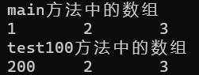
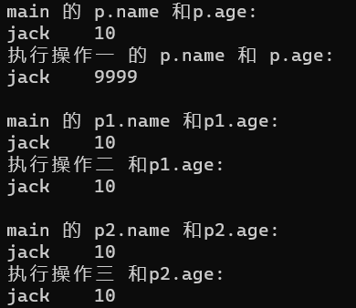
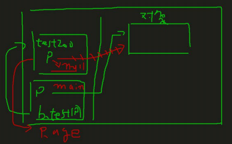
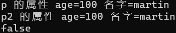
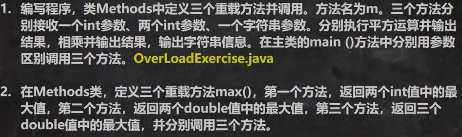

# [面向对象编程（基础部分）](./TCH_Han/Chapter7.md)  
# 值得注意的概念
- 体会面相过程与面向对象的不同之处
- 在一个类中，方法内不能再定义一个方法，**不能嵌套**
- 实参和形参的类型要一致或兼容、个数、顺序必须一致
- 形参拷贝是不会影响实参的


1. [类与对象](#1)
2. [传参机制](#2)
3. [递归练习](#3)
4. [](#4)
4. [](#5)
4. [](#6)
4. [](#7)
5. [作业](#作业)  
## 1

### 1.1 创建对象

```java
//先声明再创建
Cat cat;
cat = new Cat();

//直接创建
Cat cat = new Cat();
```


### 1.2 成员方法

像上一章说的[实现相同功能时与```C```的对比](./Chapter6.md#2)，因为```Java```把世间万物都封装成类了，然后类有一个个方法，这些在类里面方法就称为**成员方法**。与面向过程语言```C```的子程序、函数概念相当。

> 我的（**片面**）理解是想要在```Java```实现数组输出的方法，也需要定义一个类然将这个方法放到其中。
>
> 为什么要这样做呢，为什么不可以像```C```那样在主函数外面定一个新的函数然再主函数中调用即可？而是要定义一个类把方法（对应```C```的函数）放在其中，然调用时候先创建一个对象再用这个对象调用方法呢。
>
> 因为如果只是实现这一个步骤，相比与```C```要定义一个类好像有些多余，但是```Java```的思想就是**面向对象**的，把世间万物看成共同共有的属性抽取出来定义成类，然就可以让拥有这些属性的事物去使用。
>
> 这是编程思想的不同。虽然这里举的例子是先想到实现一个方法然却发现这样在```Java```中运行不了，故为其封装成一个类，毫无疑问一开始我被面向过程的思想所影响了。
>
> 就像是所有的载具都有加速这一属性，如果现在```Java```中要开发游戏中的驾驶汽车模块，就得先定义载具类然在这个类中定义加速这个方法。


### 1.3 方法的使用例子

```java
//方法在同一类中，直接调用即可
class A {
    public void print(int n) {
        System.out.println("方法被调用：n = " + n);
    }
    public void sayNu() {
        print(100);//调用同类方法
    }
}


//跨类方法调用，则需要创建对象
class A {
    B b = new B();
    b.hi();//跨类调用
}

class B {
    public void hi() {
        System.out.println("B类中的hi方法被执行");
    }
}
```


### 1.4 课堂练习(1)：写方法判断奇偶数并返回```boolean```

```java
import java.util.Scanner;

public class myHomework {
	public static void main(String[] args) {
		Scanner sca = new Scanner(System.in);
		System.out.print("输入要判断奇偶的数：");
		int nu = sca.nextInt();

		AA a = new AA();

		if (nu < 0) {//负数的处理
			nu *= -1;
		}

		if (a.panDuan(nu)) {
			System.out.println("输入的是奇数");
		} else {
			System.out.println("输入的偶数");
		}
	} 
}

class AA {
	public boolean panDuan(int n) {
		if (n % 2 == 1) { //奇数
			return true;//奇数为真
		} else {
			return false;
		}
	}
} 	
```


### 1.5课堂练习(2)：输入行、列与符号打印出对应效果

```java
import java.util.Scanner;

public class myHomework {
	public static void main(String[] args) {
		Scanner sca = new Scanner(System.in);
		AA a = new AA();

		a.printTip("输入行：");
		int hang = sca.nextInt();
		a.printTip("输入列：");
		int lie = sca.nextInt();
		a.printTip("输入字符：");
		char c = sca.next().charAt(0);
		
		a.printSth(hang, lie, c);

		sca.close();
	} 
}

class AA {
	public void printTip(String str) {//其实用语
		System.out.println(str);
	}

	public void printSth(int i, int j, char c) {//行、列、所打印的字符
		printTip("输出结果：");//同类调用
		for (int a = 0; a < i; a++) {
			for (int b = 0; b < j; b++) {
				System.out.print(c);
			}
			printTip("\t");//同类调用，换行
		}
	}
} 	
```


## 2

### 2.1  基本数据类型传参机制

**形参改变并不会影响实参**。因为基本数据类型传递是**拷贝**。

```java
public class myHomework {
	public static void main(String[] args) {
		int a = 10; int b = 20; //创建 AA 对象 名字 obj 
		AA obj = new AA(); 
		obj.swap(a, b); //调用 swap 
		System.out.println("main 方法 a=" + a + " b=" + b);//a=10 b=20
	} 
}

class AA {
	public void swap(int a, int b) {
		int temp = a;
		a =b;
		b= temp;
		System.out.println("swap 方法 a=" + a + " b=" + b);
	}
} 	
```


### 2.2 引用数据类型传参机制 （数组，对象）*重点难点*

**引用类型**传递的是**地址**（传递也是值，但是值是地址），可以通过**形参影响实参**。

- 数组

```java
public class myHomework {
	public static void main(String[] args) {

		int[] arr = {1, 2, 3};
		System.out.println("main方法中的数组 ");
		for (int i = 0; i < arr.length; i++) {
			System.out.print(arr[i] + "\t");
		}
		System.out.println();

		BB b = new BB();
		b.test100(arr);//调用
	} 
}

class BB {
	public void test100(int[] arr) {
		arr[0] = 200;
		System.out.println("test100方法中的数组 ");
		for (int i = 0; i < arr.length; i++) {
			System.out.print(arr[i] + "\t");
		}
		System.out.println();
	}
} 		
```




- 对象，**注意这里的操作2和操作3**

```java
public class myHomework {
	public static void main(String[] args) {

		BB b = new BB();
		
		//操作1
		Person p = new Person();
		p.name = "jack";
		p.age = 10;
		System.out.println("main 的 p.name 和p.age:\n" + p.name + "\t" + p.age);
		b.test200(p);
		System.out.println("执行操作一 的 p.name 和 p.age:\n" + p.name + "\t" + p.age);
		
		//操作2
		Person p1 = new Person();
		p1.name = "jack";
		p1.age = 10;
		System.out.println("\nmain 的 p1.name 和p1.age:\n" + p1.name + "\t" + p1.age);
		b.test201(p1);
		System.out.println("执行操作二 和p1.age:\n" + p1.name + "\t" + p1.age);
		
		//操作3
		Person p2 = new Person();
		p2.name = "jack";
		p2.age = 10;
		System.out.println("\nmain 的 p2.name 和p2.age:\n" + p2.name + "\t" + p2.age);
		b.test201(p2);
		System.out.println("执行操作三 和p2.age:\n" + p2.name + "\t" + p2.age);
	} 
}

class Person {
	String name;
	int age;
}

class BB {
	//操作1
	public void test200(Person p) {
		p.age = 9999;//修改属性
	}
	//操作2
	public void test201(Person p) {
		p = new Person();//修改属性
		p.name = "tom";
		p.age = 99;
	}
	//操作3
	public void test202(Person p) {
		p = null;
	}
} 	
```



- 解释：引用类型传递是传地址，在方法调用时，置为空了，应该是什么也没有，但操作3最终的结果也是```10```呢？

  引用类型传地址没有错，一开始实参将地址传递给形参```p```，使形参```p```也指向了实参的同一个对象。但是之后```p = null;```**改变了指向**，使形参```p```不再指向任何对象，也就是刚刚**建立的连接断开**了。但这并没有影响到实参，所以值维持不变。

  同样，操作2也是相同的道理，所以在操作2中，尽管**改变了对象的数值**，**但此对象非之前建立连接的对象**，所以没有成功改变原对象的数据。




### 2.3 成员方法返回类型是引用类型的实例

```java
public class myHomework {
	public static void main(String[] args) {

		Person p = new Person();
		p.name = "martin";
		p.age = 100;
		MyTools tools = new MyTools();
		Person p2 = tools.copyPerson(p);

		//到此 p 和 p2 是 Person 对象，但是是两个独立的对象，属性相同 
		System.out.println("p 的属性 age=" + p.age + " 名字=" + p.name); 
		System.out.println("p2 的属性 age=" + p2.age + " 名字=" + p2.name); 
		
		System.out.println(p == p2);//可以像对象比较看看是否为同一个对象 
	} 
}

class Person {
	String name;
	int age;
}

class MyTools {
	public Person copyPerson(Person p) {
		Person p1 = new Person();
		p1.name = p.name;
		p1.age = p.age;
		return p1;
	}
}
```




## 3

### 3.1 课堂练习(1)：递归实现斐波那契

> 我（**片面**）对递归的理解就是，递归函数会一直调用自己直到不能调用为止，那么在调用自己过程中怎么实现传值呢？
>
> 用```return```。

```java
import java.util.Scanner;

public class myHomework {
	public static void main(String[] args) {

		Scanner sca = new Scanner(System.in);
		T t = new T();
		System.out.print("输入整数：");
		int i = sca.nextInt();
		System.out.println(i + " 的斐波那契数是： " + t.fibonacci(i));
	} 
}

class T {
	public int fibonacci(int n) {
		if( n >= 1) { 
			if( n == 1 || n == 2) { 
				return 1; 
			} else { 
				return fibonacci(n-1) + fibonacci(n-2); 
			} 
		} else { 
			System.out.println("要求输入的 n>=1 的整数"); return -1; 
		}
	}
}
```


### 3.2课堂练习(2)：递归实现猴子吃桃

```java
```


### 3.3 递归调用应用实例：迷宫问题

```java
```


### 3.4 递归调用应用实例：汉诺塔

```java
```


### 3.5 递归调用应用实例：八皇后

```java
```


## 4

### 4.1 方法重载注意事项

1. 方法名：必须**相同**
2. 形参列表：必须**不同**，（形参类型或个数或顺序，至少有一样不同，参数名无要求）
3. 返回类型：无要求


```java
void show (int a, char b, double c) {} //构成重载的有

void show (int x, char y, double z) {}	 //不是，对参数名无要求
int show (int a, double c, char b) {}	 //是，形参顺序不同（返回类型无要求）
void show (int a, double c, char b) {}	 //是，形参顺序不同
boolean show (int c, char b) {}			//是，形参个数不同
void show (double c) {}				    //是，形参个数不同
double show (int x, char y, double z) {} //不是，形参无改变（名字无要求返回类型无要求）
void shows() {}						   //方法名不同，所以不是
```


### 4.2 课堂练习(1):




```java
//1
public class myHomework {
	public static void main(String[] args) {
		Methods methods = new Methods();

		System.out.println("重载1： " + methods.m(2));
		System.out.println("重载2： " + methods.m(3,4));
		System.out.println("重载3： " + methods.m("我爱罗"));
	} 
}

class Methods {
	public double m(int n1) {
		return n1 * n1;
	}
	public double m(int n1, int n2) {
		return n1 * n2;
	}
	public String m(String str) {
		return str;
	}
}
```


```java
//2.
public class myHomework {
	public static void main(String[] args) {
		Methods methods = new Methods();

		System.out.println("重载1： " + methods.max(2, 4));
		System.out.println("重载2： " + methods.max(3, 4));
		System.out.println("重载3： " + methods.max(1, 2, 3));
	} 
}

class Methods {
	public int max(int n1, int n2) {
		if (n1 > n2) {
			return n1;
		} else {
			return n2;
		}
	}
	public double max(double d1, double d2) {
		if (d1 > d2) {
			return d1;
		} else {
			return d2;
		}
	}
	public double max(double d1, double d2, double d3) {
		double max1 = d1 > d2 ? d1 : d2;
		return max1 > d3 ? max1 : d3;
	}
}
```


## 5

### 5.1 可变参数

### 5.2 课堂练习(1):

### 5.3 作用域

## 6

### 6.1 构造方法/构造器

### 6.2 课堂练习(1):

### 6.3 对象创建的流程


## 7

### 7.1 ```this```关键字

### 7.2 课堂练习(1):


## 作业

```
```