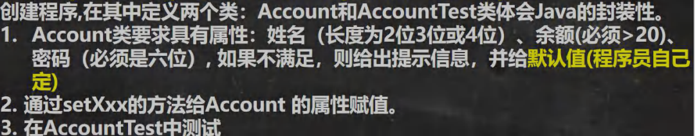
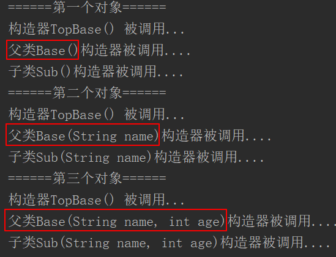
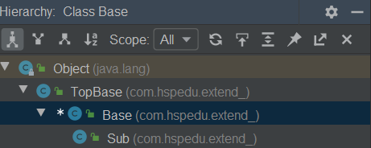
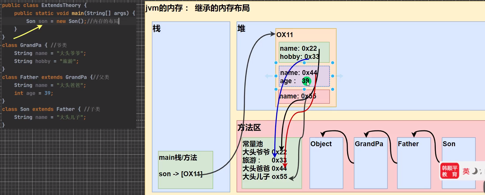
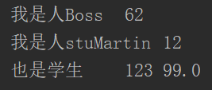
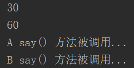
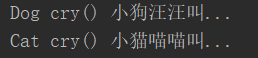
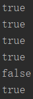

# [面向对象编程（中级部分）](./TCH_Han/Chapter8.md)  
# 值得注意的概念
- 包的本质实际就是**创建不同的文件夹/目录来保存类文件**
- 一个类最多只有一个```package```且要放在代码第一行（最上面）
- 
-  
1. [```IDEA```的使用](#1)
2. [面向对象特性-封装](#2)
3. [面向对象特性-继承](#3)
4. [```super```关键字](#4)
4. [方法重写/覆盖```override```](#5)
4. [面向对象特性-多态](#6)
4. [```object```类](#7)
4. [课堂练习:零钱通](#8)
5. [作业](#作业)  

## 1

本章的代码可以在```IDEA```中运行了。

### 1.1 ```IDEA```的快捷键

```sh
1) 删除当前行, 默认是 ctrl + Y 自己配置 ctrl + d 
2) 复制当前行, 自己配置 ctrl + alt + 向下光标 
3) 补全代码 alt + / 
4) 添加注释和取消注释 ctrl + / 【第一次是添加注释，第二次是取消注释】 
5) 导入该行需要的类 先配置 auto import , 然后使用 alt+enter 即可 
6) 快速格式化代码 ctrl + alt + L 
7) 快速运行程序 自己定义 alt + R 
8) 生成构造器等 alt + insert [提高开发效率] 
9) 查看一个类的层级关系 ctrl + H [学习继承后，非常有用] 
10) 将光标放在一个方法上，输入 ctrl + B , 可以定位到方法 [学继承后，非常有用] 
11) 自动的分配变量名 , 通过 在后面假 .var [老师最喜欢的] 
12) 还有很多其它的快捷键...
```


### 1.2 ```IDEA```设置快捷键

点击```Setting```->```Keymap```->在搜索框搜索：

1. 用```ctrl```+```滚轮```实现调字体，搜索```font```
2. 用```alt```+```d```实现快速运行，搜索```run```
3. ...


### 1.3 ```Java```常用的包

**包引入不建议用```*```**，使用哪个就用哪个。

```java
import java.lang.*;		//基本包，默认引入
import java.util.*;		//系统提供的工具包，如Scanner
import java.net.*;		//网络包，网络开发
import java.awt.*;		//界面开发GUI
```


### 1.4 包命名规则和规范

规则：只能包含数字、字母、下划线、小圆点，不能用数字开头，不能是关键字或保留字

规范：一般是小写字母 + 小圆点


### 1.4 访问修饰符

1. 公开级别：用```public```修饰，对外公开
2. 受保护级别：用```protected```修饰，对子类和同一个包中的类公开
3. 默认级别：没有修饰符号，向同一个包的类公开
4. 私有级别：用```private```修饰，只有类本身可以访问，不对外公开


| 访问级别 | 访问控制修改符 | 同类 | 同包 | 子类 | 不同包 |
| -------- | -------------- | ---- | ---- | ---- | ------ |
| 公开     | public         | ✔    | ✔    | ✔    | ✔      |
| 受保护   | protected      | ✔    | ✔    | ✔    | ✘      |
| 默认     | “无”           | ✔    | ✔    | ✘    | ✘      |
| 私有     | private        | ✔    | ✘    | ✘    | ✘      |


使用注意事项：

1. 修饰符可以用来修饰类中的属性，成员方法以及类
2. 只有默认和```public```**才能修饰类**，并且遵循上述访问权限的特点
3. 关于子类的访问权限，后面记录
4. 成员方法的访问规则和属性完全一样


## 2

### 2.1 面向对象编程三大特性之封装

面向对象编程三大特征：封装、继承和多态。

> 我（**片面**）理解封装：
>
> 将属性（成员变量）设为```private```，同时设置两个```public```的```setXXX```和```getXXX```方法。
>
> 因为```private```再同类中可以直接调用但在不同类中，是不可以直接访问的。这时候就需要调用共有方法，也即```getxxx```。这体现了编程的封装性。

```java
package com.java.learn_han.chapter8.encap;

public class Encapsulation01 {
    public static void main(String[] args) {
        Person person = new Person();
        person.setName("CDUY");
        person.setAge(21);
        person.setSalary(100);
        System.out.println(person.info());
        System.out.println(person.getSalary());

        //使用构造器指定属性
        Person smith = new Person("smith", 80, 50000);
        System.out.println("====smith的信息======");
        System.out.println(smith.info());
    }
}

/**
 * 不能随便查看人的年龄,工资等隐私，并对设置的年龄进行合理的验证。年龄合理就设置，否则给默认
 * 年龄, 必须在 1-120, 年龄， 工资不能直接查看 ， name的长度在 2-6字符 之间
 */
class Person {
    public String name;
    private int age;
    private double salary;

    public Person() {

    }

    public Person(String name, int age, double salary) {
        /*this.name = name;
        this.age = age;
        this.salary = salary;*/
        //可以将set方法写在构造器中，这样仍然可以验证
        setName(name);
        setAge(age);
        setSalary(salary);
    }

    public String getName() {
        return name;
    }

    public void setName(String name) {
        //加入对数据的校验，相当于增加了业务逻辑
        if (name.length() >= 2 && name.length() <= 6) {
            this.name = name;
        } else {
            System.out.println("名字长度不对，需要（2-6）个字符，默认名字");
            this.name = "无名人";
        }
        this.name = name;
    }

    public int getAge() {
        return age;
    }

    public void setAge(int age) {
        if (age >= 1 && age <= 120) {
            this.age = age;
        } else {
            System.out.println("你设置年龄不对，需要在（1-120），给默认年龄18");
            this.age = 18;
        }
    }

    public double getSalary() {
        return salary;
    }

    public void setSalary(double salary) {
        this.salary = salary;
    }

    public String info() {
        return "信息为 name = " + name + " age = " + age + "薪水 = " + salary;
    }
}
```


### 2.2 课堂练习(1)：封装练习



```java
//AccountTest.java
package com.java.learn_han.chapter8.encap;

public class AccountTest {
    public static void main(String[] args) {
        Account account = new Account();
        account.setName("CDUY");
        account.setSalary(10);
        account.setPassword("12346");

        System.out.println(account.showInfo());
    }
}

//Account.java
package com.java.learn_han.chapter8.encap;

public class Account {
    String name;
    double salary;
    String password;

    public Account() {

    }

    public Account(String name, double salary, String password) {
        setName(name);
        setSalary(salary);
        setPassword(password);
    }

    public String getName() {
        return name;
    }

    public void setName(String name) {
        this.name = name;
    }

    public double getSalary() {
        return salary;
    }

    public void setSalary(double salary) {
        if (salary <= 20) {
            System.out.println("没钱啦自动充20");
            this.salary = 20;
        } else {
            this.salary = salary;
        }
    }

    public String getPassword() {
        return password;
    }

    public void setPassword(String password) {
        if (password.length() == 6) {
            this.password = password;
        } else {
            System.out.println("密码长度不为6，自动重置为：111111");
            this.password = "111111";
        }
    }

    public String showInfo() {
        return "Name: " + name + " Salary: " + salary + "Password: " + password;
    }
}
```


## 3

### 3.1 面向对象编程三大特性之继承

```class 子类 extends 父类{}```便是继承

1. 子类自动拥有父类定义的属性和方法
2. 父类又称超类、基类
3. 子类又称派生类

```java
//Extends01.java
package com.java.learn_han.chapter8.extend_;

public class Extends01 {
    public static void main(String[] args) {
        Pupil pupil = new Pupil();
        pupil.name = "银角大王";
        pupil.age = 11;
        pupil.testing();
        pupil.setScore(50);
        pupil.showInfo();

        System.out.println("=========================");
        Graduate graduate = new Graduate();
        graduate.name = "金角大王";
        graduate.age = 21;
        graduate.testing();
        graduate.setScore(90);
        graduate.showInfo();
    }

}

//Student.java
package com.java.learn_han.chapter8.extend_;

public class Student {

    public String name;
    public int age;
    private double score;

    public void setScore(double score) {
        this.score = score;
    }

    public void showInfo() {
        System.out.println("学生名：" + name + " 年龄：" + age + " 成绩：" + score);
    }
}

//Pupil.java
package com.java.learn_han.chapter8.extend_;

public class Pupil extends Student {

    public void testing() {
        System.out.println("小学生：" + name + "正在考小学数学");
    }
}

//Graduate.java
package com.java.learn_han.chapter8.extend_;

public class Graduate extends Student {

    public void testing() {
        System.out.println("大学生：" + name + "正在考大学数学");
    }
}
```


### 3.2 继承的讨论/细节问题

>韩老师笔记：
>
>1. 子类继承了所有的属性和方法，非私有的属性和方法可以在子类直接访问, 但是**私有**属性和方法**不能**在子类**直接访问**，要通过父类提供公共的方法去访问。
>2. 子类必须调用父类的构造器， 完成父类的初始化 。
>3. 当创建子类对象时，不管使用子类的哪个构造器，默认情况下总会去调用父类的无参构造器，如果父类没有提供无参构造器，则必须在子类的构造器中用```super```去指定使用父类的哪个构造器完成对父类的初始化工作，否则，编译不会通过。
>4.  如果希望指定去调用父类的某个构造器，则显式的调用一下 : ```super(参数列表)```。
>5. ```super```在使用时，必须放在构造器第一行(```super```只能在构造器中使用) 。
>6. ```super()```和```this()```都只能放在构造器第一行，因此这两个方法**不能共存在一个构造器**，但可以共存在一个方法中。
>7. java 所有类都是```Object```类的子类，```Object```是所有类的基类。
>8. 父类构造器的调用不限于直接父类！将一直往上追溯直到```Object```类(顶级父类)。
>9. 子类最多只能继承一个父类(指直接继承)，即 java 中是单继承机制。
>      - 思考：如何让```A```类继承```B```类和```C```类？ ```A```继承```B```，```B```继承```C``` 
>10. 不能滥用继承，子类和父类之间必须满足```is-a```的逻辑关系。

重点理解**第三条**。

```java
//ExdendsDetail.java 				
package com.java.learn_han.chapter8.extend_;

public class ExdendsDetail {
    public static void main(String[] args) {
        System.out.println("======第一个对象======");
        Sub sub = new Sub();
        System.out.println("======第二个对象======");
        Sub sub2 = new Sub("jack");//创建了子对象sub2
        System.out.println("======第三个对象======");
        Sub sub3 = new Sub("King", 10);
    }
}

//Sub.java
package com.java.learn_han.chapter8.extend_;

public class Sub extends Base{

    public Sub() {//无参构造器
        //super(); //默认调用父类的无参构造器
        System.out.println("子类Sub()构造器被调用....");
    }
    //当创建子类对象时，不管使用子类的哪个构造器，默认情况下总会去调用父类的无参构造器
    public Sub(String name) {
        super("tom");
        System.out.println("子类Sub(String name)构造器被调用....");
    }

    public Sub(String name, int age) {
        super("king", 20);
        System.out.println("子类Sub(String name, int age)构造器被调用....");
    }
}

//Base.java
package com.java.learn_han.chapter8.extend_;

public class Base extends TopBase {

    public Base() { //无参构造器
        System.out.println("父类Base()构造器被调用....");
    }
    public Base(String name) {//有参构造器
        System.out.println("父类Base(String name)构造器被调用....");
    }
    public Base(String name, int age) {//有参构造器
        //默认super()
        System.out.println("父类Base(String name, int age)构造器被调用....");
    }
}

//TopBase.java
package com.java.learn_han.chapter8.extend_;

public class TopBase {

    public TopBase() {
        //super(); Object的无参构造器
        System.out.println("构造器TopBase() 被调用...");
    }
}
```



```ctrl```+```h```看继承关系。




### 3.3 继承的本质分析

> 韩老师解读：
>
> 1. 首先看子类是否有该属性 。
> 2. 如果子类有这个属性，并且可以访问，则返回信息。 
> 3. 如果子类没有这个属性，就看父类有没有这个属性(如果父类有该属性，并且可以访问，就返回信息..)。 
> 4.  如果父类没有就按照(3)的规则，继续找上级父类，直到 Object... 。
>
> 其中第3点，**不可跨类寻找**，比如一属性，父类是私有爷爷是公有，但子类也是找不到的。

```java
package com.hspedu.extend_; 

public class ExtendsTheory { 
    public static void main(String[] args) { 
        Son son = new Son();//内存的布局 
        System.out.println(son.name);//返回就是大头儿子 
        //System.out.println(son.age);//错误，因为 son 无，但是父类此属性为私有
        System.out.println(son.getAge());//返回的就是 39，正确，调用父类有子类无的方法，这也是封住的意义
        System.out.println(son.hobby);//返回的就是旅游 
    } 
}

class GrandPa { //爷类 
    String name = "大头爷爷";
    String hobby = "旅游"; 
}

class Father extends GrandPa {//父类 
    String name = "大头爸爸"; 
    private int age = 39; 
    public int getAge() { //分装
        return age; 
    } 
}

class Son extends Father { //子类
    String name = "大头儿子"; 
}
```





### 3.4 课堂练习(1)：

### 3.5 课堂练习(2)：

### 3.6 课堂练习(3)：


## 4 

### 4.1 ```super```关键字基本介绍

1. 访问父类的属性（不可访问```private```属性）：```super.属性名```
2. 访问父类的方法（不可访问```private```方法）：```super.方法名(参数列表)```
3. 访问父类的构造器：**只能出现在第一句**

>**访问属性规则**（n1 和 this.n1 查找的规则）：
>
>- (1) 先找本类，如果有，则调用
>- (2) 如果没有，则找父类(如果有，并可以调用，则调用)
>- (3) 如果父类没有，则继续找父类的父类,整个规则，就是一样的,直到 Object类
>- 提示：
>  - 如果查找属性的过程中，找到了，但是不能访问， 则报错, cannot access
>  - 如果查找属性的过程中，没有找到，则提示属性不存在
>
>**方法访问规则**（找```cal```方法时(```cal()```和```this.cal()```)，顺序是）：
>
>- (1)先找本类，如果有，则调用
>- (2)如果没有，则找父类(如果有，并可以调用，则调用)
>-  (3)如果父类没有，则继续找父类的父类,整个规则，就是一样的,直到 Object类
>- 提示：
>   - 如果查找方法的过程中，找到了，但是不能访问， 则报错, cannot access
>   - 如果查找方法的过程中，没有找到，则提示方法不存在

```java
//Super01.java
package com.java.learn_han.chapter8.super_;

public class Super01 {
    public static void main(String[] args) {
        B b = new B();
        b.test();
    }
}

//Base.java
package com.java.learn_han.chapter8.super_;

public class Base {

    public int n1 = 888;
    public int age = 111;

    public void cal() {
        System.out.println("Base类的cal() 方法...");
    }
}

//A.java
package com.java.learn_han.chapter8.super_;

public class A extends Base {

    //n1 是继承了Base类中的
    protected int n2 = 200;
    int n3 = 300;
    private int n4 = 400;//子类是不可访问的

    public void test100() {
    }

    protected void test200() {
    }

    void test300() {
    }

    private void test400() {//子类是不可访问的
    }
}


//B.java
package com.java.learn_han.chapter8.super_;

public class B extends A {

    public int n1 = 888;

    public void test() {
        System.out.println("B类的test()运行并开始调用父类的属性和方法");
        System.out.println("super.n1= " + super.n1);//找父类的n1，
        super.cal();//寻找父类的cal()

        System.out.println("现在开始调用了本类的属性和方法");
        System.out.println("用n1调用本类属性：" + n1);
        System.out.println("用this.n1调用本类属性：" + this.n1);
        System.out.print("用cal()调用本类方法");
        cal();
        System.out.print("用this.cal()调用本类方法");
        this.cal();//调用本类的cal()
    }

    public void cal() {
        System.out.println("B类的cal()方法...");
    }

    public void ok() {
        super.test100();//可以，公共
        super.test200();//可以，保护
        super.test300();//可以，默认
        //super.test400();//不可以，不能访问父类private方法
    }

    //回顾：访问父类的构造器，只能放在构造器的第一句且只出现一句
    public B() {
        super();
    }
}
```


### 4.2 ```super```编程带来的便利

1. 调用父类构造器好处（分工明确。父类属性由父类初始化，子类属性由子类初始化）
2. 当子类中有和父类中的成员（属性和方法）重名时，为访问父类成员，必须通过```super```，如果没有重名使用```super```、```this```直接访问是相同的
3. ```super```访问不限于直接父类，如果爷爷类和本类中有同名的成员，也可以使用```super```去访问爷爷类成员；如果多个基类（上级类）中都有同名的成员，使用```super```访问遵循就近原则：A->B->C（当然还有访问权限相关原则）


### 4.3  ```super```与```this```区别

| No.  | 区别点     | this                                                   | super                                    |
| ---- | ---------- | ------------------------------------------------------ | ---------------------------------------- |
| 1    | 访问属性   | 访问本类中的属性，如果本类没有此属性则从父类中继续查找 | 从父类开始查找属性                       |
| 2    | 调用方法   | 访问本类中的方法，如果本类没有此方法则从父类继续查找   | 从父类开始查找方法                       |
| 3    | 调用构造器 | 调用本类构造器，必须放在构造器的首行                   | 调用父类构造器，必须放在子类构造器的首行 |
| 4    | 特殊       | 表示当前对象                                           | 子类中访问父类对象                       |

 


## 5

### 5.1方法重写/覆盖```override```

方法覆盖（重写）是**子类**有一个方法和**父类**的某个方法名称、返回类型、参数一样，那么子类的此方法便覆盖了父类的方法。

**载注意事项和使用细节**:

1. 子类的方法的**形参列表**，**方法名称**，要和**父类**的方法的形参列表，方法名称**完全一样**。

2. 子类方法的**返回类型**和**父类**方法类型**一样**，或者**是**父类返回类型的**子类**，比如这样定义是正确的。
   - 父类```public Object getInfo() {}```
   - 子类```public String getInfo() {}```
   
3. 子类方法不能缩小父类方法的访问权限 。

   - ```public``` > ```protected``` >　```默认``` > ```private```，下面是正确的，因为子类是**扩大**了父类的访问权限，并不是缩小。　

   - 父类```void sayOk() {}```

   - 子类```public void sayOk() {}```

```java
//Override01.java
package com.java.learn_han.chapter8.override_;

public class Override01 {

    public static void main(String[] args) {
        Dog dog = new Dog();
        dog.cry();
    }
}

//Animal.java
package com.java.learn_han.chapter8.override_;

public class Animal {
    public void cry() {
        System.out.println("动物呼唤..");
    }

    public Object m1() {
        return null;
    }

    public String m2() {
        return null;
    }

    protected void eat() {
    }
}

//Dog.java
package com.java.learn_han.chapter8.override_;

public class Dog extends Animal {

    //因为是重写Dog的 cry方法和 Animal的 cry定义形式一样(名称、返回类型、参数)
    public void cry() {
        System.out.println("小狗旺旺叫..");
    }

    //细节: 子类方法的返回类型是父类返回类型的子类
    public String m1() {
        return null;
    }

    public void eat() {//父类是protected，子类是public 扩大 没有缩小
    }

}
```


### 5.2 课堂联系(1)：重写父类方法

```java
//OverrideExercise.java
package com.java.learn_han.chapter8.override_;

public class OverrideExercise {
    public static void main(String[] args) {

        Person person = new Person("Boss", 62);
        person.Say();

        Student student = new Student("stuMartin", 12, 123, 99);
        student.Say();
    }
}

//Person.java
package com.java.learn_han.chapter8.override_;

public class Person {

    private String name;
    private int age;

    public Person(String name, int age) {
        this.name = name;
        this.age = age;
    }

    public String getName() {
        return name;
    }

    public void setName(String name) {
        this.name = name;
    }

    public int getAge() {
        return age;
    }

    public void setAge(int age) {
        this.age = age;
    }

    public void Say() {
        System.out.println("我是人" + getName() + "\t" + getAge());
    }
}

//Student.java
package com.java.learn_han.chapter8.override_;

public class Student extends Person {

    private int id;
    private double score;

    public Student(String name, int age, int id, double score) {
        super(name, age);
        this.id = id;
        this.score = score;
    }

    public int getId() {
        return id;
    }

    public void setId(int id) {
        this.id = id;
    }

    public double getScore() {
        return score;
    }

    public void setScore(double score) {
        this.score = score;
    }

    public void Say() {
        super.Say();//调用父类Say方法
        System.out.println( "也是学生"  + "\t" + getId() + "\t" + getScore());
    }
}
```




### 5.3 重写与重载区别

> 我（**片面**）理解是：
>
> 重载是什么，比如一个方法可以有好多不同的参数
>
> 而重写是，比如一个学校有不同学院的学生，他们有一个共同的身份是大学生，然后是各学院的学生，那么这时候就可以重写了，比如其中有一个方法是说，如果是对其它学校就说我是光明大学学生，如果在光明大学校园里，就说我是什么什么学院，那么这个说方法就需要重写。
>
> 重载是聚焦不同参数但要实现相同流程的概念，而重写是聚焦相同参数执行不同功能的概念。

| 名称           | 发生范围 | 方法名   | 形参列表                         | 返回类型                                                     | 修饰符                             |
| -------------- | -------- | -------- | -------------------------------- | ------------------------------------------------------------ | ---------------------------------- |
| 重载(overload) | 本类     | 必须一样 | 类型，个数或者顺序只有有一个不同 | 无要求                                                       | 无要求                             |
| 重写(override) | 父子类   | 必须一样 | 相同                             | 子类重写的方法，返回的类型喝父类返回的类型一致，或者是其子类 | 子类方法不能缩小父类方法的访问范围 |


## 6

### 6.1  面向对象编程三大特性之多态

```java
//Poly01.java
package com.hspedu.poly_;

public class Poly01 {
    public static void main(String[] args) {

        Master tom = new Master("汤姆");
        Dog dog = new Dog("大黄~");
        Bone bone = new Bone("大棒骨~");
        tom.feed(dog, bone);

        Cat cat = new Cat("小花猫~");
        Fish fish = new Fish("黄花鱼~");
        System.out.println("===========-------");
        tom.feed(cat, fish);
    }
}

//Bone.java
package com.hspedu.poly_; 

public class Bone { 
    private String name; 
    public Animal(String name) { 
        this.name = name; 
    }
     //省略getName，setName
}

//Bone.java
package com.hspedu.poly_; 
public class Bone extends Food { 
    public Bone(String name) { 
        super(name); 
    } 
}

//Cat.java
package com.hspedu.poly_; 
public class Cat extends Animal { 
    public Cat(String name) { 
        super(name); 
    } 
}

//Dog.java
package com.hspedu.poly_; 
public class Dog extends Animal { 
    public Dog(String name) {
        super(name); 
    } 
}

//Fish.java
package com.hspedu.poly_; 
public class Fish extends Food { 
    public Fish(String name) { 
        super(name); 
    } 
}

//Food.java
package com.hspedu.poly_; 
public class Food { 
    private String name; 
    public Food(String name) { 
        this.name = name; 
    }
    //省略getName，setName
}

//Master.java
package com.hspedu.poly_; 
public class Master { 
    private String name; 
    public Master(String name) { 
        this.name = name; 
    }
    //省略getName，setName
    
    //使用多态机制，可以统一的管理主人喂食的问题，animal 编译类型是 Animal,可以指向(接收) Animal 子类的对象， food 同
    public void feed(Animal animal, Food food) { 
        System.out.println("主人 " + name + " 给 " + animal.getName() + " 吃 " + food.getName());
    }
    
    /** 如果动物很多，食物很多 feed 方法很多，不利于管理和维护
    public void feed(Dog dog, Bone bone) { 
    System.out.println("主人 " + name + " 给 " + dog.getName() + " 吃 " + bone.getName());
    } 
    public void feed(Cat cat, Fish fish) { 
        System.out.println("主人 " + name + " 给 " + cat.getName() + " 吃 " + fish.getName()); 
    }
    //省略.....
    */   
} 

```

  

### 6.2 多态的基本介绍（难点）

> 校长在学校网站说下周一开学，那么学校后勤处、老师、家长和学生听到这一消息后都会有不同的反应，即执行不同的方法。
>

作为面向对象三大特性，多态是建立在封装与继承基础之上的。

1. 方法的多态
   - 方法重载体现多态
   - 方法重写体现多态

```java
package com.java.learn_han.chapter8.poly_;

public class PloyMethod {
    public static void main(String[] args) {
        //方法重载体现多态
        A a = new A();
        System.out.println(a.sum(10, 20));//这里传入不同的参数，就会调用不同 sum 方法，就体现多态
        System.out.println(a.sum(10, 20, 30));

        //方法重写体现多态
        B b = new B();
        a.say();
        b.say();
    }
}

class B {
    public void say() {
        System.out.println("B say() 方法被调用...");
    }
}

class A extends B {
    public int sum(int n1, int n2) {//与下面的 sum 构成重载
        return n1 + n2;
    }

    public int sum(int n1, int n2, int n3) {
        return n1 + n2 + n3;
    }

    public void say() {
        System.out.println("A say() 方法被调用...");
    }
}
```




2. 对象的多态（**核心，难点**）

> 韩老师的几句话（**记住**）：
>
> 1. 一个对象的编译类型和运行类型可以不一致（也可以一致）。
>    - 可以让父类的引用指向子类的对象：```Animal animal = new Dog();```，其中**```animal```的编译类型是```Animal```运行类型是```Dog```**
> 2. 编译类型在定义对象时，就确定，不可改变。
>    - 比如上面提到的```animal```，编译类型就是```Animal```，**且不可改变**
> 3. 运行类型是可以变化的。
>    - ```animal = new Cat();```，```animal```运行类型变成了```Cat```，但编译类型仍然不变
> 4. 编译类型看定义时```=```的**左边**，运行类型看```=```的**右边**。

```java
//PolyObject.java
package com.hspedu.poly_.objectpoly_; 

public class PolyObject { 
    public static void main(String[] args) { 
       
        Animal animal = new Dog(); 
        animal.cry(); //小狗汪汪叫 因为animal 运行类型是 Dog,所以 cry 就是 Dog 的 cry 
        animal = new Cat(); //animal 编译类型 Animal,运行类型就是 Cat 
        animal.cry(); //小猫喵喵叫 
    } 
}

//Animal.java
package com.hspedu.poly_.objectpoly_; 

public class Animal { 
    public void cry() { 
        System.out.println("Animal cry() 动物在叫...."); 
    } 
}

//Cat.java
package com.hspedu.poly_.objectpoly_; 

public class Cat extends Animal { 
    public void cry() { 
        System.out.println("Cat cry() 小猫喵喵叫..."); 
    } 
}

//Dog.java
package com.hspedu.poly_.objectpoly_; 

public class Dog extends Animal {
    public void cry() { 
        System.out.println("Dog cry() 小狗汪汪叫..."); 
    } 
}
```



  


### 6.3 多态的快速入门案例

[在一开始的案例中](#6.1  面向对象编程三大特性之多态)可以用多态方便地增加新的“喂食类型”，比如“小花猪”喜欢吃“米饭”，只需创造米饭与小花猪并继承然在主函数调用```feed```方法即可，十分方便。

```java
//Poly01.java
package com.hspedu.poly_;

public class Poly01 {
    public static void main(String[] args) {

		//相同的，略
        
        //添加 给小猪为米饭
        Pig pig = new Pig("小花猪");
        Rice rice = new Rice("米饭");
        System.out.println("===================");
        tom.feed(pig, rice);//直接调用 feed 方法即可
    }
}

//Pig.java
package com.hspedu.poly_;

public class Pig extends Animal {
    public Pig(String name) {
        super(name);
    }
}


//Rice.java
package com.hspedu.poly_;

public class Rice extends Food {
    public Rice(String name) {
        super(name);
    }
}
```


### 6.4 多态的注意事项和细节讨论

- 多态的**前提**是：两个对象（类）存在继承关系

- 多态的向上转型
  1. 本质：父类的引用指向了子类的对象。
  2. 语法：```父类类型 引用名 = new 子类类型();```，例```Animal animal = new Cat();```。
  3. 特点：编译类型看**左边**，运行类型看**右边**。
     - **可以调用**父类中**所有**成员（需遵守访问权限）
     - **不能调用子类中特有**成员，因为在编译阶段，能调用哪些成员,是由**编译类型**来决定的（*成员包括属性和方法*） 
     - 最终运行效果看子类的具体实现，即调用方法时，按照从子类(运行类型)开始查找方法,[规则与前面所讲调用规则一致](#4.1 ```super```关键字基本介绍)
  
- 多态的向下转型
  
  - ```Animal animal = new Cat();```我现在就是想用```Cat```的方法，怎么办？就可以使用向下转型
  
  1. 语法：```子类类型 引用名 = (子类类型) 父类引用;```，例```Cat cat = (Cat) animal```。
  2. **只能强转**父类的**引用**，不能强转父类的对象（比如小明这个人的实体，可以改名，这个名就是引用，但小明本身不可改变）。
  3. 要求父类的引用必须指向的是当前目标类型的对象，像上面提到的```animal```向下转型时，就只能转```Cat```，**而不能是其它**。
     - ```Cat cat = (Cat) animal``` ✔
     - ```Dog dog = (Dog) animal``` ✘
  4. 当向下转型后，可以调用子类类型中所有的成员。
  
  

>我（**片面**）的理解是
>
>- 在编译```javac```时，可以调用哪些成员（属性和方法）是由编译类型决定的，```animal```调用```catchMouse()```是错误的。而在运行过程中，如果子类重写了父类方法比如```eat()```，那么具体的实现由子类决定。
>- 即编译时由编译类型来处理，运行时由运行类型来处理。
>- 但是正如博客中所说“要用子类实例对象，先是生成子类实例赋值给父类引用，在将父类引用向下强转给子类引用，这不是多此一举吗？”，[Java向下转型的意义](https://blog.csdn.net/xyh269/article/details/52231944)
>

```java
//PolyDetail.java
package com.hspedu.poly_.detail_; 

public class PolyDetail {
    public static void main(String[] args) { 
        
        //向上转型：
        Animal animal = new Cat(); 
        Object obj = new Cat();//可以吗? 可以 Object 也是 Cat 的父类 
         //animal.catchMouse();错误，因为该编译类型中 没有此方法 
    
        animal.run();//跑（与父同）
        animal.sleep();//睡（与父同） 
        animal.eat();//猫吃鱼.. 因为在运行过程的调用是由运行类型决定的，即调用的是子类具体实现
        animal.show();//hello,你好（与父同） 
        
        
        //向下转型：（原因希望 可以调用 Cat 的 catchMouse 方法） 
        Cat Cat = (Cat) animal; //所以此时的编译类型是 cat 运行类型也是 cat，看等号左右边
        cat.catchMouse();//猫抓老鼠 
        Dog dog = (Dog) animal; //错误的! 要求父类的引用必须指向的是当前目标类型的对象
    } 
}


//Animal.java
package com.hspedu.poly_.detail_; 

public class Animal { 
    String name = "动物"; 
    int age = 10; 
    public void sleep() { 
        System.out.println("睡"); 
    }
    public void run() { 
        System.out.println("跑");
    }
    public void eat() { 
        System.out.println("吃"); 
    }
    public void show(){ 
        System.out.println("hello,你好"); 
    } 
}


//Cat.java
package com.hspedu.poly_.detail_; 

public class Cat extends Animal { 
    public void eat(){//方法重写 
        System.out.println("猫吃鱼"); 
    }
    public void catchMouse(){//Cat 特有方法 
        System.out.println("猫抓老鼠"); 
    } 
}


//Dog.java
package com.hspedu.poly_.detail_; 

public class Dog extends Animal {//Dog 是 Animal 的子类 
}
```

- 属性没有重写的说法，**属性的值**看**编译类型**

```java
package com.hspedu.poly_.detail_;

public class PolyDetail02 {
    public static void main(String[] args) {
        //属性没有重写之说！属性的值看编译类型
        Base base = new Sub();//向上转型
        System.out.println("Base类的count" + base.count);// ？ 看编译类型 10
        Sub sub = new Sub();
        System.out.println("Sub类的count" + sub.count);//?  20
    }
}

class Base { //父类
    int count = 10;//属性
}

class Sub extends Base {//子类
    int count = 20;//属性
}
```


- ```instancedOf```比较操作符，比较操作符，用于判断**对象**的**运行类型**是否为 XX 类型或 XX 类型的子类型

```java
package com.hspedu.poly_.detail_; 

public class PolyDetail03 { 
    public static void main(String[] args) { 
        BB bb = new BB(); 
        System.out.println(bb instanceof BB);// true 
        System.out.println(bb instanceof AA);// true 
        
        //aa 编译类型 AA, 运行类型是 BB 
        //BB 是 AA 子类
        AA aa = new BB(); 
        System.out.println(aa instanceof AA); 
        System.out.println(aa instanceof BB); 
        Object obj = new Object(); 
        System.out.println(obj instanceof AA);//false 
        String str = "hello"; 
        //System.out.println(str instanceof AA); 没法比 因为一个是字符串 一个是类
        System.out.println(str instanceof Object);//true 
    } 
}

class AA {} //父类

class BB extends AA {}//子类
```




### 6. 课堂练习(1)：

```java
```


### 6.  ```Java```的动态绑定机制


### 6. 多态的应用

****


## 7

### 7.1 ```equals```方法

**```==```和```equals```的对比**

1. ```==```是一个比较运算符
   - 即可以判断基本类型，有可以判断引用类型
   - 如果判断基本类型，判断的是值是否相等
   - 如果判断引用类型，判断的是地址是否相等（即判断不试试同一个对象）
2. ```equals```是```object```类中的方法，只能判断引用类型
3. 默认判断的是地址是否相等，子类中往往重写改方法，用于判断内容是否相等，比如```Integer```,```String```


### 7.2  如何重写```equals```方法


### 7.3 ```hashCode```方法


### 7.4 ```toString```方法


### 7.5 ```finalize```方法


****

## 8

### 8.1 断点调试```debug```


### 8.2 零钱通


## 作业

```
```


