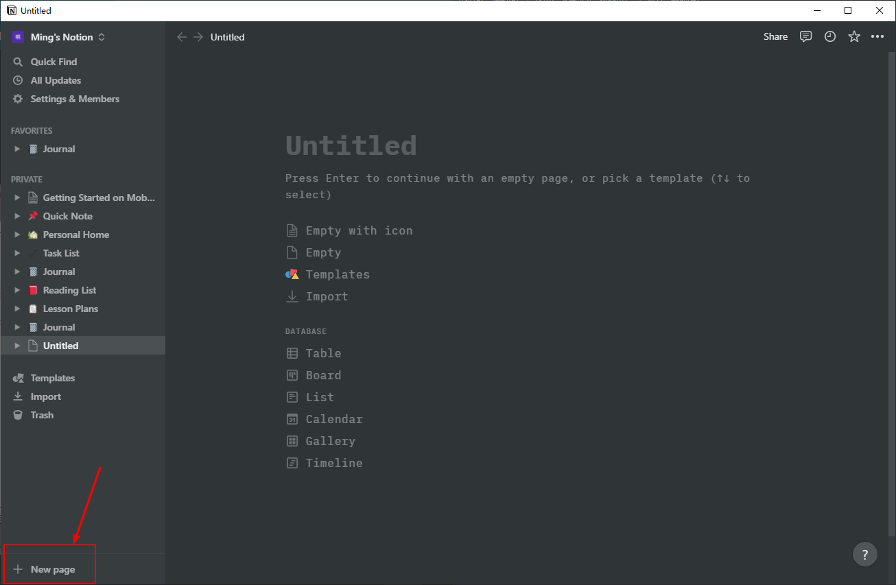
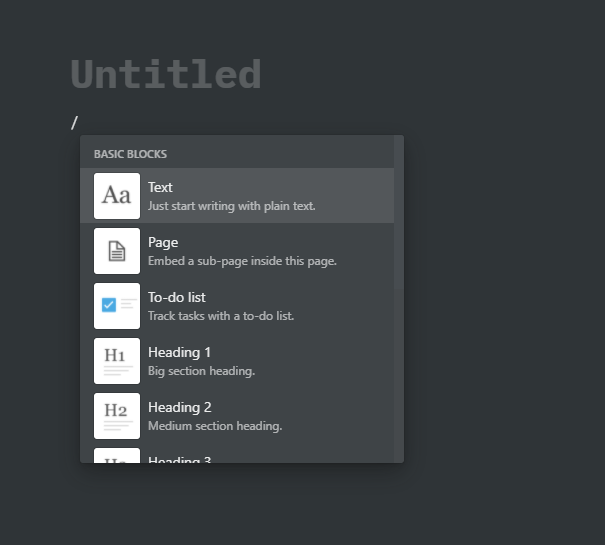
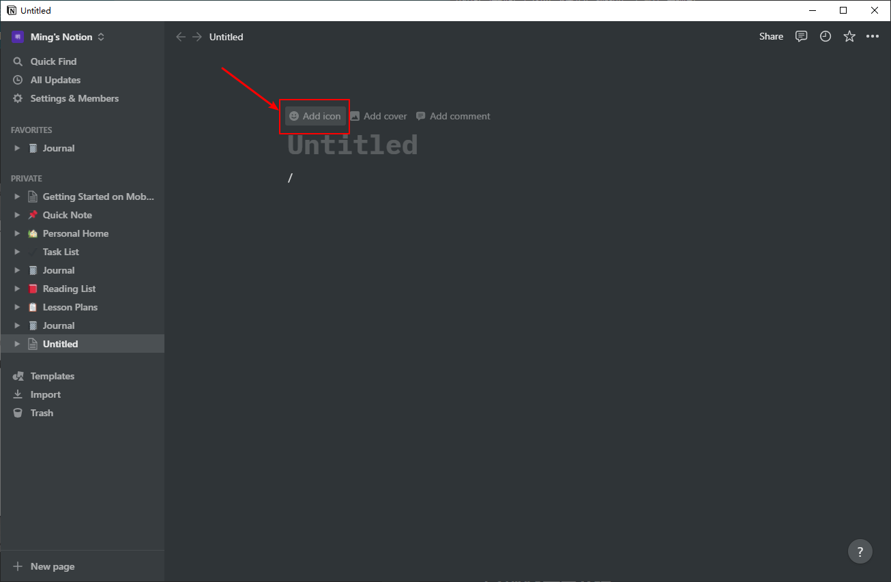

# [Notion的学习](.notion.md)  

- 本教程参考自[b站](https://www.bilibili.com/video/BV1gQ4y1K76r?p=1)，笔记大纲根据视频顺序（一集为1大纲）。


## P1 建立新页面

1. Notion可以在空白页面添加文本、图像、待办事项、强大的数据库
2. 如果需要添加一个新的页面



3. 新建页面后，可以按下```\```选择添加的内容形式



4. 新建好页面后，可以弄一个图标方面日后查找，（选择的图标会在左边侧边栏显示）



*P1 结束*


## P2 新建数据库

1. 在Notion中数据库实质上是更智能的电子表格并用“页面”进行展示（有不同的展现形式）
2. 


## P3 block类型介绍


## P4 写作和编辑


## P5 快速查找功能


## P6 模板


## P7 提醒功能


## P8 小图标和封面


## P9 表格视图数据库


## P10 展板视图数据库


## P11 日历视图数据库


## P12 图库视图数据库


## 